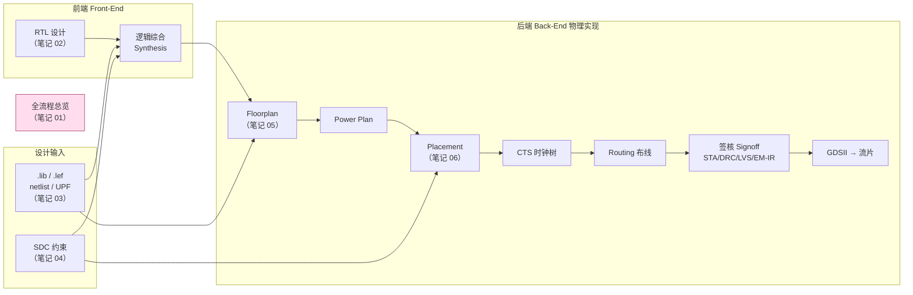

# IC Backend Notes · 索引与学习路线

> **来源课程（原版・英文）**：Adam Teman, *Digital VLSI Design (DVD)*, Bar-Ilan University, Course **83-612**（由 Intel 支持）
> 课程主页：<https://enicslabs.com/academic-courses/dvd-english/>
> **中文转述**：B站合集《精品课程·芯片设计从RTL到GDS》（`6918961`，63 课，系上述 DVD 课程的中文搬运/讲解）
> 适用读者：已具备数字电路与逻辑设计基础的工科学生 / 初级数字 IC 工程师 · 用途：可复习 + 可速查
> 整理：**J.C** · 2026-06-18

---

## 一、本目录包含什么

六篇独立、自洽的 Markdown 笔记，**已按逻辑（学习/流程）顺序编号**：全流程总览 → RTL → 输入文件 → SDC → Floorplan → Placement。每篇按 **「是什么 / 为什么 / 怎么做 / 常见坑」** 组织，文末附 **本章小结** 与 **课后自测**，并配 Mermaid 图与代码示例。

| # | 笔记文件 | 主题 | DVD 原版讲座 |
|---|----------|------|--------------|
| 01 | [01_Backend_Flow_Overview.md](01_Backend_Flow_Overview.md) | RTL→GDSII 全流程总览：抽象层次、前/后端分工、七大阶段、PPA 与 ECO、工具链对照 | Lec 1 · Introduction & Digital Design |
| 02 | [02_RTL_Languages.md](02_RTL_Languages.md) | Verilog 语法、阻塞/非阻塞、组合 vs 时序、避免 latch、FSM、可综合子集 | Lec 2 · Verilog (Synthesizeable RTL) |
| 03 | [03_Backend_Input_Files.md](03_Backend_Input_Files.md) | netlist / Liberty(.lib) / LEF / DEF / SDC / UPF / 寄生 / 工艺规则 逐一讲清 | Lec 3 · Logic Synthesis I (Std Cell Libs) |
| 04 | [04_SDC_Constraints.md](04_SDC_Constraints.md) | 时钟/生成时钟/虚拟时钟、IO 延迟、false_path/MCP、clock_groups、MMMC，含完整模板 | Lec 5 · Static Timing Analysis |
| 05 | [05_Floorplan.md](05_Floorplan.md) | die/core 几何、利用率、macro 摆放与阻挡、电源(ring/stripe/mesh)、IR/EM、多电压、时序预算 | Lec 6 · Moving to the Physical Domain |
| 06 | [06_Placement.md](06_Placement.md) | 全局/合法化/详细布局、模拟退火、解析式、min-cut、时序/拥塞驱动、工具实践 | Lec 7 · Standard Cell Placement |

> **05 Floorplan** 是样板章：除笔记外另配「**教案**（知识点在页）+ **可编辑 PPT**（[`slides/05_Floorplan.pptx`](slides/05_Floorplan.pptx)）+ **论文级插图**（[`assets/floorplan/`](assets/floorplan/)）+ **口语讲稿**（[`lecture_scripts/05_Floorplan.md`](lecture_scripts/05_Floorplan.md)）」全套，由 [`_SlideKit`](../_SlideKit/) 流水线产出。

---

## 二、这些主题在整个流程中的位置

> **笔记 01** 是这张图本身的展开；其余五篇是图中各环节的纵深。

---

## 三、学习顺序

本目录**已按逻辑顺序编号**，从 `01` 依次读到 `06` 即可——即"先建地图（01 全流程），再从设计源头（02 RTL → 03 输入文件 → 04 SDC）走到物理实现（05 Floorplan → 06 Placement）"。
以**复习/自测**为目标，可直接跳每篇末尾的「易混淆点 · 课后自测」集中突破。

---

## 四、贯穿全篇的主线索

- **PPA 权衡**（性能 / 功耗 / 面积）：贯穿综合到签核的每一步取舍，见 [01](01_Backend_Flow_Overview.md)。
- **时序 (Timing)**：setup/hold → SDC 约束 → STA → 时序驱动布局，串起 [04](04_SDC_Constraints.md)、[06](06_Placement.md)。
- **数据文件流**：RTL → netlist → DEF → GDS，库文件 .lib/.lef 全程参与，见 [03](03_Backend_Input_Files.md)。
- **工具映射**：Synopsys（DC / Fusion Compiler / ICC2 / PrimeTime）vs Cadence（Genus / Innovus / Tempus），各篇均给出命令对照。

---

## 五、配套：图示与 PPT 流水线（_SlideKit）

可复用的"笔记 → 论文插图 → 可编辑幻灯片 + 口语讲稿"流水线放在仓库根目录 [`../_SlideKit/`](../_SlideKit/)（与 `_BiliKit` 同级）：

1. **画图**：用 Python（matplotlib）+ 统一的**现代 IC 语义多色**主题 [`_SlideKit/theme.py`](../_SlideKit/theme.py) 绘制**论文级插图**（占满画框、字号大、可插入 PPT），一次导出 PNG + SVG。Floorplan 示例：[`_SlideKit/diagrams/floorplan.py`](../_SlideKit/diagrams/floorplan.py)。
2. **出片**：[`_SlideKit/deck.py`](../_SlideKit/deck.py) 由一份「页面规格」**同时**产出**可编辑 PPT**（python-pptx 原生文本 + 插入插图）与逐页**版面预览**（用于校对）。Floorplan 示例：[`_SlideKit/decks/floorplan.py`](../_SlideKit/decks/floorplan.py)。
3. **三件套**：每个主题配 `教案`（知识点在页）+ `slides/<n>.pptx`（可编辑）+ `lecture_scripts/<n>.md`（口语讲稿）。

详见 [`_SlideKit/README.md`](../_SlideKit/README.md)。

---

## 六、待补充

- 课程视频的**转写字幕尚未生成**（`_BiliKit` 仍在处理 `6918961`）；待字幕产出后可回填课程原话与例子。
- 已覆盖、本批次未含、可作为下一批的主题：**逻辑综合细节**（DVD Lec 3–4）、**STA 深入**（Lec 5）、**CTS 时钟树**（Lec 8）、**Routing 布线**（Lec 9）、**封装与 IO**（Lec 10）、**Signoff 签核**（Lec 11）、**Tcl 脚本**。

---

> 整理人：**J.C**
