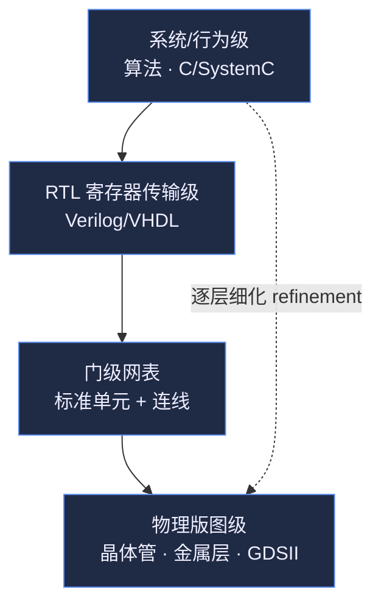
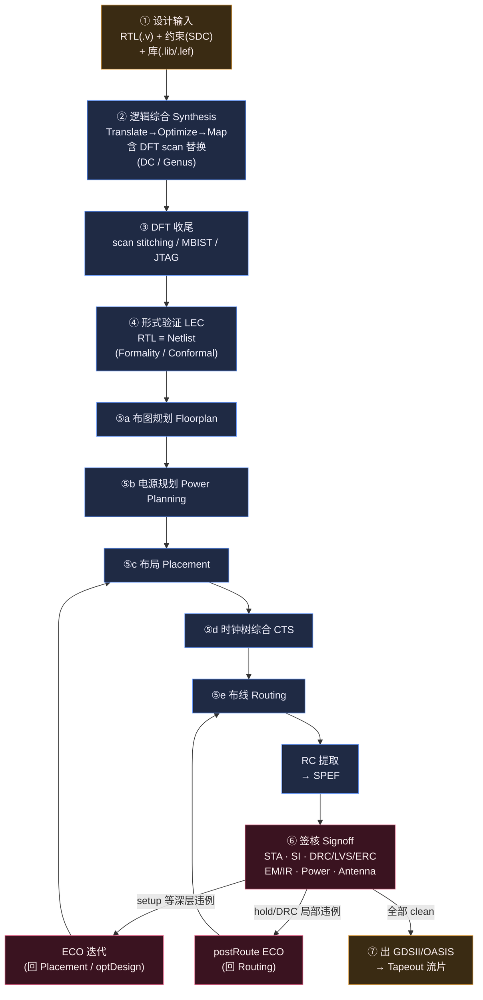
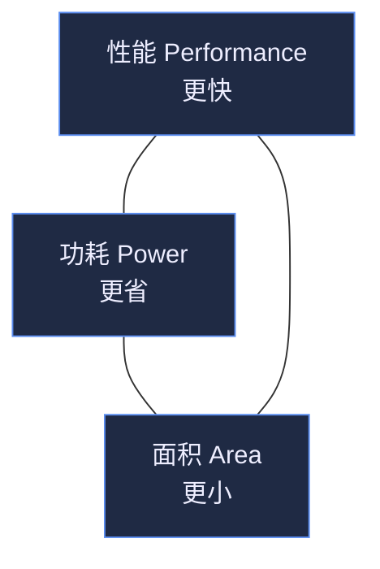

# 数字后端全流程介绍（RTL → GDSII）

> 适用课程章节：第 1–5 课（数字 VLSI 设计、抽象层次、分而治之、前后端分工、RTL 综合）、第 11–12 课（综合流程）、第 31 课（物理设计概览）。
> 本篇定位为**全流程总览 + 速查**，每个子环节的深入细节（库文件、STA、布局算法、CTS、布线等）在对应专题笔记中展开。
> 笔记整理：J.C
> 课程原版 (English source): Adam Teman, *Digital VLSI Design (DVD)*, Bar-Ilan University · Course 83-612 · 对应 DVD Lecture 1 (Introduction & Digital Design) · https://enicslabs.com/academic-courses/dvd-english/

---

## 0. 导读：这篇笔记解决什么问题

学完前端 Verilog/综合，再接触物理设计时，最容易"只见树木不见森林"——知道 `compile_ultra` 怎么敲、知道 floorplan 怎么画，却说不清**一颗芯片从一行 RTL 代码到能交给晶圆厂的 GDSII，中间到底走了哪些台阶、每一阶段吃什么、吐什么、谁来做**。

本篇就是这张"地图"：先建立**抽象层次**与**分而治之**的世界观，再把 **RTL→GDSII** 全流程按阶段拆开，逐段给出"输入 / 目标 / 输出 / 主要工具"，最后落到 **PPA 权衡**、**时序收敛与 ECO 迭代**、**关键数据文件**和 **Synopsys/Cadence 工具链对照**。

> 术语约定：全篇统一写作 **PnR**（Place & Route，布局布线）、**IR-drop（电压降）**，避免同义异写造成检索困难。

---

## 1. 数字 IC 设计的抽象层次与分而治之

### 1.1 是什么：抽象层次（Abstraction Levels）

数字 VLSI（超大规模集成电路, Very Large Scale Integration）动辄数十亿晶体管，人脑无法直接面对晶体管管理整颗芯片。解决办法是**分层抽象**：每一层只关心本层关心的事，向上隐藏下层细节，向下提供清晰契约。常用四层（自顶向下）：

| 抽象层次 | 中文(English) | 描述对象 | 典型表示 / 语言 | 类比 |
|---|---|---|---|---|
| 系统/行为级 | 系统/行为级(System / Behavioral Level) | 算法、数据流、吞吐/延迟 | C/C++、SystemC、MATLAB、行为级 Verilog | "要做什么" |
| 寄存器传输级 | RTL(Register Transfer Level) | 寄存器之间的数据传输与组合逻辑 | Verilog/VHDL/SystemVerilog | "每个时钟沿数据如何流动" |
| 门级/逻辑级 | 门级(Gate Level) | 标准单元（与或非、触发器） | 门级网表 Netlist (.v) | "用哪些门搭出来" |
| 晶体管/物理级 | 物理版图级(Transistor / Physical Layout) | 晶体管、金属互连、版图几何 | SPICE（电路网表）、GDSII/OASIS（版图） | "实际硅片长什么样" |

> 说明 1：本表把**系统级(System / Algorithmic, 含 HLS 的 untimed 模型)**与**行为级(Behavioral)**合并呈现，便于初学者建立直觉。在严格的抽象层次分类中二者可再细分（系统/算法级 > 行为级 > RTL），不应认为"系统级"与"行为级"完全等同。
> 说明 2：**LEF（Library Exchange Format）不是晶体管/版图级的表示**，它是单元的**库级物理抽象**（cell 黑盒视图：只含外框、引脚、阻塞层、布线规则，不含晶体管几何），因此本表的物理级"典型表示"列只列 GDSII/OASIS 与 SPICE。LEF 的定位见 §5 文件表。

**核心观察**：抽象层越往下越接近物理实现，信息越多、自由度越小；越往上越接近意图，越易于人类推理。设计的本质就是**逐层细化（refinement）**，每下一层都把上一层的"意图"翻译成更具体的"实现"。

### 1.2 为什么重要：分而治之（Divide and Conquer）

复杂度无法一口吃下，工程上用两条正交的"分而治之"主线：

1. **纵向分层**——上面的抽象层次。每一层用最合适的工具和语言推理，跨层用标准接口（如网表、`.lib`/`.lef`）衔接。
2. **横向分块**——层次化设计(Hierarchical Design)。把芯片切成 Block / Partition / Macro，团队并行开发，最后集成（Top-level integration）。

> **工程意义**：分层 + 分块让"几十亿晶体管"变成"一群可独立验证、可并行推进、可复用的小问题"。IP 复用（如标准单元库、PLL、SRAM、CPU 核）正是这一思想的产物。

### 1.3 设计自动化（EDA）的意义

如果每一层细化都靠手工，规模上去后既慢又错。**电子设计自动化(EDA, Electronic Design Automation)** 把"从一层到下一层"的细化交给算法：

- **综合(Synthesis)**：RTL → 门级网表（DC/Genus 自动完成布尔优化、工艺映射）。
- **布局布线(PnR, Place & Route)**：网表 → 物理版图（ICC2/Innovus 自动摆放、连线）。
- **验证/签核**：仿真、形式验证、STA、DRC/LVS 等自动检查正确性。

EDA 的价值：**把工程师从"手工画门、手工连线"中解放出来，去做架构、约束、收敛决策**。课程第 3 课"从手工到自动及现代工具链"讲的就是这一演进。



---

## 2. 前端设计与后端设计的分工

整条芯片设计流分两大阵营，分界线通常划在**逻辑综合产出门级网表**处。

### 2.1 前端设计（Front-End）

> 关键词：**功能正确（Functionality）**。前端不关心芯片"长什么样"，只关心"算得对不对、快不快"。

| 阶段 | 中文(English) | 产出 |
|---|---|---|
| 规格定义 | 规格(Specification / Spec) | 设计需求文档（功能、接口、性能/功耗预算） |
| 架构设计 | 微架构(Micro-architecture) | 模块划分、流水线、总线、存储层次 |
| RTL 编码 | RTL 设计(RTL Coding) | 可综合 Verilog/SystemVerilog |
| 功能验证 | 功能验证(Functional Verification) | 仿真/UVM、形式属性验证，覆盖率达标 |
| 逻辑综合 | 逻辑综合(Logic Synthesis) | **门级网表 Netlist** + 约束传递 |

前端的"出货"就是一份**门级网表（gate-level netlist）** + **约束（SDC）**，它是前后端的交接物。

> 注意区分两类"形式验证"：
> - **形式/属性验证(Formal Property Verification)**：用断言(assertion/property)证明设计满足某性质，属**功能验证**范畴（工具：VC Formal / JasperGold）。
> - **逻辑等价性检查(LEC, Logic Equivalence Check)**：证明两份网表**功能等价**，用于综合/ECO 前后比对（工具：Formality / Conformal）。两者目的不同：前者查断言，后者查等价。

### 2.2 后端设计（Back-End / 物理实现 Physical Implementation）

> 关键词：**物理可制造（Manufacturability）+ 物理收敛（Timing/Power/DRC 闭合）**。后端把网表"落地"成版图。

后端从网表开始，经布图规划、电源规划、布局、时钟树综合、布线，最后签核出 **GDSII**，交付晶圆厂（Fab）流片（Tapeout）。课程第 31 课"物理设计：版图规划和时钟树综合"即后端的入口。

```mermaid
flowchart LR
    subgraph FE["前端 Front-End（功能正确）"]
      direction TB
      S["Spec 规格"] --> AR["Architecture 架构"]
      AR --> RTL["RTL 编码"]
      RTL --> FV["功能验证"]
      FV --> SYN["逻辑综合"]
    end
    SYN --> NL(("门级网表<br/>+ SDC"))
    NL --> FP
    subgraph BE["后端 Back-End（物理实现）"]
      direction TB
      FP["Floorplan"] --> PP["Power Plan"]
      PP --> PL["Placement"]
      PL --> CTS["CTS"]
      CTS --> RT["Routing"]
      RT --> SG["Signoff"]
    end
    SG --> GDS(("GDSII<br/>Tapeout"))
    classDef fe fill:#13351f,stroke:#3fae6b,color:#eef
    classDef be fill:#1f2a44,stroke:#5b8def,color:#eef
    class S,AR,RTL,FV,SYN fe
    class FP,PP,PL,CTS,RT,SG be
```



> Mermaid 提示：从节点指向 `subgraph` 边界（`NL --> BE`）在部分 Mermaid 版本下渲染不稳定，已改为指向子图内首节点 `NL --> FP`，可移植性更好。

---

## 3. 完整 RTL→GDSII 总流程

### 3.1 总流程图（必看）



> 关于 ECO 回踩点：违例类型决定退回到哪一阶段——**深层 setup/拓扑问题**常退回 Placement 或重跑 `optDesign`；**hold/局部 DRC** 多在布线后做 **postRoute ECO** 并回到 Routing。因此图中画了两条回边，而非"任何违例都退回布局"。
> 关于 RC 提取：**RC 提取（生成 SPEF）是 signoff 的前置独立步骤**，已在 ROUTE→SIGNOFF 之间单列为节点，强化数据流。

下面逐阶段展开，每段统一给出 **输入 / 目标 / 输出 / 主要工具**。

---

### 3.2 ① 设计输入（Design Setup）

- **是什么**：把综合/物理实现需要的三类原料准备齐。
- **为什么重要**：垃圾进、垃圾出（GIGO）。库版本错、约束缺失，后面全部白跑。
- **三类输入**：

| 输入 | 文件 | 内容 |
|---|---|---|
| 设计 | RTL `.v` / `.sv` | 可综合的功能描述 |
| 约束 | SDC(Synopsys Design Constraints) | 时钟、IO 延迟、伪路径、多周期等 |
| 库 | `.lib`(Liberty 文本) → 编译为 `.db` / `.lef` | 时序/功耗模型 + 物理抽象 |

> 库格式提示：`.lib` 是 Liberty **文本源**；Design Compiler/PrimeTime 实际链接的是用 **Library Compiler（`lc_shell` 或 `read_lib`+`write_lib`）编译出来的二进制 `.db`**。即 `.lib → (Library Compiler) → .db`。后续综合脚本里出现的 `slow.db` 即由此而来。

- **怎么做**（SDC 片段示例）：

```tcl
# clk 周期 5ns（200MHz），占空比 50%
create_clock -name clk -period 5.0 [get_ports clk]
set_clock_uncertainty 0.15 [get_clocks clk]      ;# 时钟不确定度（jitter+裕量）

# 时钟端口本身不加 input_delay，故从 all_inputs 里排除 clk
set inputs_no_clk [remove_from_collection [all_inputs] [get_ports clk]]
set_input_delay  2.0 -clock clk $inputs_no_clk
set_output_delay 2.0 -clock clk [all_outputs]

# 驱动与负载：clk 端口由时钟树单独处理，不在此设 driving_cell，故同样排除
set_driving_cell -lib_cell BUFX2 $inputs_no_clk
set_load 0.05 [all_outputs]
```

- **常见坑**：忘记给 `set_clock_uncertainty`，综合时序"虚好"；库的工作角点（corner）与目标不一致；忘约束异步/伪路径导致后续被假违例淹没；把 `set_input_delay`/`set_driving_cell` 误加到时钟端口上。

---

### 3.3 ② 逻辑综合 Synthesis（DC / Genus）

- **是什么**：把 RTL 翻译并优化成由标准单元构成的**门级网表**。课程第 11–12 课主线。
- **三步走（务必记牢）**：

| 步骤 | 中文(English) | 做什么 |
|---|---|---|
| 1. 翻译 | 翻译(Translate / Elaborate) | RTL → 与工艺无关的通用布尔/RTL 中间表示（GTECH） |
| 2. 优化 | 优化(Optimize) | 布尔最小化、共享、常量传播、结构优化（与工艺无关） |
| 3. 工艺映射 | 工艺映射(Technology Mapping) | 把布尔网络映射到具体库单元，做时序/面积/功耗驱动的单元选择与尺寸调整 |

- **输入**：RTL + SDC + `.db`（由 `.lib` 编译，见 §3.2）（+ DFT/clock-gating 设置）
- **目标**：在满足约束（时序、综合 DRC、面积）前提下得到**可综合、可优化**的网表。
- **输出**：门级网表 `.v`、综合后 `.sdc`、时序/面积/功耗报告、`.ddc`（DC 数据库）。
- **主要工具**：Synopsys **Design Compiler (DC)**（图形版/旗舰为 **DC Graphical** 与 **DC NXT**；先进节点推综合-PnR 一体的 **Fusion Compiler**）、Cadence **Genus**。

> **关键澄清：综合里的 "DRC" 不是物理验证的几何 DRC！**
> - 综合/STA 语境的 **DRC = 设计规则约束(Design Rule Constraints)**，指 `max_transition` / `max_capacitance` / `max_fanout` 这类**电学设计约束**，违反它们叫"DRC violation"，由约束或库定义。
> - 签核语境的 **DRC = 设计规则检查(Design Rule Check)**，是**几何制造规则**（线宽、间距、enclosure 等）。
> - 二者**同名不同义**，是初学者高频混淆点（已列入 §8 考点）。

- **怎么做**（Design Compiler 经典脚本骨架）：

```tcl
# 0) 前提：slow.lib 需先用 Library Compiler 编译为 slow.db
#    （lc_shell: read_lib slow.lib; write_lib ...），DC 读取的是 .db

# 1) 读库
set link_library   "* slow.db"        ;# "*" 表示已加载到内存的设计本身
set target_library "slow.db"

# 2) 读 RTL（read_verilog 对单文件隐含 elaborate；多文件/参数化建议 analyze + elaborate）
read_verilog rtl/top.v
current_design top
link

# 3) 约束
source constraints/top.sdc
set_max_area 0

# 4) 综合（translate+optimize+map 一把梭）
compile_ultra -gate_clock          ;# -gate_clock 自动插入时钟门控

# 5) 报告 & 导出
report_timing -delay max -max_paths 10
report_area
report_power
write -format verilog -hierarchy -output netlist/top_syn.v
write_sdc netlist/top_syn.sdc
```

- **常见坑**：未开 `-gate_clock` 导致动态功耗偏高；约束过松综合"假收敛"，到物理阶段崩盘；保留层次（`ungroup`/`flatten`）选择不当影响后续可调试性与 QoR；把综合 DRC 与几何 DRC 混为一谈。

---

### 3.4 ③ 可测性设计 DFT（Design For Test）

- **是什么**：在网表中加入**测试结构**，让芯片造出来后能用 ATE（自动测试设备）高效筛出制造缺陷。
- **为什么重要**：芯片"功能对"≠"造得没缺陷"。没有 DFT，量产良率（yield）无法保证、坏片测不出来。
- **与综合的关系（重要）**：**scan FF 替换通常与综合一体完成**——DFT Compiler 与 DC 集成，`compile` 时即插入 scan-ready 触发器；**scan chain stitching（把 scan-FF 串成链）一般在综合之后到布局阶段完成**（可结合物理位置做 scan reorder）。因此 DFT 并非"完全独立于综合之后"的串行块，总流程图把 scan 替换标在综合内、stitching 标在其后。
- **三大手段**：

| 技术 | 中文(English) | 作用 |
|---|---|---|
| 扫描链 | 扫描(Scan Chain) | 把普通 DFF 换成 Scan-FF，串成移位链，可直接读写所有寄存器状态，测组合逻辑故障 |
| 内建自测 | MBIST(Memory BIST) | 片内逻辑自动测试 SRAM/存储器 |
| 边界扫描 | 边界扫描(Boundary Scan / JTAG, IEEE 1149.1) | 通过 TAP（TDI/TDO/TCK/TMS）测引脚连接、板级互连 |

- **怎么做**（DFT Compiler / 网表中 Scan-FF 形态示意）：

```verilog
// 普通 DFF 被替换为带扫描的触发器：多了 SI(scan in)/SE(scan enable)
// SE=0 → 功能模式：数据走 D 端
// SE=1 → 移位模式：D 被 SI 取代，所有 reg 串成一条/多条 scan chain
// （SDFFRX1 / 端口名为库相关示例，实际名以工艺库为准）
SDFFRX1 u_reg ( .D(d), .SI(scan_in), .SE(scan_en),
                .CK(clk), .Q(q) );
```

- **故障模型**：固定型故障(stuck-at)、跳变延迟故障(transition / at-speed)、桥接(bridging) 等；ATPG 工具生成测试向量与覆盖率。
- **主要工具**：Synopsys **DFT Compiler + TestMAX ATPG（原 TetraMAX / TetraMAX II）**；Cadence **Genus DFT + Modus**。
- **常见坑**：scan 插入改变了网表，后续 LEC 必须用"考虑 scan"的模式比对；scan enable 的时序/拓扑没规划好导致绕线拥塞。

---

### 3.5 ④ 形式验证 / 等价性检查 LEC（Logic Equivalence Check）

- **是什么**：用**形式化方法**证明两份设计在逻辑上**功能等价**，不靠仿真向量。
- **为什么重要**：综合、DFT 插入、CTS、ECO 都会改网表。必须证明"改完还是原来的功能"。
- **典型比对点**：
  - RTL ≡ 综合后网表
  - 综合网表 ≡ DFT 插入后网表
  - 布线前网表 ≡ 布线后/ECO 后网表
- **输出**：等价/不等价报告 + 不等价点（non-equivalence points）定位。
- **主要工具**：Synopsys **Formality**；Cadence **Conformal LEC**。

```tcl
# Formality 极简流程
# read_db 读的是编译后的二进制库 .db（不是 .lib 文本源），用于解析单元
read_db ref.db

# 参考(golden)：读 RTL/网表并 elaborate，set_top 即把它设为 reference
read_verilog -r rtl/top.v
set_top r:/WORK/top

# 实现(revised)：读综合后网表并 elaborate，set_top 即把它设为 implementation
read_verilog -i netlist/top_syn.v
set_top i:/WORK/top

match
verify
```

> 说明：`read_db` 读**库**（`.db`），参考/实现两份**设计**由 `read_verilog -r` / `-i` 指定。在 Formality 中，对 `r:` 容器执行 `set_top` 即自动指定为 reference，对 `i:` 容器执行 `set_top` 即自动指定为 implementation（无需 `set_reference_design` / `set_implementation_design`）；`r:/WORK/top`、`i:/WORK/top` 这类容器路径在 elaborate 之后才成立（`read_verilog` 隐含完成 elaborate）。

- **常见坑**：寄存器重定时（retiming）、有限状态机重编码会导致状态点对不上，需要给工具额外的映射/setup；scan/clock-gating 模式没开导致假不等价。

---

### 3.6 ⑤ 物理设计（Physical Design / PnR）

物理设计是后端核心，分五个子阶段。课程第 31–52 课逐一深入；本篇给总览。

#### ⑤a 布图规划 Floorplan

- **目标**：确定芯片**边界/纵横比**、**核心区(core)** 与 **IO 环/pad ring**、**硬宏(macro, 如 SRAM/PLL)的位置**、行(row)与轨道(track)、电源 IO/bump 规划、引脚摆放(pin placement)。
- **物理单元插入**：floorplan/place 阶段还需放置**well-tap（阱接触）/endcap（端帽，行边界保护）/boundary cell** 等物理单元，以及在空隙插 **decap（去耦电容）单元**保证局部供电稳定。
- **输入**：网表 + `.lef`（物理抽象）+ 时序约束 + 面积/IO 目标。
- **输出**：带 floorplan 的 **DEF（Design Exchange Format）**。
- **怎么做**（Innovus 示意）：

```tcl
floorPlan -coreMarginsBy die -site core \
          -r 0.9 0.7 5 5 5 5      ;# 纵横比 0.9, 利用率 0.7, 四周留 5um
placeInstance u_sram0 120 80 R0   ;# 手工摆放硬宏
addHaloToBlock 8 8 8 8 u_sram0    ;# 宏周围留隔离带
addWellTap -cell TAPCELL -cellInterval 30   ;# 周期性插 well-tap
addEndCap  -preCap ENDCAPL -postCap ENDCAPR ;# 行两端插 endcap
```

- **常见坑**：利用率（utilization）定太高→布线拥塞；宏摆放不合理→关键路径绕远、pin access 困难；漏插 well-tap 导致 latch-up/电位漂移风险。

#### ⑤b 电源规划 Power Planning

- **目标**：搭建**电源网络（PG, Power/Ground）**——环(ring)、条带(stripe)，保证全芯片供电充足，控制 **IR-drop（电压降）** 与 **EM（电迁移, Electromigration）**。课程第 35 课。
- **顺序细节（重要）**：**PG ring/stripe 在 floorplan/电源规划阶段搭建**；而**标准单元的供电轨 follow-pin rail 通常在单元布局之后随单元行(row)自动生成**（标准单元上下边缘的 VDD/VSS rail 与单元摆放绑定）。因此 follow-pin 不应理解为与 ring/stripe 同时、同阶段完成。
- **输出**：含 PG 网格的 DEF；多电压域时配合 **UPF(Unified Power Format, IEEE 1801)** 描述电源意图（电源域、电平转换器 level shifter、隔离单元 isolation、电源开关 power switch）。Cadence 阵营对应的格式为 **CPF(Common Power Format)**，二者是两大低功耗格式体系。

```tcl
# UPF 片段：定义两个电源域并加电平转换/隔离
create_power_domain PD_TOP
create_power_domain PD_CORE -elements {u_core}
set_isolation iso_core -domain PD_CORE -clamp_value 0 ...
set_level_shifter ls_core -domain PD_CORE ...
```

```tcl
# Innovus 加电源环 + 条带（ring/stripe 在此阶段；follow-pin rail 随布局生成）
addRing   -nets {VDD VSS} -width 2 -spacing 1 \
          -layer {top M8 bottom M8 left M7 right M7}
addStripe -nets {VDD VSS} -width 1 -spacing 1 -set_to_set_distance 40 -layer M7
```

- **常见坑**：条带太稀→IR-drop 超标；电源网格挡住信号布线资源→拥塞。

#### ⑤c 布局 Placement

- **目标**：把所有标准单元摆到 row 里，**全局布局(global placement)→合法化(legalization)→详细布局(detailed placement)**，做到**时序驱动 + 拥塞最小化**。课程第 36–40 课。
- **输入**：floorplan 后的 DEF + 网表 + 约束。
- **输出**：摆放完成、可做 placement-based STA 的 DEF。
- **算法**：现代商用工具主流是**解析式/二次布局(analytical/quadratic) + 多级(multilevel)** 方法；**模拟退火(Simulated Annealing)** 是经典/历史方法（如 TimberWolf），如今基本仅用于宏摆放微调，不再作为标准单元的主力全局布局算法。

```tcl
place_opt                 ;# 时序驱动布局 + 优化
report_congestion         ;# 看拥塞热点
```

- **常见坑**：高扇出网络（reset/scan_en）未做 buffer 规划；局部拥塞导致绕线 DRC。

#### ⑤d 时钟树综合 CTS（Clock Tree Synthesis）

- **是什么**：布局前时钟被当作**理想时钟(ideal clock)**（零延迟、零偏移）；CTS 用缓冲器/反相器搭建真实时钟网络，平衡到各寄存器。课程第 31、41–46 课。
- **目标**：控制**时钟偏移(clock skew)** 与**插入延迟(insertion delay/latency)**，控制**时钟抖动(jitter)**，满足时钟 DRC（最大 transition/capacitance）。
- **useful skew（有用偏移）**：现代 CTS 并非一味追求"零 skew"。通过**主动引入有用偏移**，把时钟边沿在相邻寄存器间"借时序"——给紧张路径的终点寄存器晚到一点时钟以放宽 setup，相当于在级间重新分配时序裕量。同时要兼顾 clock gating 对时钟树拓扑/平衡组的影响。"skew 越小越好"是常见误解。
- **输出**：含真实时钟树的 DEF；时钟从 ideal 变 propagated。

```tcl
set_clock_tree_options -target_skew 0.05 -max_transition 0.15
clock_opt                 ;# CTS + 时序优化（ICC2: clock_opt / Innovus: ccopt_design）
report_clock_tree -summary
```

- **常见坑**：CTS 后保持时间(hold)违例剧增（时钟到了、数据没动），需要插 hold buffer；多时钟/CTS 平衡组(skew group)没设好；过度追求零 skew 而放弃 useful skew 带来的收敛空间。

#### ⑤e 布线 Routing

- **目标**：用真实金属层把所有连接连通——**全局布线(global route)→详细布线(detailed route)**，满足时序 + 信号完整性(SI, 串扰 crosstalk) + 制造规则。课程第 48–52 课。
- **算法**：迷宫布线(maze/Lee)、多层非均匀网格、分层定向。
- **输出**：完整布线的 DEF（含所有 metal/via）。

```tcl
routeDesign               ;# NanoRoute 全局+详细布线
optDesign -postRoute      ;# 布线后时序/DRC 优化
```

- **常见坑**：串扰导致的噪声/延迟变化（需 SI-aware 布线）；天线效应(antenna)违例需插二极管或跳层。

---

### 3.7 ⑥ 签核 Signoff

签核是"放行流片前的终审"，所有维度必须**全部 clean**。课程第 57–60 课。

| 签核项 | 中文(English) | 检查内容 | 主要工具 |
|---|---|---|---|
| 静态时序 | 签核 STA(Static Timing Analysis) | setup/hold、recovery/removal、MMMC 多模多角 | PrimeTime(PT) / Tempus |
| 信号完整性 | SI / 串扰签核(Crosstalk Signoff) | 串扰噪声(glitch)、串扰引起的 delta delay | PrimeTime-SI / Tempus（SI 模式） |
| 寄生提取 | RC 提取(Parasitic Extraction) | 从版图抽取 R/C → **SPEF** | StarRC / Quantus |
| 物理验证 | 物理验证(Physical Verification) | **DRC**（几何设计规则）/**LVS**（版图 vs 网表）/**ERC**（电气规则） | IC Validator(ICV, Synopsys) / Calibre(Siemens EDA) / Pegasus(Cadence) |
| 功耗签核 | 功耗(Power Signoff) | 动态/静态功耗分析 | PrimePower(Synopsys) / Voltus(Cadence) |
| 电压降/电迁移 | IR-drop（电压降）/ EM | 电源网络压降与电迁移（EMIR） | Voltus(Cadence) / RedHawk-SC(Ansys，现已并入 Synopsys) |
| 天线 | 天线效应(Antenna) | 金属面积/栅极比，防工艺损伤 | DRC 工具内置 |

> 工具归属提示：
> - **Calibre 属 Siemens EDA**（业界事实标准），与 Synopsys 的 ICV、Cadence 的 Pegasus 并列但厂商不同。
> - **RedHawk / RedHawk-SC 是 Ansys 产品**（Ansys 现已被 Synopsys 收购整合），常与 Synopsys 流程搭配。Synopsys 原生功耗/IR 签核方向为 **PrimePower + PrimeRail / RedHawk-SC（收购后）**；因此不应把 RedHawk 简单归到"Synopsys 原生工具"。
> - **EMIR** 指电源网络的电压降(IR-drop) 与电迁移(EM) 联合签核；**EM** 是金属因长期大电流导致的金属原子迁移、最终断路/短路；**IR-drop** 是供电路径电阻引起的瞬时压降——二者不同但常一起做。

- **关键概念**：签核用的是**提取了真实寄生（SPEF）**的网表，比综合阶段的估算精确得多；STA 在 **MMMC（多模多角, Multi-Mode Multi-Corner）** 下做，覆盖 PVT（工艺/电压/温度）+ OCV/AOCV/POCV（片上偏差建模）。

```tcl
# PrimeTime signoff STA 骨架
read_verilog netlist/top_route.v
read_parasitics top.spef          ;# 真实寄生
read_sdc top.sdc
update_timing
report_timing -delay_type max -nworst 10    ;# setup
report_timing -delay_type min                ;# hold
```

- **常见坑**：综合/PnR 内置 STA 与 signoff STA 引擎差异导致"工具内 clean、signoff 报违例"；hold 违例在**快角点(fast corner)** 常更严重，但在**低电压/RC 主导的先进节点，hold 也可能在 slow corner 恶化**——不要绝对化"hold 只看快角点"。

---

### 3.8 ⑦ 出 GDSII / OASIS → Tapeout

- **是什么**：把通过全部签核的版图导出为晶圆厂可识别的几何格式。
  - **GDSII**(Graphic Data System II)：业界长期标准的版图流交换格式。
  - **OASIS**(Open Artwork System Interchange Standard)：新一代，文件更小、读写更快，先进节点常用。
- **流片(Tapeout)**：把 GDS 连同 fill（填充单元/dummy metal）、标识层一并交付 Fab，进入掩模制版与制造。课程第 59 课"填充单元和天线效应"即收尾环节。

```tcl
# -units 表示 1 micron 对应多少 database unit；1000 即 1 DBU = 1nm。
# 该值并非固定，须与库的 manufacturing grid / DBU 设定一致，否则版图尺度错位。
streamOut top.gds -mapFile gds.map -libName TOP -units 1000 -mode ALL
```

---

## 4. PPA 三角与时序收敛 / ECO 迭代

### 4.1 PPA 三角权衡（Performance / Power / Area）

后端一切优化决策，本质是在 **PPA 三角**上找平衡点：

| 维度 | 中文(English) | 主要驱动 | 典型手段 |
|---|---|---|---|
| 性能 | 性能(Performance) | 时钟频率 / 时序裕量 | 更快单元、上尺寸(upsizing)、流水线、缩短关键路径 |
| 功耗 | 功耗(Power) | 动态 + 静态(漏电) | 时钟门控、多阈值(multi-Vt)、电源门控、降压 |
| 面积 | 面积(Area) | die size / 良率 / 成本 | 逻辑共享、下尺寸、提高利用率 |



> **三者通常此消彼长**：提频常增功耗/面积；用**高阈值(HVT)** 单元省漏电但单元变慢可能伤时序；用 **LVT** 提速但漏电飙升。工程上不存在"PPA 全赢"，常按路径需求**混用 multi-Vt**做局部权衡。

### 4.2 时序收敛（Timing Closure）与 ECO 迭代

- **时序收敛**：让设计在所有 corner/mode 下 **setup 与 hold 裕量(slack) ≥ 0**、且 DRC/SI/功耗全部达标的过程。这是后端最耗时的环节。
- **ECO(Engineering Change Order, 工程变更)**：在不重跑整条流程的前提下，做**局部小改**来修违例或改功能：
  - **Pre-mask ECO**：流片前改，可动任意层；
  - **Post-mask / metal ECO**：流片后只改金属层（用预留的 spare cell/gate array），省掉昂贵的全套掩模。
- **常见 ECO 动作**：修 setup（上尺寸/插 buffer/改 Vt）、修 hold（插 delay buffer）、修 DRC、改逻辑（spare cell 重连）。

```tcl
# PrimeTime ECO：自动生成修时序的改动脚本
# 注：命令选项随 PT 版本而异；物理感知 ECO 常需 -physical_mode 与布局信息
fix_eco_timing -type setup -methods {size_cell insert_buffer}

# 输出改动脚本给 PnR 工具实现；format 取值随版本（如 icctcl / icc2）
write_changes -format icctcl -output eco.tcl
```

> **迭代心智模型**：综合→PnR→signoff 不是一次直线，而是**反复回踩**。签核报违例→定位→ECO→局部重布线/重时序→再签核，直到全 clean。回踩到哪一阶段取决于违例类型（见 §3.1 总图两条回边）。LEC 在每次 ECO 后保证功能不变。

---

## 5. 关键数据文件总览（一句话速记）

> 细节见各 input 文件专题笔记，这里只点到为止、建立索引。

| 文件 | 中文(English) | 一句话作用 |
|---|---|---|
| Netlist `.v` | 门级网表(Gate Netlist) | 标准单元实例 + 连线，描述"用什么门、怎么连" |
| `.lib` / `.db` | 时序库(Liberty / 编译库) | `.lib` 是文本时序/功耗/约束模型；DC/PT 实际读由 Library Compiler 编译的二进制 `.db` |
| `.lef` | 库交换格式(Library Exchange Format) | 单元/工艺的**物理抽象**（黑盒视图）：外框尺寸、引脚、金属层、布线规则（不含晶体管） |
| SDC | 设计约束(Synopsys Design Constraints) | 时钟、IO 延迟、伪/多周期路径等时序意图 |
| UPF | 统一电源格式(Unified Power Format, IEEE 1801) | 低功耗电源意图：电源域、隔离、电平转换、电源开关（Cadence 阵营对应 CPF） |
| DEF | 设计交换格式(Design Exchange Format) | 物理实现状态：floorplan、布局、布线（与 LEF 同属 Cadence 开放的 LEF/DEF 体系） |
| SPEF | 标准寄生交换格式(Standard Parasitic Exchange Format) | 从版图提取的 R/C 寄生，供 signoff STA |
| GDS / OASIS | 版图流(Layout Stream) | 最终几何版图，交付 Fab 流片 |

---

## 6. Synopsys 与 Cadence 主流工具链对照

| 流程环节 | Synopsys | Cadence | 备注 |
|---|---|---|---|
| 逻辑综合 Synthesis | Design Compiler (DC) / DC NXT | Genus | 先进节点 Synopsys 推 Fusion Compiler 综合-PnR 一体 |
| 物理实现 PnR | IC Compiler II (ICC2) / Fusion Compiler (FC) | Innovus | FC 把综合+PnR 融合在同一引擎 |
| 签核 STA | PrimeTime (PT) | Tempus | signoff 级静态时序 |
| SI / 串扰签核 | PrimeTime-SI | Tempus（SI 模式） | crosstalk glitch + delta delay |
| 寄生提取 RC | StarRC | Quantus | 输出 SPEF |
| 物理验证 DRC/LVS | IC Validator (ICV) | Pegasus | **Siemens EDA Calibre**（第三方）为业界事实标准 |
| 功耗 / IR-drop(电压降) | PrimePower / PrimeRail（RedHawk-SC 来自 Ansys） | Voltus | EMIR signoff；RedHawk 系 Ansys 工具，常搭 Synopsys 流程 |
| 形式等价 LEC | Formality | Conformal LEC | RTL≡Netlist 等价性（查等价） |
| 形式/属性验证 | VC Formal | JasperGold | 断言/性质证明（查断言，区别于 LEC） |
| 仿真 Simulation | VCS | Xcelium | 功能/门级仿真 |
| DFT / ATPG | DFT Compiler + TestMAX ATPG（原 TetraMAX） | Genus DFT + Modus | 扫描插入 + 测试向量生成 |

> 记忆口诀（综合→PnR→STA→RC→PV）：
> **Synopsys**：DC → ICC2/FC → PT → StarRC → ICV
> **Cadence**：Genus → Innovus → Tempus → Quantus → Pegasus

---

## 7. 本章小结

1. **两条分而治之主线**：纵向"抽象层次"（系统→RTL→门级→物理）逐层细化，横向"层次化分块"并行开发；EDA 把每一层之间的细化自动化。
2. **前后端分界在综合**：前端追求**功能正确**（Spec→架构→RTL→验证→综合出网表），后端追求**物理收敛与可制造**（网表→floorplan→电源→布局→CTS→布线→签核→GDSII）。
3. **RTL→GDSII 七大阶段**：输入 → 综合（翻译/优化/映射，含 scan 替换）→ DFT 收尾（stitching/MBIST/JTAG）→ LEC → 物理设计（FP/PG/Place/CTS/Route）→ RC 提取(SPEF) + 签核（STA/SI/DRC/LVS/EM-IR/Power/Antenna）→ 出 GDS 流片。
4. **一切决策围绕 PPA**，靠**时序收敛 + ECO 迭代**逼近目标；签核必须基于真实寄生（SPEF）与 MMMC，ECO 回踩点取决于违例类型。
5. **数据文件即接口**：netlist/.lib(.db)/.lef/SDC/UPF/DEF/SPEF/GDS 串起整条流；记住每个文件"管什么"。
6. **工具链对照**：Synopsys（DC/FC/ICC2/PT/StarRC/Formality/ICV）vs Cadence（Genus/Innovus/Tempus/Quantus/Conformal/Pegasus），注意第三方 Calibre(Siemens) 与 Ansys RedHawk 的归属。

---

## 8. 易混淆点 · 课后自测

| # | 问题 | 要点 |
|---|---|---|
| 1 | 前端 vs 后端的分界？ | 以**逻辑综合产出门级网表**为界；前端管功能正确，后端管物理实现与收敛。 |
| 2 | `.lib` 和 `.lef` 区别？ | `.lib` 是**时序/功耗**模型（电学，需编译为 `.db`），`.lef` 是**物理抽象**（几何/引脚/层，黑盒，不含晶体管）。综合主要看 .lib/.db，布局布线必须用 .lef。 |
| 3 | DEF vs GDSII？ | DEF 是**设计中间态**的物理信息（与 LEF 配套，可读），GDSII 是**最终几何版图流**（交付 Fab）。 |
| 4 | ideal clock 与 propagated clock？ | CTS **之前**时钟理想化（零 skew/latency）；CTS **之后**用 `set_propagated_clock` 看真实时钟延迟。 |
| 5 | setup 与 hold 谁怕慢谁怕快？ | setup 怕**路径太慢**（数据来不及，通常 slow corner worst）；hold 怕**路径太快**（数据跑太早，**通常 fast corner worst，但低压/RC 主导的先进节点 hold 也可能在 slow corner 恶化**，勿绝对化）。CTS 后 hold 违例常激增。 |
| 6 | recovery/removal 是什么？ | 针对**异步控制端相对时钟**的时序检查：recovery = 异步信号（如异步复位）**释放沿**距下一有效时钟沿的最小提前量（类比 setup）；removal = 释放沿距时钟沿的最小保持量（类比 hold）。 |
| 7 | clock skew vs jitter？ | skew 是**空间**上不同寄存器时钟到达差（确定性，可设计补偿，甚至主动用 useful skew 借时序）；jitter 是**时间**上同一边沿的随机抖动（源于 PLL/电源噪声）。 |
| 8 | 综合阶段的 STA 为何不算数？ | 用的是**线负载/估算寄生**，不准；signoff 用 **SPEF 真实寄生** + signoff 引擎（PT/Tempus）。 |
| 9 | 综合 "DRC" vs 几何 "DRC"？ | 综合 DRC = **设计规则约束**（max_transition/max_cap/max_fanout，电学）；签核 DRC = **设计规则检查**（几何制造规则）。**同名不同义**，高频混淆点。 |
| 10 | DRC vs LVS vs ERC？ | 几何 DRC 查**制造规则**；LVS 查**版图与网表一致性**；ERC 查**电气规则**（如悬空栅、错误电源连接）。 |
| 11 | 为什么要 LEC？它和形式属性验证区别？ | 综合/DFT/CTS/ECO 都改网表，LEC **形式化证明功能等价**（不靠仿真覆盖率）；形式属性验证(VC Formal/JasperGold) 证明设计满足**断言/性质**，二者目的不同。 |
| 12 | 天线效应是什么、怎么修？ | 制造刻蚀过程中，长金属走线积累电荷，放电时击穿栅氧；修法：插**天线二极管**、**跳层(layer hopping)**、打断长金属。 |
| 13 | MMMC / OCV / AOCV / POCV？ | **MMMC** = 多模多角（多工作模式 × 多 PVT 角点同时签核）；**OCV** 全局 derate 建模片上偏差，**AOCV** 按路径深度/距离更精细，**POCV** 用统计分布(参数化)进一步收紧悲观度。 |
| 14 | pre-mask 与 post-mask(metal) ECO？ | pre-mask 可改任意层；post-mask 只动金属层（靠 spare cell），省全套掩模成本。ECO 回踩点取决于违例阶段/类型。 |
| 15 | PPA 能不能全赢？ | 不能，三者此消彼长；用 multi-Vt、按路径需求局部权衡是常规手段。 |
| 16 | 扫描链解决什么？与综合什么关系？ | 让制造缺陷**可测**（可控可观），不是功能问题；scan FF 替换通常**在综合内完成**，chain stitching 在综合后/布局阶段。 |
| 17 | useful skew 是什么？ | CTS 主动引入有用偏移在级间"借时序"放宽 setup，并非"skew 越小越好"。 |

---

> 后续可继续拆分的专题笔记：①《输入文件详解：.lib(.db) / .lef / SDC / UPF》 ②《逻辑综合与 DC/Genus 实战》 ③《STA 与时序约束（MMMC/OCV/AOCV/POCV）》 ④《物理设计：Floorplan→Route 全流程实操（Innovus/ICC2）》 ⑤《Signoff：DRC/LVS/RC/EM-IR/SI》。
