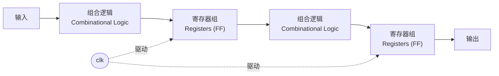
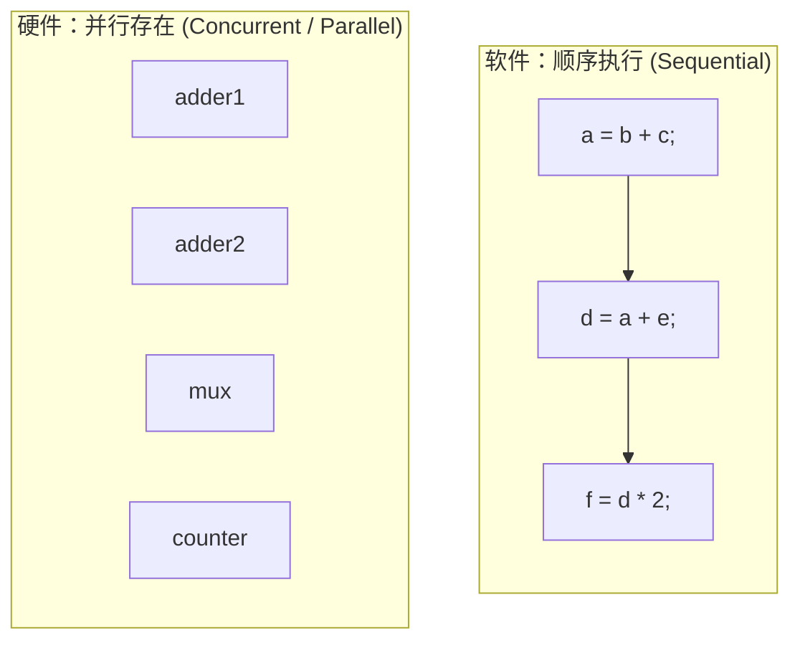
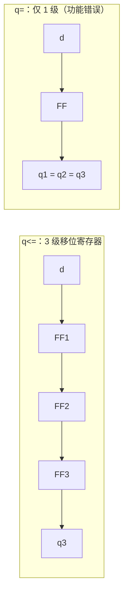
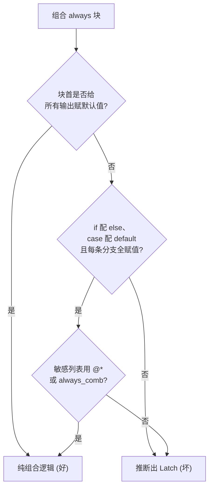
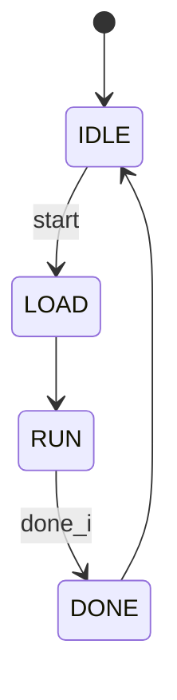
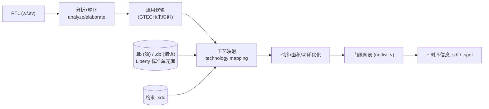

# RTL 语言介绍（以 Verilog 为主）

> 本篇对应课程第 5–10 课与第 61 课，聚焦“如何用一种语言把数字电路写出来、并让综合工具把它变成门级网表”。本质口诀贯穿全篇：**写 Verilog 不是“写程序”，而是“描述硬件”——你写的每一行都对应着可以并行存在的晶体管与连线。**
> 课程原版 (English source): Adam Teman, *Digital VLSI Design (DVD)*, Bar-Ilan University · Course 83-612 · 对应 DVD Lecture 2 (Verilog - Synthesizeable RTL) · https://enicslabs.com/academic-courses/dvd-english/

---

## 1. 抽象层次与 RTL 的位置

### 1.1 是什么

数字 IC 设计是一个**自顶向下、逐层细化**的过程。从最抽象的算法到最终的版图，业界通常用以下几个抽象层次(abstraction level)来描述电路：

| 抽象层次 | 描述对象 | 典型表达 | 对应文件 |
|---|---|---|---|
| 行为级(Behavioral) | 算法/功能，无时序概念 | C/C++、SystemC、行为 Verilog | `.c`/`.cpp`/`.h`（SystemC）、`.v`/`.sv`（行为 Verilog） |
| 寄存器传输级(RTL, Register-Transfer Level) | 寄存器之间的数据传输 + 组合逻辑 | 可综合 Verilog/VHDL | `.v` / `.sv` |
| 门级(Gate Level) | 标准单元(standard cell)与连线 | 综合后网表(netlist) | `.v`(netlist) |
| 晶体管级(Transistor/Switch Level) | MOS 管 | SPICE 网表 | `.sp` / `.cir` |
| 物理/版图级(Layout) | 几何图形 | GDSII / OASIS | `.gds` |

> **注意辨析：** SystemC 是基于 C++ 的一套类库(class library)，源文件后缀是 `.cpp`/`.h`，用于系统级/事务级建模(TLM)；而 **SystemVerilog(`.sv`) 是 Verilog 的超集，与 SystemC 完全是两回事**，切勿混淆。

**RTL = 寄存器传输级**：用“**寄存器(register)之间的数据如何在时钟(clock)驱动下传输，以及寄存器之间的组合逻辑(combinational logic)如何运算**”来描述电路。它是数字前端设计的**主战场**——既足够抽象（不用画门），又足够具体（综合工具能据此推断出确定的硬件结构）。

### 1.2 为什么重要

- RTL 是**人写、机器综合**的分界线。RTL 之上靠人脑设计，RTL 之下（门级、版图）由 EDA 工具自动生成。
- RTL 决定了电路的**微架构(micro-architecture)**：有多少级流水线、多少个寄存器、关键路径(critical path)在哪里。综合工具只能在你给定的微架构内做局部优化，**改变不了你的架构决策**。

### 1.3 RTL 模型的核心心智图



> **一句话概括 RTL：** 电路 = 若干寄存器 + 寄存器之间的组合逻辑云(logic cloud)，所有寄存器被同一个（或几个）时钟边沿同步更新。设计 RTL 就是定义“每个时钟沿，每个寄存器从什么逻辑取值”。

---

## 2. 硬件描述语言(HDL)概览

### 2.1 是什么

硬件描述语言(HDL, Hardware Description Language)是用来描述、仿真、综合数字电路的专用语言。主流有三种：

| 语言 | 起源 | 定位与特点 |
|---|---|---|
| Verilog | 1984，Gateway（后并入 Cadence），IEEE 1364 | 语法类 C，简洁；数字前端事实标准 |
| SystemVerilog(SV) | IEEE 1800，Verilog 的超集 | 增加 `logic`、`always_ff/comb/latch`、接口(interface)、强大验证特性(class/constraint/assertion)；现代 RTL + 验证主力 |
| VHDL | 1980s，美国国防部 | 语法类 Ada，强类型、冗长但严谨；欧洲、航空航天、FPGA 领域常见 |

> 三者关系：**SystemVerilog 向后兼容 Verilog**（合法 Verilog 通常是合法 SV）。本篇以 Verilog 为主，关键处标注 SV 的现代写法。

### 2.2 为什么重要——硬件“并行” vs 软件“顺序”（初学者最大误区）

这是从软件转到硬件**最关键、也最容易翻车**的认知。

- **软件**：CPU 逐条执行指令，语句顺序决定行为，前一句没执行完后一句不会动。
- **硬件**：电路中所有的门、所有的连线**同时、持续地通电工作**。HDL 描述的是“结构”，不是“执行序列”。



> 上图右侧的 `adder1/adder2/mux/counter` 之间**没有连线**，是有意为之：它们彼此独立、同时通电并行存在，画上连线反而会误导成“数据通路”。

**关键结论：**
- 多个 `always` 块、多条 `assign` 语句之间是**并行**的，书写先后顺序**不影响**电路行为。
- 只有在**单个 `always` 块内部**，阻塞赋值(`=`)才表现出“类似顺序”的语义（这其实是仿真器对组合逻辑求值次序的建模，见第 5 节）。
- 不要把 `for` 循环想成“跑多少圈”，综合时它会被**展开(unroll)**成并行的硬件副本（见 8.3 的可综合示例）。

---

## 3. Verilog 基础语法

### 3.1 module 与端口

`module` 是 Verilog 的基本设计单元，对应电路中的一个**模块/块(block)**。

```verilog
// 推荐：ANSI 风格端口声明（Verilog-2001 起）
module adder #(
    parameter WIDTH = 8            // 参数化位宽
) (
    input              clk,
    input              rst_n,      // 低有效复位，命名约定 _n
    input  [WIDTH-1:0] a,
    input  [WIDTH-1:0] b,
    output [WIDTH-1:0] sum,
    inout              io_pad       // 双向口，常见于 IO/总线
);
    assign sum = a + b;
endmodule
```

端口方向：

| 关键字 | 含义 | 物理对应 |
|---|---|---|
| `input` | 输入 | 只能被外部驱动 |
| `output` | 输出 | 由本模块驱动 |
| `inout` | 双向 | 需配合三态(tri-state)使用，典型见于芯片 PAD、共享总线 |

**`inout` 三态双向口的典型写法**：用一个使能信号 `oe`(output enable)控制方向，不输出时驱动高阻 `z`，把总线让给外部：

```verilog
// 双向口最小示例：oe=1 时本模块驱动总线，oe=0 时释放为高阻、接收外部数据
inout  io;
wire   din  = io;                  // 读：直接采样总线
assign io   = oe ? dout : 1'bz;    // 写：oe=0 时输出 z，避免总线冲突(bus contention)
```

> **常见坑：** 多个驱动源同时拉总线（都不为 `z`）会造成总线冲突，仿真出 `x`、硅片上是大电流。必须保证任意时刻**至多一个**驱动源有效。

### 3.2 数据类型：`wire` / `reg` / `logic`

**最常见的误解：`reg` 不等于硬件寄存器！** `reg` 只是“可以在过程块(always/initial)中被赋值的变量”，它**可能**综合成寄存器，也可能综合成纯组合逻辑——取决于你怎么写。

| 类型 | 用途 | 是否对应触发器 |
|---|---|---|
| `wire` | 连续赋值(`assign`)目标、模块互连、可多驱动 | 否（纯连线/组合） |
| `reg` | 过程块(`always`/`initial`)中赋值的目标 | **不一定**，看代码结构 |
| `logic`(SV) | 统一替代 `wire`+`reg`，可被 `assign` 或 `always` 赋值 | 不一定 |

> **现代建议：** 用 SystemVerilog 时，几乎所有单驱动信号都用 `logic`，省去 `wire`/`reg` 的纠结。但要注意 **`logic` 是 4 态的单驱动网/变量，只允许一个驱动源**：一旦出现多驱动（如三态总线、多模块共同驱动同一线网）就会编译报错，此时必须改用 `wire`/`tri`。

### 3.3 位宽与进制表示

```verilog
// 格式： <位宽>'<进制><数值>
8'hFF       // 8 位十六进制 = 11111111
4'b1010     // 4 位二进制
8'd255      // 8 位十进制
16'h00_FF   // 下划线仅为可读性，无意义
-8'sd5      // 有符号(signed)十进制 -5
8'bxxxx_zzzz// x=不定态(unknown)，z=高阻态(high-Z)；此处 4+4=8 位
'0 / '1     // SV：全 0 / 全 1，自动匹配位宽（纯 Verilog-2001 不支持）
```

#### 位宽扩展、截断与有符号陷阱（高频 bug）

Verilog 的位宽规则极易踩坑，务必牢记：

- **默认无符号(unsigned)**：未加 `signed` 的 `reg`/`wire`/字面量都按无符号处理。
- **表达式自动位宽扩展(self-determined / context-determined width)**：表达式的位宽由所有操作数及赋值目标共同决定。若临时结果位宽不够，进位/高位会被悄悄丢弃。

```verilog
reg [7:0] a, b;
reg [7:0] sum8;
reg [8:0] sum9;
// 坑：sum8 = a + b 时，加法结果按 8 位截断，进位(carry)丢失
sum8 = a + b;            // 8'hFF + 8'h01 = 8'h00（进位丢失！）
// 正确：目标位宽足够，或显式扩展，保住进位
sum9 = a + b;            // 结果 9 位，得到 9'h100
sum9 = {1'b0, a} + {1'b0, b};   // 显式补 0 扩展更清晰
```

- **有符号/无符号混算**：只要表达式里有一个操作数是无符号，整个表达式按无符号求值，`signed` 操作数会被当无符号，比较/移位结果可能出乎意料。

```verilog
reg signed [3:0] s = -1;     // = 4'b1111
reg        [3:0] u =  1;
// 坑：s 与无符号 u 比较时，s 被当 4'b1111 = 15（无符号），故 (s > u) 为真！
if (s > u) ... ;             // 直觉上 -1 > 1 应为假，实际为真
```

> **稳妥做法：** 需要有符号运算时，所有相关信号/字面量都显式声明 `signed`（或用 `$signed()`/`$unsigned()` 强制），并预留足够位宽防截断。

### 3.4 常用运算符

| 类别 | 运算符 | 说明 |
|---|---|---|
| 算术 | `+ - * / %` | 除/取模综合代价高，慎用 |
| 关系 | `> < >= <= == !=` | |
| 逻辑 | `&& \|\| !` | 结果为 1 bit |
| 按位 | `& \| ^ ~ ^~` | 逐位运算 |
| 归约(reduction) | `&a \|a ^a` | 对向量所有位做与/或/异或，结果 1 bit |
| 移位 | `<< >> <<< >>>` | `<<<`/`>>>` 为算术移位 |
| 三元 | `cond ? x : y` | 综合成多路选择器(MUX) |
| 拼接/复制 | `{a,b}` / `{4{a}}` | 向量拼接 / 复制 |

```verilog
wire [3:0] nib    = 4'b1011;
// 归约异或 = 把所有位逐位异或；4'b1011 含奇数个(3 个)1，故结果为 1。
// 该结果即“偶校验位(even-parity bit)”：使“数据+校验位”中 1 的总数为偶。
wire       parity = ^nib;          // = 1^0^1^1 = 1
wire [7:0] dup    = {2{nib}};      // 复制拼接 -> 1011_1011
wire [7:0] cat    = {nib, 4'h0};   // 拼接 -> 1011_0000
wire [3:0] mux    = sel ? a : b;   // 2 选 1
```

---

## 4. 过程块与连续赋值

### 4.1 `assign` 连续赋值

驱动 `wire`，描述**纯组合逻辑**，右侧任一信号变化即刻反映到左侧。

```verilog
assign y = (a & b) | c;        // 持续生效，没有时钟概念
```

### 4.2 `always` 过程块

`always` 块根据**敏感列表(sensitivity list)**触发，是描述时序与较复杂组合逻辑的主力。

```verilog
// 组合逻辑：always @(*) 或 SV 的 always_comb
always @(*) begin
    case (sel)
        2'b00:   y = a;
        2'b01:   y = b;
        default: y = 1'b0;
    endcase                    // case 必须以 endcase 闭合（不是 end！）
end

// 时序逻辑：时钟边沿触发
always @(posedge clk) begin
    q <= d;                    // 一个 D 触发器
end
```

> **硬伤提醒：** `case` 必须以 `endcase` 闭合，`if/begin` 才用 `end`。把内层写成 `end` 会直接编译失败，是初学者高频语法错误。

### 4.3 `initial` 块

只在仿真 0 时刻执行一次，**仅用于仿真(testbench)**，一般**不可综合**（见第 9 节可综合子集）。

```verilog
initial begin
    clk = 0;
    forever #5 clk = ~clk;     // 产生 10ns 周期时钟，仅仿真
end
```

### 4.4 SystemVerilog 的意图化过程块（强烈推荐）

| SV 关键字 | 等价 Verilog | 工具检查 |
|---|---|---|
| `always_comb` | `always @(*)` | 综合/lint 报告意外锁存器 |
| `always_ff @(posedge clk)` | `always @(posedge clk)` | 检查是否真的推断触发器 |
| `always_latch` | — | 显式声明确实要锁存器 |

用这些关键字，工具会**主动校验你的意图**，把“无意推断出锁存器”这类错误在编译期就抓出来。

---

## 5. 阻塞赋值(`=`) vs 非阻塞赋值(`<=`)

### 5.1 是什么

| | 阻塞赋值(blocking) `=` | 非阻塞赋值(non-blocking) `<=` |
|---|---|---|
| 语义 | 立即计算并赋值，块内后续语句看到新值 | 先用旧值计算右侧，本时间步统一更新左值 |
| 类比 | 像软件顺序执行 | 像所有触发器“同时”采样 |
| 用于 | **组合逻辑** | **时序逻辑** |

> **严谨说明：** 非阻塞赋值并不是字面意义的“块尾”更新，而是在**当前时间步的非阻塞赋值(NBA, Non-Blocking Assign)事件区域**统一更新——即同一时间步内，先在 active 区域算完所有右值，再到 NBA 区域写回左值。日常可通俗记成“先算后统一更新”，但要知道它源自 Verilog 的分层事件队列(active/inactive/NBA 等 region)。

### 5.2 为什么重要——黄金准则(Golden Rules)

> **1. 时序逻辑（`always @(posedge clk)`）只用 `<=`。**
> **2. 组合逻辑（`always @(*)`）只用 `=`。**
> **3. 绝不在同一个 `always` 块里混用 `=` 和 `<=`。**
> **4. 一个信号只在一个 `always` 块里被赋值（避免多驱动）。**

### 5.3 经典对比：移位寄存器

```verilog
// 正确：用 <= ，三级移位寄存器 q1->q2->q3
always @(posedge clk) begin
    q1 <= d;
    q2 <= q1;     // 用的是“本拍旧的 q1”
    q3 <= q2;
end
```

```verilog
// 错误：在时序块用 = ，全部塌缩成一个触发器
always @(posedge clk) begin
    q1 = d;
    q2 = q1;      // 用的是“刚刚更新的 q1” = d
    q3 = q2;      // 三个 q 都等于 d ！
end
```

下图说明两者推断出的硬件差异：



### 5.4 常见坑

- 在时序块里用 `=` → **竞争(race condition)**、仿真与综合结果可能不一致、移位逻辑塌缩。
- 在组合块里用 `<=` → 仿真可能出现“慢一拍”或多余事件，综合一般仍对，但是坏习惯且可能引入仿真不匹配。
- 同一信号两个 always 块都驱动 → 综合报 **multiple drivers** 错误。

---

## 6. 组合逻辑 vs 时序逻辑建模

### 6.1 组合逻辑建模

输出**只**由当前输入决定，没有记忆。

```verilog
// 4 选 1 MUX
always @(*) begin
    case (sel)
        2'b00: y = d0;
        2'b01: y = d1;
        2'b10: y = d2;
        2'b11: y = d3;
    endcase
end
```

### 6.2 时序逻辑建模——D 触发器与复位

```verilog
// 无复位 DFF
always @(posedge clk)
    q <= d;

// 同步复位(synchronous reset)：复位也要等时钟沿
always @(posedge clk) begin
    if (!rst_n) q <= 1'b0;
    else        q <= d;
end

// 异步复位(asynchronous reset)：rst_n 进敏感列表，断言(assert)立即生效
always @(posedge clk or negedge rst_n) begin
    if (!rst_n) q <= 1'b0;
    else        q <= d;
end
```

> **极易出错的极性匹配（必须背下来）：** 异步复位的敏感列表必须**同时**含时钟边沿与复位边沿，且**复位的边沿方向必须与判断极性一致**：
> - 低有效复位：`@(posedge clk or negedge rst_n)` 配 `if (!rst_n)`；
> - 高有效复位：`@(posedge clk or posedge rst)` 配 `if (rst)`。
>
> 若写成 `@(posedge rst_n)` 却判断 `if(!rst_n)`，工具会报错或推断出语义错误的硬件。**敏感列表写不全、极性配反**是异步复位最常见的两类 bug。

### 6.3 同步复位 vs 异步复位

| | 同步复位 | 异步复位 |
|---|---|---|
| 敏感列表 | 只有 `posedge clk` | 含 `negedge rst_n`（低有效） |
| 优点 | 时序干净、利于 STA、不易受复位毛刺误触发 | 复位断言(assert)不依赖时钟，可在无时钟时强制电路进入已知态 |
| 缺点 | 复位时必须有时钟、占用数据路径逻辑 | 复位释放(de-assert)需做**复位同步**避免亚稳态(metastability) |
| 工业实践 | ASIC 常用 | 也很常用，**异步复位、同步释放**是主流折中 |

> **要点：** “异步”指**断言**那一刻不依赖时钟，可立即把电路拉入已知态；而**释放**那一刻若不与时钟对齐，触发器在恢复时间(recovery)/移除时间(removal)窗口内可能进入亚稳态，故工业上普遍采用“异步断言、同步释放(async assert, sync de-assert)”。注意上电瞬间复位树尚未稳定，并非“一上电就立刻进入复位态”，需由可靠的上电复位(POR)电路保证。

---

## 7. 避免意外锁存器(Latch)

### 7.1 是什么 / 为什么是坑

锁存器(latch)是**电平敏感**的存储元件。在 `always @(*)` 组合块中，如果**某条路径下某个输出没有被赋值**，仿真器为“保持原值”就必须推断出一个 latch。Latch 在 ASIC 流程中是大麻烦：

- 难以做静态时序分析(STA)，时序收敛困难；
- 对毛刺敏感，可能引入功能错误；
- 多数 ASIC 设计规则**默认禁止意外 latch**。

> **与组合环的区别（易混）：** latch 是**电平存储**（有记忆），由“组合块漏赋值”推断而来；组合环(combinational loop)是**无任何存储**的自反馈通路（见 9.2），二者成因和危害不同，别混为一谈。

### 7.2 坏例子 vs 好例子

**坏例子①：`if` 没有 `else`**

```verilog
// BAD：sel=0 时 y 未赋值 -> 推断出 latch
always @(*) begin
    if (en) y = a;
end
```

```verilog
// GOOD-1：补 else
always @(*) begin
    if (en) y = a;
    else    y = 1'b0;
end

// GOOD-2：开头给默认值（推荐，最稳）
always @(*) begin
    y = 1'b0;          // default
    if (en) y = a;
end
```

**坏例子②：`case` 分支不全、缺 `default`**

```verilog
// BAD：sel=2'b10/2'b11 未覆盖 -> latch
always @(*) begin
    case (sel)
        2'b00: y = a;
        2'b01: y = b;
    endcase
end
```

```verilog
// GOOD：补 default（或确保所有分支都给所有输出赋值）
always @(*) begin
    case (sel)
        2'b00:   y = a;
        2'b01:   y = b;
        default: y = 1'b0;
    endcase
end
```

> **`case` 变体与综合质量：** 译码/FSM 中常用 `casez`（`?`/`z` 当通配位）做范围匹配；应**避免 `casex`**，因为它把 `x` 也当通配，仿真/综合行为危险且易掩盖错误。SystemVerilog 还可用 `unique case`/`priority case` 向工具与 lint **声明意图**（互斥/有优先级），帮助综合优化并报告未覆盖项。

**坏例子③：敏感列表不全**

```verilog
// BAD：漏了 b，仿真行为错误（综合一般按 @* 处理，仿真/综合不匹配）
always @(a) y = a & b;
```

```verilog
// GOOD：用 @(*) 让工具自动补全敏感列表
always @(*) y = a & b;
```

### 7.3 避免 latch 的检查清单



> 上图把“块首给默认值”作为一条**捷径分支**：只要在块首给所有输出赋默认值，后续即便分支不全也不会推断出 latch，这是最稳的写法；否则就必须靠 `if/else`、`case/default` 把每条路径补全。

**三板斧：** ① 块首给所有输出赋默认值；② `if` 配 `else`、`case` 配 `default`；③ 用 `always @(*)` / `always_comb`。

---

## 8. 有限状态机(FSM)、参数化与计数器

### 8.1 FSM 写法：一段式 / 两段式 / 三段式

以一个简单的序列检测/握手 FSM 为例，状态：`IDLE → LOAD → RUN → DONE`。

**状态编码(state encoding)：** 常见有二进制(binary)、独热(one-hot)、格雷(gray)。FPGA 因触发器资源充裕，状态数适中时常用 one-hot（省译码逻辑、常更快）；但**状态很多时 one-hot 反而面积大、扇出(fanout)压力大，未必更优**。ASIC 默认按 RTL 里写定的 `localparam` 编码综合；若要让 DC 重新编码，需工具把状态机抽取成 FSM 块并配合 `set_fsm_encoding_style` / `set_fsm_state_vector` / `set_fsm_encoding` 等命令（`compile_ultra` 是综合优化总开关，**并不专门做状态重编码**）。手写常用 `localparam` 显式编码便于调试。

```verilog
module fsm_3seg (
    input            clk, rst_n, start, done_i,
    output reg       busy
);
    // 状态编码用 localparam（内部常量，不可被外部 override，避免被改坏）
    localparam [1:0] IDLE = 2'd0,
                     LOAD = 2'd1,
                     RUN  = 2'd2,
                     DONE = 2'd3;

    reg [1:0] cur, nxt;     // 现态/次态(current/next state)

    // 第①段：时序，状态寄存器（只更新现态）
    always @(posedge clk or negedge rst_n) begin
        if (!rst_n) cur <= IDLE;
        else        cur <= nxt;
    end

    // 第②段：组合，次态逻辑（纯 = ，必须给 nxt 默认值防 latch）
    always @(*) begin
        nxt = cur;                 // 默认保持
        case (cur)
            IDLE: if (start)  nxt = LOAD;
            LOAD:             nxt = RUN;
            RUN : if (done_i) nxt = DONE;
            DONE:             nxt = IDLE;
            default:          nxt = IDLE;
        endcase
    end

    // 第③段：寄存输出(registered output)，时序块 -> 输出无毛刺、时序更友好
    // 注意：寄存输出比现态“晚一拍”，时序图上要据此对齐
    always @(posedge clk or negedge rst_n) begin
        if (!rst_n) busy <= 1'b0;
        else        busy <= (nxt == RUN) || (nxt == LOAD);  // 用 nxt 抵消一拍延迟
    end
endmodule
```

| 写法 | 结构 | 优点 | 缺点/取舍 |
|---|---|---|---|
| 一段式(1-process) | 状态转移+输出全写在一个时序块 | 代码短 | 逻辑混杂，输出与状态耦合，难维护、易出错 |
| 两段式(2-process) | ①时序状态寄存器 ②组合（次态+输出） | 结构清晰，最常用之一 | 业界对“两段式”有多种切分；此处指**次态与输出都放组合块**，故组合输出可能有毛刺(glitch) |
| 三段式(3-process) | ①状态寄存器 ②次态逻辑 ③输出逻辑（可寄存） | **最清晰、可维护、易做寄存输出** | 代码略长 |

> **工业推荐：三段式**。把次态逻辑与输出逻辑分开，便于把输出寄存(registered output)以消除毛刺、改善时序——如上例第③段即用时序块产生寄存输出。若不需要寄存，也可把第③段写成组合块（`always @(*) busy = (cur==RUN)||(cur==LOAD);`），但那样输出仍带毛刺，请按需取舍。



### 8.2 参数化设计(parameter / localparam)

```verilog
module counter #(
    parameter            WIDTH = 8,                 // 可被外部 override
    // 默认值随 WIDTH 联动，避免硬编码 8'd255 在 WIDTH 改变时被截断
    parameter [WIDTH-1:0] MAX  = {WIDTH{1'b1}}      // 默认全 1
)(
    input                  clk, rst_n, en,
    output reg [WIDTH-1:0] cnt,
    output                 tc                        // 终值(terminal count)
);
    localparam [WIDTH-1:0] STEP = 1;                 // 仅内部用，外部不可改

    // 注：'0 为 SystemVerilog 语法；如用纯 Verilog-2001 请改为 {WIDTH{1'b0}}
    always @(posedge clk or negedge rst_n) begin
        if (!rst_n)  cnt <= {WIDTH{1'b0}};
        else if (en) cnt <= (cnt == MAX) ? {WIDTH{1'b0}} : cnt + STEP;
    end

    assign tc = (cnt == MAX);
endmodule
```

实例化时覆盖参数：

```verilog
counter #(.WIDTH(4), .MAX(4'd9)) u_bcd (
    .clk(clk), .rst_n(rst_n), .en(1'b1), .cnt(bcd), .tc(carry)
);
```

- `parameter`：模块的可配置常量，实例化时可 override，用于**可参数化位宽/深度**；默认值应**与参数化位宽自洽**（如上例 `MAX = {WIDTH{1'b1}}`，而非写死 `8'd255` 在 `WIDTH=4` 时被截断）。
- `localparam`：模块内部局部常量，**不可**从外部修改（如状态编码值、固定常数），更安全。

### 8.3 `generate` / `for` 展开的可综合示例

参数化结构常用 `genvar` + `generate for` 在**编译期**展开成并行硬件副本。下例参数化生成 `N` 位行波进位加法器(ripple-carry adder)：

```verilog
module rca #(parameter N = 4) (
    input  [N-1:0] a, b,
    input          cin,
    output [N-1:0] sum,
    output         cout
);
    wire [N:0] c;
    assign c[0] = cin;

    genvar i;
    generate
        for (i = 0; i < N; i = i + 1) begin : gen_fa   // 命名 generate 块（必需）
            assign sum[i] = a[i] ^ b[i] ^ c[i];
            assign c[i+1] = (a[i] & b[i]) | (c[i] & (a[i] ^ b[i]));
        end
    endgenerate

    assign cout = c[N];
endmodule
```

`always` 块内部也可用**定长 `for`**（边界为编译期常量）描述规则结构，综合时同样被展开：

```verilog
// 8 位优先编码：循环在综合时展开为并行逻辑
integer k;
always @(*) begin
    idx = 4'd0;                        // 默认值，防 latch
    for (k = 0; k < 8; k = k + 1)      // 从低位到高位扫描，后写覆盖前写
        if (din[k]) idx = k[3:0];      // 故最高的有效位胜出（最高优先级）
end
```

> **常见坑：** `for` 循环边界必须是**编译期常量**，否则不可综合；`generate for` 的块要**命名**（`begin : name`）以便层次化引用与调试。

---

## 9. 可综合子集 vs 仅仿真结构

### 9.1 是什么

并非所有 Verilog 都能变成硬件。**可综合子集(synthesizable subset)**是综合工具（DC/Genus 等）能映射成门级网表的语法集合。

| 仅用于仿真，不可综合 | 用途 |
|---|---|
| `initial` 块 | testbench 初始化、激励 |
| 延时 `#10` | 仿真时序，硬件没有“delay 语句” |
| `$display / $monitor / $finish` | 仿真打印与控制 |
| `fork...join`、`wait`、real 类型 | 验证/建模 |
| `force / release`、`$random` | 验证 |

| 可综合 | 说明 |
|---|---|
| `assign`、`always @(*)`、`always @(posedge clk)` | 核心建模 |
| `if/else`、`case`、`for`(定长展开) | 控制结构 |
| `parameter/localparam`、`generate` | 参数化/结构生成 |
| 算术/逻辑/位运算 | 映射成对应运算单元 |

### 9.2 常见坑

- 在 RTL 里写 `#5` 延时 → 综合**忽略**该延时，导致仿真（带延时）与综合后（无延时）行为不一致。
- `for` 循环边界必须是**编译期常量**，否则不可综合。
- 综合工具会忽略 `initial`（多数 ASIC 综合流），因此**寄存器初值必须靠复位**，不能靠 `initial`。
- **关键控制寄存器必须可复位**：无复位的 DFF 在 ASIC 上电后为 `x`（不定态），仿真会把 `x` 沿组合逻辑**传播(x-propagation)**，污染下游、掩盖真实 bug。例如下面这种写法在上电时无确定初值：

```verilog
// 风险：无复位，上电后 state 为 x，仿真会向下游传播不定态
always @(posedge clk)
    state <= next_state;          // 关键状态机寄存器务必加复位！
```

- **避免组合环(combinational loop)**：无寄存器打断的自反馈路径会导致振荡、STA 无法分析。
  - 最直接的形式：`assign a = a ^ b;`（左值出现在自身右侧表达式）。
  - 更隐蔽也更常见：FSM/反馈逻辑中，**组合输出又回馈成自己的次态/输入而中间没有寄存器**，例如组合块里 `nxt` 依赖 `out`、`out` 又依赖 `nxt`。
  - **根治原则：任何反馈通路上至少插入一级寄存器**把环打断；切勿用组合逻辑首尾相接形成回路。与 latch 的区别见 7.1（latch 有电平存储，组合环无存储）。

---

## 10. RTL 与综合的衔接

### 10.1 RTL 如何变成标准单元

综合(synthesis)就是把 RTL 翻译成由**标准单元库(standard cell library)** 中的门构成的网表，并满足时序/面积/功耗约束。



- `always @(posedge clk) q<=d;` → 推断出一个 **DFF 标准单元**（如 `DFFRX1`）。
- `assign y = a & b;` → 映射成一个 **AND 单元**（如 `AND2X1`）。
- `cnt + 1` → 映射成一个**加法器**（综合工具从 DesignWare/通用算子库选结构）。
- 三元 `?:` / `case` → 映射成 **MUX**。

> **`.lib` 与 `.db` 的关系（易困惑）：** `.lib` 是**文本**的 Liberty 源文件；`.db` 是 Design Compiler 把 `.lib` 编译后的**二进制**库（用 `read_db`/`link` 读取）。二者是**同一时序模型的两种封装**：日常约束/查看看 `.lib`，DC 流程里加载 `.db`。下文 Tcl 用 `.db`，与上图标注的 `.lib` 是源↔编译关系，并非两份不同的库。

### 10.2 典型综合命令（呼应全流程笔记）

Synopsys Design Compiler(DC) 经典 Tcl 流程片段：

```tcl
# 1. 读库与设计（.db 由 .lib 编译而来）
set link_library   "* sc_tt.db"
set target_library "sc_tt.db"
read_verilog rtl/counter.v
current_design counter
link

# 2. 施加约束（SDC）
create_clock -name clk -period 2.0 [get_ports clk]
# 注意：all_inputs 含 clk，对时钟端口加 input_delay 不规范，应排除时钟
set in_no_clk [remove_from_collection [all_inputs] [get_ports clk]]
set_input_delay  0.4 -clock clk $in_no_clk
set_output_delay 0.4 -clock clk [all_outputs]

# 3. 综合（compile_ultra 为 DC-Ultra 总优化开关，需对应 license；
#         基础 compile 优化能力较弱、无 DesignWare 自动重构等高级特性）
compile_ultra

# 4. 输出网表与时序（新流程用 write_file；write 为兼容旧别名）
write_file -format verilog -hierarchy -output netlist/counter.mapped.v
write_sdc  counter.sdc
report_timing -max_paths 10
report_area
```

对应 Cadence 工具命名（备查）：综合 **Genus**，布局布线 **Innovus**，签核时序 **Tempus**，寄生提取 **Quantus**；Synopsys 对应分别为 DC/Fusion Compiler、IC Compiler II(ICC2)、PrimeTime(PT)、StarRC。

一个最小 Liberty(`.lib`) 片段（**节选**，为聚焦时序模型省略了部分 pin 与 timing 细节）：

```liberty
cell (DFFRX1) {
    area : 5.99 ;
    /* ff 组：定义触发器的状态变量与时钟/复位（RN' 表示 RN 低有效） */
    ff (IQ, IQN) { next_state : "D"; clocked_on : "CK"; clear : "RN'"; }
    pin (D)  { direction : input;  /* timing(setup/hold) 省略 */ }
    pin (CK) { direction : input;  clock : true; }
    pin (RN) { direction : input;  /* 低有效异步复位，timing 省略 */ }
    pin (Q)  { direction : output; function : "IQ";
               timing () { /* 时钟->Q 延时表 省略 */ } }
    pin (QN) { direction : output; function : "IQN"; }
}
```

> **设计含义：** RTL 写得好不好，直接决定综合后的关键路径、面积与功耗。例如把过深的组合逻辑切几级流水、把状态机输出寄存、避免大位宽除法，都是 RTL 阶段就该做的“可综合性/时序友好”设计。

---

## 本章小结

1. **RTL = 寄存器 + 寄存器间组合逻辑**，是“人写、机器综合”的分界线，决定电路微架构。
2. **硬件是并行的**：多个 `always`/`assign` 之间同时存在，书写顺序不代表执行顺序——这是软件转硬件的头号误区。
3. **`reg` ≠ 寄存器**：是否推断触发器取决于代码结构（是否在时钟沿赋值）。
4. **黄金赋值准则**：时序用 `<=`、组合用 `=`、不混用、一个信号一个块驱动。
5. **避免 latch 三板斧**：块首默认值、`if/else` 与 `case/default` 补全、`always @(*)`/`always_comb`；并与组合环区分（latch 有电平存储，组合环无存储）。
6. **FSM 推荐三段式**：状态寄存器 / 次态逻辑 / 输出逻辑分离，第③段用时序块即得寄存输出、消毛刺；状态编码用 `localparam`。
7. **参数化**：`parameter` 对外可配（位宽/深度），默认值要与位宽自洽；`localparam` 内部常量（状态编码）。
8. **可综合子集**：`initial`、`#`延时、`$display` 仅供仿真；寄存器初值靠复位而非 `initial`，关键控制寄存器必须可复位。
9. **位宽陷阱**：默认无符号、表达式自动位宽扩展易丢进位、signed/unsigned 混算出错——预留位宽并显式 `signed`。
10. **RTL → 综合**：触发器/门/MUX/加法器分别映射成对应标准单元，约束(SDC)+库(`.lib`/`.db`)驱动优化。

---

## 易混淆点 · 课后自测

| 考点 | 关键回答要点 |
|---|---|
| `=` vs `<=` | 阻塞=立即、用于组合；非阻塞=本时间步 NBA 区域统一更新、用于时序；移位寄存器须用 `<=`，否则塌缩 |
| `wire` vs `reg` | `wire` 给 `assign`、可多驱动；`reg` 给过程块；`reg` 不必然是触发器；SV 用 `logic` 统一（仅单驱动） |
| 阻塞赋值会推断出寄存器吗 | 看是否在 `@(posedge clk)` 块；组合块的 `=` 不产生触发器 |
| 为什么会产生 latch / 如何避免 | 组合块分支未全赋值 → latch；用默认值 + else/default + `@(*)` 消除 |
| latch vs 组合环 | latch 电平敏感、有存储（漏赋值推断）；组合环无存储、自反馈（须插寄存器打断） |
| 同步复位 vs 异步复位 | 看 `rst` 是否进敏感列表；异步复位边沿与判断极性必须匹配；工业常用“异步断言、同步释放”，复位释放需同步避免亚稳态 |
| 一/两/三段式 FSM | 三段式最清晰、第③段时序块可寄存输出消毛刺；两段式组合输出有毛刺；一段式耦合难维护 |
| 状态编码 | binary 省寄存器、one-hot 状态适中时 FPGA 上常更快/省译码（状态多则面积大）、gray 相邻只变 1 位（低功耗/跨时钟） |
| `parameter` vs `localparam` | 前者实例化可 override（默认值要与位宽自洽），后者模块内常量不可外改（宜用于状态编码） |
| 可综合 vs 仿真 | `initial`/`#`/`$display`/`fork-join` 仅仿真；寄存器初值靠复位 |
| 位宽与符号陷阱 | 默认无符号、表达式自动位宽扩展丢进位、signed/unsigned 混算出错；显式 `signed` 并留足位宽 |
| `case` 写法 | 避免 `casex`（x 当通配危险）；`casez` 谨慎；SV 用 `unique`/`priority case` 表达意图 |
| 阻塞/非阻塞为何不混用 | 防止仿真竞争与“仿真-综合不匹配(sim-synth mismatch)” |
| `always @(*)` vs `always @(a or b)` | 前者自动补全敏感列表，避免漏信号导致的仿真错误 |
| `.lib` vs `.db` | 同一时序模型：`.lib` 文本源、`.db` 为 DC 编译后的二进制库 |
| 时钟门控(clock gating) / 不要门控时钟 | 手动门控时钟易引入毛刺，应用综合工具自动插入 ICG 单元 |

> 笔记整理：J.C — 用于《芯片设计从 RTL 到 GDS》第 5–10、61 课复习与速查。
