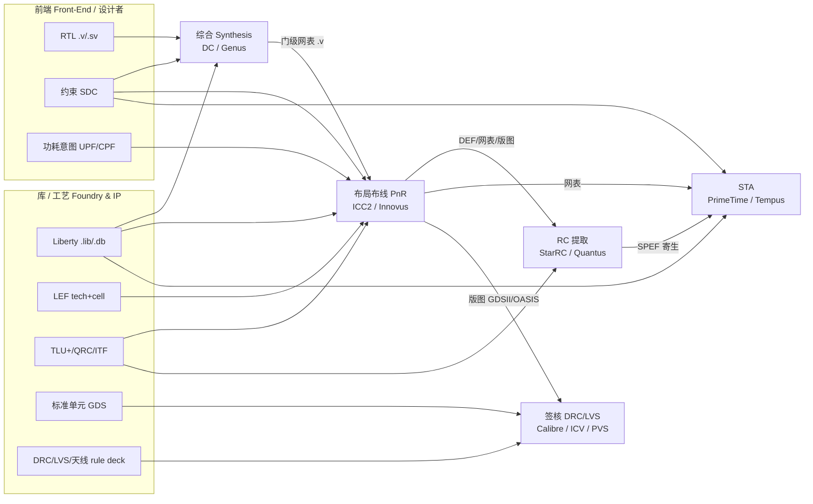
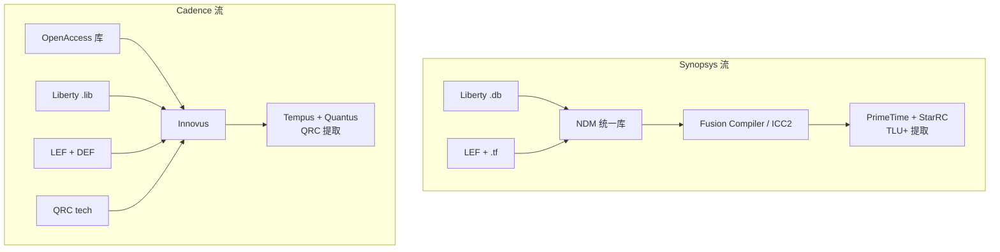

# 数字后端输入文件介绍

> 适用范围：物理实现（Place & Route, PnR）与静态时序分析（Static Timing Analysis, STA）阶段所需的全部输入文件。
> 对齐课程：第13课（标准单元库 / 库定义 / 单元类型）、第14课（LEF / 版图抽象 / 技术库）、第15课（Liberty 时序模型 / 延迟计算 / 电流源模型）、第16课（库文件查阅 / IP 核集成），并关联综合与 SDC。
> 速查定位：当你拿到一个项目，问"我该准备哪些文件、谁给我、给谁用"时，直接看本篇的总览表与各小节"是什么 / 为什么 / 由谁产生·被谁消费 / 怎么做 / 常见坑"。
> 课程原版 (English source): Adam Teman, *Digital VLSI Design (DVD)*, Bar-Ilan University · Course 83-612 · 对应 DVD Lecture 3 (Logic Synthesis I - Standard Cell Libraries) · https://enicslabs.com/academic-courses/dvd-english/

---

## 一、总览：后端到底吃哪些文件

数字后端（back-end）关注的两大分析维度是 **物理实现（PnR，布局布线）** 与 **时序签核（STA，静态时序分析）**。需要说明的是，STA 并非后端独有：它贯穿前端综合到最终签核，PnR 引擎内部也内嵌时序分析。它们都不"凭空"工作，而是消费一组从前端、库供应商（foundry / IP vendor）、综合工具传递下来的文件。可以按用途把输入分成六大类：

| 类别 | 中文(English) | 代表文件 | 一句话作用 |
|---|---|---|---|
| 逻辑 | 逻辑连接(Logical) | 门级网表 `.v` | 设计"连了什么单元、怎么连" |
| 时序/功耗 | 时序与功耗(Timing & Power) | Liberty `.lib` / `.db` | 每个单元的延迟、约束、功耗模型 |
| 物理 | 物理抽象 / 库容器 / 版图 | LEF（抽象）、NDM/Milkyway（库容器）、GDS（最终版图） | 单元/宏的尺寸、引脚、布线层、版图 |
| 约束 | 设计约束(Constraints) | SDC、UPF/CPF | 时钟、IO 延迟、电源意图 |
| 寄生/RC | 寄生提取(Parasitic/RC) | TLU+、QRC tech、ITF | 把布线几何换算成 R、C |
| 工艺/规则 | 工艺与规则(Technology & Rules) | tech file、map、rule deck | 工艺角、层映射、DRC/LVS/天线规则 |

> 注意"物理"这一类内部层次不同：**LEF 才是物理抽象**（只给尺寸/引脚/阻挡）；**NDM/Milkyway 是库数据库/容器格式**（封装逻辑+物理+时序多视图）；**GDS 是含全部多边形的最终版图**。三者不可混为一谈，详见第八节。

一个最小但完整的"PnR 启动料包"通常包含：**网表 + .db(.lib) + LEF + SDC + TLU+ + (可选)UPF**。STA 还会额外吃 **SPEF / SDF**。需要强调：SPEF/SDF 并非来自 foundry/前端的外部交付件，而是由后端 PnR / RC 提取流程内部产生，再作为 STA / 门级仿真的关键**输入**——对本篇主题（后端输入文件）而言，它们恰恰是 STA 不可或缺的输入，下文第七节会专门辨析其"产生者→消费者"链路。

> 料包形态因流而异：在 Synopsys NDM 流里，LEF/Liberty/tech file 已被编译进 NDM，启动料包以 NDM 库形态交付；在 Cadence 流里则是 LEF + .lib 分立。两流料包不等价，迁移时勿照搬清单。

### 1.1 数据流总览图



> 图中两个关键纠正：① **SDC 由前端/设计者编写**，同时喂综合、PnR、STA，并非综合的产物；② **SPEF 由独立的 RC 提取工具（StarRC/Quantus）产生**，不是 PnR 直接吐出，与正文口径一致。

---

## 二、门级网表 Gate-Level Netlist（`.v`）

### 是什么
门级网表(gate-level netlist)是**综合(synthesis)**工具（Synopsys Design Compiler/DC、Fusion Compiler；Cadence Genus）把 RTL 映射到目标工艺库后产出的 Verilog 文件。它只包含**对工艺库单元(standard cell)与宏(macro)的例化(instantiation)**，以及它们之间的连线(net)，不再有 `always`、`if`、`+` 这类行为级描述。

### 为什么重要
它是后端的"骨架"——PnR 拿到它才知道要摆放哪些单元、连哪些线；STA 拿到它才知道时序路径怎么走。它是前端到后端的**核心交接物之一**（SDC、UPF 同样在综合阶段一并交接）。

### 由谁产生 / 被谁消费
- **产生者**：综合工具（DC / Fusion Compiler / Genus）。
- **消费者**：PnR（ICC2 / Innovus）、STA（PrimeTime / Tempus）、LVS（与提取网表比对）、门级仿真。

### RTL vs 门级网表（核心区别）

| 维度 | RTL | 门级网表 |
|---|---|---|
| 抽象层级 | 行为/寄存器传输级 | 工艺单元级 |
| 语句 | `always`、运算符、`if/case` | 仅 `module` 例化 + `wire` |
| 单元名 | 无（待综合） | `AND2_X1`、`DFFRX2` 等库单元 |
| 可仿真性 | 功能仿真 | 门级仿真(需 `.v` sim model + SDF) |
| 时序 | 无 | 由库单元决定 |

### 怎么做（典型片段）

```verilog
// RTL 风格
always @(posedge clk) q <= d;

// 综合后门级网表风格
module top (clk, d, q);
  input  clk, d;
  output q;
  wire   clk_int;                                       // 显式声明内部 net
  CLKBUFX2 \clk_buf (.A(clk), .Y(clk_int));             // 综合插入的时钟缓冲
  DFFRX1   \reg_q  (.D(d), .CK(clk_int), .Q(q), .QN()); // CK 由 buffer 输出驱动；QN 悬空仅示意
endmodule
```

> 片段要点：buffer 输出 `clk_int` 真正驱动 DFF 的 `CK`，所有 net 均已声明；`QN()` 留空表示该输出未使用（教学示意，实际工具会保留或优化）。转义标识符 `\reg_q`、`\clk_buf` 结尾需有一个空格（Verilog 转义标识符规则）。

DC 中导出命令：
```tcl
write_verilog -hierarchical ./netlist/top.mapped.v
# 若物理实现 / 低功耗流程需要带电源地引脚，加 -pg：
write_verilog -pg ./netlist/top.mapped.pg.v
```

### 常见坑
- **网表必须和读入后端的 `.lib`/LEF 出自同一套库**，否则会报 "cell not found"。
- 网表里的转义标识符（如 `\reg_q[0] `，注意结尾有空格）在脚本里匹配时容易踩坑。
- **是否输出电源/地(PG)引脚由导出选项决定**，并非固定规律：功能验证网表常省略 PG（VDD/VSS 视为全局连接）；物理实现、尤其是 UPF 多电压/多电源域流程常要求带 PG pin 的网表（`write_verilog -pg`）。

---

## 三、时序/功耗库 Liberty（`.lib` / 编译后 `.db`）

### 是什么
Liberty（后缀 `.lib`，ASCII 文本）是描述**每个标准单元/宏在某个工艺角下的时序与功耗特性**的库文件。它回答："这个单元从输入到输出延迟多少？输入电容多大？建立/保持约束是什么？漏电多少？"

`.db` 是 Synopsys 把 `.lib` **编译后的二进制格式**，读写更快；DC/ICC2/PrimeTime 直接吃 `.db`（也可读 `.lib`）。Cadence 工具直接读 `.lib`。

### 由谁产生 / 被谁消费
- **产生者**：foundry / IP vendor 用**库表征(library characterization)**工具（如 Synopsys SiliconSmart）跑 SPICE 生成 `.lib`；`.db` 由 Synopsys Library Compiler 编译。
- **消费者**：综合（DC/Genus）、PnR（ICC2/Innovus）、STA（PrimeTime/Tempus）、功耗分析。

### 为什么重要
没有 Liberty，工具不知道任何单元的延迟和功耗，综合无法优化、STA 无法算时序、功耗分析无从谈起。它是**时序与功耗的"真值表"**。

### 内容详解

**3.1 时序弧(timing arc) 与单边性(unateness)**
描述某个"输入引脚 → 输出引脚"之间的时序关系，分类：
- 组合弧(combinational arc)：如 AND 的 A→Y。
- 时序弧(sequential)：如触发器 CK→Q 的传播延迟。
- 约束弧(constraint arc)：setup/hold/recovery/removal。

每条组合弧还带 **`timing_sense`（单边性 unateness）**：
- `positive_unate`（正单边，如缓冲/与门，输入升→输出升）；
- `negative_unate`（负单边，如反相器/与非门，输入升→输出降）；
- `non_unate`（非单边，如 XOR、时钟到 Q 路径），需两个方向都算。

条件时序用 **`when`** 描述状态相关弧（如不同选择信号下的延迟），`mode` 用于模式相关时序。

**3.2 延迟模型：NLDM / CCS / ECSM**

| 模型 | 全称 | 原理 | 特点 |
|---|---|---|---|
| NLDM | 非线性延迟模型(Non-Linear Delay Model) | 二维查找表(LUT)，以输入转换时间(slew)与输出负载电容(load)为索引，查出延迟与输出 slew | 经典、文件小；成熟工艺仍广泛用于签核，先进节点精度受限 |
| CCS | 复合电流源(Composite Current Source) | 把单元输出建模为随时间变化的电流源 I(t)，对负载更精确 | 精度高、文件大；含 CCS-timing / CCS-power / CCS-noise |
| ECSM | 有效电流源模型(Effective Current Source Model) | 以输出电压波形为主的电流源模型，含 ECSM-timing / ECSM-power / ECSM-noise（亦称 ECSM-aging） | Cadence 主导推动（现走向开放/IEEE 方向），与 CCS 定位相当 |

> 互读说明：Synopsys（PrimeTime）与 Cadence（Tempus）的签核工具对 CCS 与 ECSM 多有互读支持，"某模型只能某家用"并不准确。

NLDM 片段（**`index_1`/`index_2` 对应哪个变量由模板 `lu_table_template` 的 `variable_1`/`variable_2` 声明决定，并非固定**）：
```liberty
/* 先定义模板：本例 variable_1=输入转换(slew)，variable_2=输出负载(load) */
lu_table_template (delay_template_7x7) {
  variable_1 : input_net_transition ;          /* slew */
  variable_2 : total_output_net_capacitance ;  /* load */
  index_1 ("0.01, 0.04, 0.08, 0.16, 0.32, 0.64, 1.28");
  index_2 ("0.5, 1.0, 2.0, 4.0, 8.0, 16.0, 32.0");
}

cell (AND2_X1) {
  area : 1.064 ;
  pin (Y) {
    direction : output ;
    timing () {
      related_pin   : "A" ;
      timing_sense  : positive_unate ;
      /* 模板已定义索引，引用时通常不必重复写 index_1/index_2 */
      cell_rise   (delay_template_7x7) { values ( "0.021,...", "0.025,...", ... ); }
      cell_fall   (delay_template_7x7) { values ( "0.020,...", "0.024,...", ... ); }
      rise_transition (delay_template_7x7) { values ( "0.012,...", ... ); }  /* 输出 slew，时序传播必需 */
      fall_transition (delay_template_7x7) { values ( "0.011,...", ... ); }
    }
  }
  pin (A) { direction : input ; capacitance : 0.0012 ; }
}
```

> 关键提醒：延迟表（`cell_rise/cell_fall`）必须与转换表（`rise_transition/fall_transition`）**成对出现**——没有输出 slew 表，slew 无法向下级传播，时序就算不下去。

CCS 在驱动端 timing 组里多出 `output_current_rise/fall`（输出电流波形）；接收端则用 `receiver_capacitance`（分段输入电容，描述 Miller 效应下随输入翻转变化的有效输入电容），二者配合实现对负载的精确建模。

**3.3 输入电容与转换时间**
- `capacitance` / `rise_capacitance` / `fall_capacitance`：引脚负载，决定上一级延迟。
- 转换时间(transition/slew)是延迟 LUT 的索引之一，slew 传播是时序计算核心。

**3.4 时序约束：setup / hold**
触发器数据引脚上的 `timing_type : setup_rising / hold_rising`，给出相对时钟的建立/保持时间，用于 STA 判 violation。

**3.5 设计规则约束(DRV) 与降额(derate)**
库里还有直接影响综合/PnR 的**设计规则约束(Design Rule Constraint, DRV)**：
- `max_transition` / `default_max_transition`：最大允许转换时间；
- `max_capacitance`：引脚/网络最大负载电容；
- `max_fanout`：最大扇出。

先进工艺签核绕不开**偏差/降额**：片上偏差(On-Chip Variation, OCV)、高级 OCV(AOCV) 与参数化 OCV(POCV)。库可携带 `k_*` 比例因子(scaling/k-factor)，工具侧再用 `set_timing_derate` 施加降额。

**3.6 功耗与 PG 引脚**
- 漏电功耗(leakage power)：`cell_leakage_power`。**漏电随温度升高而增大**；最坏漏电角通常是 **快角(ff) + 高压 + 高温**（如 `ff_0p88v_125c`），而慢角(ss)漏电最小。务必记住"高温→漏电大"。
- 内部功耗(internal power)：`internal_power()` 组，与翻转有关的短路+充放电能量。
- 动态功耗还需结合活动率（VCD/SAIF）由功耗工具算。
- **`pg_pin` / `related_power_pin` / `related_ground_pin`**：CCS 与低功耗（多电压）流程必需，库中显式声明每个引脚关联的电源/地，UPF 才能正确连 PG。

**3.7 PVT 工艺角(corner)**
每个 `.lib` 对应一组 **PVT = 工艺(Process) / 电压(Voltage) / 温度(Temperature)**。`library` 头部必须声明 `delay_model` 与单位等顶层属性：
```liberty
library (sc_ss_0p72v_125c) {
  delay_model           : table_lookup ;   /* 顶层必填：没有它库无意义 */
  time_unit             : "1ns" ;
  voltage_unit          : "1V" ;
  current_unit          : "1mA" ;
  capacitive_load_unit (1, pf) ;
  pulling_resistance_unit : "1kohm" ;
  nom_process : 1.0 ; nom_voltage : 0.72 ; nom_temperature : 125.0 ;
  operating_conditions ("ss_0p72v_125c") {
    process : 1.0 ; voltage : 0.72 ; temperature : 125.0 ;
    /* tree_type 属线负载模型(WLM)旧概念，合法值为 balanced_tree/worst_case_tree/best_case_tree；
       现代物理实现流程不用 WLM，operating_conditions 中通常省略此行 */
  }
  default_operating_conditions : ss_0p72v_125c ;
}
```
常用角：`ss`(slow-slow, 最慢, 查 setup)、`ff`(fast-fast, 最快, 查 hold)、`tt`(typical)。多角多模(MMMC)分析需要一套库覆盖所有 corner。

### 怎么做（编译 / 读入）
```tcl
# .lib -> .db ：Synopsys Library Compiler（lc_shell）命令
read_lib  sc_ss_0p72v_125c.lib
write_lib sc_ss_0p72v_125c -format db -output sc_ss_0p72v_125c.db
# 等价地，dc_shell 中可用 read_db / write_db 读写已编译的 .db

# ICC2/PT 中关联
set_app_var link_library "* sc_ss_0p72v_125c.db ram_ss.db"
```

### 常见坑
- **库名(library name)与文件名可不同**，`link_library` 用的是库内部名（首行 `library(...)`）。
- corner 用错（拿 ff 库查 setup）会得到乐观结果，掩盖真实违例。
- **同一 corner 内时序模型要一致**（NLDM 与 CCS 不要在同一签核场景混用）；先进节点（约 ≤28nm）签核推荐 CCS/ECSM，成熟工艺（如 40nm 及以上）NLDM 仍可用于签核。
- 宏（SRAM/IP）的 `.lib` 往往单独提供，IP 集成时要核对其 PVT 与单元库一致。

---

## 四、物理抽象库 LEF（Library Exchange Format）

### 是什么
LEF（Library Exchange Format，由 Cadence 提出并开放、现为业界事实标准的 ASCII 格式）描述**物理布线所需的几何抽象信息**，分两类：

1. **技术 LEF(technology LEF)**：描述工艺本身——金属层(layer)、布线规则、过孔(via)、site、单位、电气/几何规则。**全设计共用一份。**
2. **单元/宏 LEF(cell/macro LEF)**：描述每个标准单元或宏的**外形尺寸(size)、引脚(pin)位置与所在层、布线阻挡(OBStruction, OBS)**。

### 由谁产生 / 被谁消费
- **产生者**：foundry（technology LEF、标准单元 LEF）、IP vendor（宏 LEF）。
- **消费者**：PnR（Innovus 直接读；ICC2 多经编译进 NDM）、布线 DRC、寄生提取的层名对齐。

### 为什么 PnR 用抽象而不是完整 GDS
GDS 含每个单元的**全部多边形（晶体管、所有层）**，数据量巨大。PnR 只需知道"单元多大、引脚在哪、哪里不能布线"。LEF 把单元简化成**一个带引脚和阻挡的黑盒**，让布局布线引擎跑得快、内存省。最终签核(LVS)才用真实 GDS。

> 注意 LEF 只含**粗略电气信息**（如 `RESISTANCE RPERSQ`），精确 RC 由提取工具的 tech 文件（TLU+/QRC）提供，不要指望 LEF 给出签核级 RC。

### 4.1 technology LEF 内容
```lef
UNITS
  DATABASE MICRONS 1000 ;
END UNITS

MANUFACTURINGGRID 0.005 ;     # 制造网格，所有几何须对齐其整数倍

LAYER metal1
  TYPE ROUTING ;
  DIRECTION HORIZONTAL ;
  PITCH 0.14 ;                # 布线间距
  WIDTH 0.07 ;               # 最小线宽
  SPACING 0.07 ;             # 最小间距
  RESISTANCE RPERSQ 0.38 ;   # 方块电阻（粗略，精确 RC 靠 TLU+/QRC）
  CAPACITANCE CPERSQDIST 0.00015 ;
  EDGECAPACITANCE 0.00005 ;
END metal1

VIA VIA12 DEFAULT
  LAYER metal1 ; RECT -0.035 -0.035 0.035 0.035 ;
  LAYER via1   ; RECT -0.035 -0.035 0.035 0.035 ;
  LAYER metal2 ; RECT -0.035 -0.035 0.035 0.035 ;
END VIA12

SITE core
  CLASS CORE ;
  SYMMETRY Y ;               # 允许沿 Y 翻转摆放（行间镜像必需）
  SIZE 0.19 BY 1.4 ;         # 标准单元行的基本格点（决定行高）
END core
```

### 4.2 cell / macro LEF 内容
标准单元用 `CLASS CORE`；**宏（如 SRAM）用 `CLASS BLOCK`，IO 单元用 `CLASS PAD`，end-cap 用 `CLASS ENDCAP`**。引脚需用 `USE` 标注信号类型：
```lef
MACRO AND2_X1
  CLASS CORE ;
  SIZE 0.76 BY 1.4 ;                 # 单元外形（宽 x 行高）
  SITE core ;
  PIN A
    DIRECTION INPUT ;
    USE SIGNAL ;
    PORT
      LAYER metal1 ; RECT 0.10 0.40 0.17 0.50 ;   # 引脚在 metal1 上的可连接矩形
    END
  END A
  PIN Y  DIRECTION OUTPUT ; USE SIGNAL ; PORT LAYER metal1 ; RECT 0.55 0.40 0.62 0.50 ; END END Y
  PIN VDD DIRECTION INOUT ; USE POWER  ; ... END VDD
  PIN VSS DIRECTION INOUT ; USE GROUND ; ... END VSS
  OBS
    LAYER metal1 ; RECT 0.0 0.0 0.76 0.10 ;        # 布线阻挡：此处禁止布线
  END
END AND2_X1
```
> 其它常见且重要的属性：`PIN ... USE CLOCK`（时钟引脚）、天线相关 `ANTENNADIFFAREA` / `ANTENNAGATEAREA` 等，供布线器判天线效应。

### 怎么做（读入）
```tcl
# Innovus 经典流：在 init 阶段指定 LEF（顺序：tech LEF 先于 cell LEF）
set init_lef_file {tech.lef stdcell.lef macros.lef}
init_design
# 新接口等价写法：set_db init_lef_file {tech.lef stdcell.lef macros.lef}

# ICC2 一般用 NDM；LEF 经技术映射 / lef2ndm 流程构库后读入
```

### 常见坑
- **technology LEF 必须先于 cell LEF 读入**，否则层未定义报错。
- 标准单元高度须为 **SITE 高度的整数倍**：单行高单元等于一个 SITE 高；但也存在 **2x/3x 多行高(multi-height)单元**，须是 SITE 高度整数倍才能正确摆入行(row)。
- OBS 缺失会让布线器在单元内部乱布导致短路；OBS 过度会人为拥塞。
- LEF 与 Liberty 的引脚名、单元名必须一一对应（物理-时序视图一致性）。

---

## 五、约束 SDC（Synopsys Design Constraints）

### 是什么
SDC（Synopsys Design Constraints，源自 Tcl）是**时序约束的入口文件**：定义时钟、IO 延迟、伪路径、多周期路径、输入转换/输出负载等。综合、PnR、STA 都消费同一份（或派生）SDC。

### 由谁产生 / 被谁消费
- **产生者**：设计者 / 前端工程师手写（非综合产物）。
- **消费者**：综合（DC/Genus）、PnR（ICC2/Innovus）、STA（PrimeTime/Tempus）。

### 在输入中的角色（细节见 SDC 专题笔记）
本篇只定位它："告诉工具时序目标是什么"。没有 SDC，工具无法判断时序是否收敛——它是**约束维度的总开关**。

```sdc
create_clock -name clk -period 1.25 [get_ports clk]      ;# 1/1.25ns = 800 MHz
# all_inputs 含 clk 端口本身，应把时钟端口剔除，否则会给 clk 也加 input_delay：
set inputs_no_clk [remove_from_collection [all_inputs] [get_ports clk]]
set_input_delay  0.3 -clock clk $inputs_no_clk
set_output_delay 0.3 -clock clk [all_outputs]
set_input_transition  0.1 $inputs_no_clk                ;# 输入端口的驱动 slew
set_load              0.05 [all_outputs]                ;# 输出端口的负载电容
set_clock_uncertainty 0.05 [get_clocks clk]
set_false_path -from [get_ports test_mode]
```

### 常见坑
- `set_input_delay ... [all_inputs]` 会把**时钟端口自身**也加上 input_delay（`all_inputs` 含 clk），应先用 `remove_from_collection` 剔除时钟端口，这是初学者高发错误。
- 后端读入前需把综合用的"理想时钟"约束补上 CTS 后的实际偏差（或在后端启用 propagated clock）。
- MMMC 下每个 scenario 关联不同 SDC + 库 + 寄生，配错会分析错对象。

---

## 六、功耗意图 UPF / CPF

### 是什么
**UPF(Unified Power Format, IEEE 1801)** 与 **CPF(Common Power Format, Cadence 主导)** 是描述**低功耗设计意图**的文件，给多电压/多电源域设计用。功能网表本身不含"哪块该断电、哪里要电平转换"，这些信息由 UPF/CPF 单独提供。

### 由谁产生 / 被谁消费
- **产生者**：设计者 / 低功耗架构师手写。
- **消费者**：综合、PnR、签核（DRC/LVS、功耗、UPF 验证）、功耗仿真——同一份"golden UPF"贯穿全流程。

> 工具阵营：Synopsys 全流程主推 **UPF**；Cadence 早期用 CPF，现也支持 UPF。新项目基本统一到 **UPF**。

### 核心概念

| 概念 | 中文(English) | 作用 |
|---|---|---|
| power domain | 电源域(power domain) | 一组共享供电/可独立开关的逻辑 |
| supply set | 供电集(supply set) | 把 power/ground net 打包，便于策略引用（新式 UPF 推荐） |
| isolation | 隔离单元(isolation cell) | 关断域输出钳位，防止浮空传到开域 |
| level shifter | 电平转换(level shifter) | 跨不同电压域信号转换 |
| power switch | 电源开关(power switch / MTCMOS) | 给可断电域插入开关管 |
| retention | 保持寄存器(retention register) | 断电时保留状态的特殊触发器 |
| power state table | 电源状态表(PST) | 枚举各电源域的合法电压组合，UPF 验证核心 |

### 怎么做（UPF 片段）
> 以下示例兼顾**经典/旧式**与**新式 supply_set** 两种风格。`-isolation_power_net` / `-retention_power_net` 是旧式写法（IEEE 1801-2009 风格，仍可用）；较新版本（1801-2015+）推荐 `-isolation_supply_set` / `associate_supply_set`。

```tcl
create_power_domain PD_TOP
create_power_domain PD_CPU -elements {u_cpu}

# 供电端口/网络（新式建议用 supply_set 打包）
create_supply_port VDD ;  create_supply_net VDD
create_supply_port VSS ;  create_supply_net VSS
create_supply_net  VDD_SW
associate_supply_set [create_supply_set ss_cpu -function {power VDD_SW} -function {ground VSS}] \
    -handle PD_CPU.primary

# 电源开关
create_power_switch sw_cpu -domain PD_CPU \
    -input_supply_port {in VDD} -output_supply_port {out VDD_SW} \
    -control_port {ctrl pwr_en}

# 隔离：旧式 -isolation_power_net；新式可用 -isolation_supply_set
set_isolation iso_cpu -domain PD_CPU -isolation_power_net VDD -isolation_ground_net VSS \
    -clamp_value 0 -applies_to outputs

# 电平转换（跨电压域信号）
set_level_shifter ls_cpu -domain PD_CPU -applies_to outputs -location self

# 保持寄存器
set_retention ret_cpu -domain PD_CPU -retention_power_net VDD -retention_ground_net VSS

# 电源状态表（PST）：枚举合法供电组合，UPF 验证的核心
add_power_state PD_CPU.primary -state {ON  {-supply_expr {power == FULL_ON}}} \
                               -state {OFF {-supply_expr {power == OFF}}}
```

### 常见坑
- UPF 在综合、PnR、签核、功耗仿真各阶段需保持一致（"golden UPF"贯穿）。
- 跨域信号缺隔离/电平转换 = LVS/功能错误；这是低功耗设计高发坑。
- 电源网（supply net）名要与 PG（Power/Ground）连接、网表 supply、库 `pg_pin` 一致。
- UPF 写法随 IEEE 1801 版本差异较大（2009 / 2015 / 2018），团队需统一版本，避免新旧命令混用导致工具解释不一致。

---

## 七、寄生与 RC 提取相关文件

### 是什么
布线完成后，金属线本身有电阻 R 与电容 C（寄生 parasitic）。要把"几何尺寸"换算成"R、C 值"，需要**RC 提取技术文件**。主流：

| 文件 | 产生者 | 消费者 | 说明 |
|---|---|---|---|
| ITF (`.itf`) | **foundry** | StarRC（用于编译 TLU+） | 互连工艺文件(Interconnect Technology Format)，TLU+ 的源 |
| `.tluplus` (TLU+) | **StarRC**（由 ITF + layer map 编译） | ICC2 / StarRC | 提取用的电容/电阻查找表 |
| QRC tech file | foundry / Quantus 流程 | Quantus / Innovus | Cadence 流的精确电容/电阻技术库 |
| captable | Cadence | Innovus 布线阶段 | 电容表，用于布线阶段快速 RC 估算（签核级精确提取用 QRC tech） |
| nxtgrd | StarRC | StarRC | 提取用的工艺网格文件 |

> 工具命令说明：现代流程中由 **Synopsys 工具（StarRC 流程）将 ITF + layer map 编译为 TLU+**。历史上曾用 `grdgenxo` 等可执行名，但具体命令随 PDK / 工具版本而异，初学者应以当前 PDK 文档为准，不必记死某个可能过时的命令名。

### 为什么重要
RC 决定**互连延迟(interconnect delay)**与串扰(crosstalk)；先进工艺互连延迟常超过单元延迟。没有正确的 RC tech，布线后时序就是错的。

### RC corner 与 MMMC
先进工艺 RC 提取按 corner 区分，常见命名：`cbest` / `cworst`（电容最优/最差）、`rcbest` / `rcworst`（RC 综合最优/最差）、`typical`。这些 RC corner 在 MMMC 中与库 corner、SDC 组合成分析场景(scenario)。max/min 两套 TLU+ 必须对上正确的 setup/hold 场景。

### 输出：SPEF（对提取是产物，对 STA 是输入）
提取工具（StarRC/Quantus）读 RC tech + DEF/版图，产出 **SPEF(Standard Parasitic Exchange Format)** 寄生文件，再交给 STA。**SPEF 对 PnR/提取是产物、对 STA 是关键输入**——这是初学者最易混的点。相关寄生格式还有 **DSPF**（含晶体管级详细寄生）与 **SBPF**（二进制压缩格式），SPEF 是 STA 最常用的标准交换格式；提取还会建模 **耦合电容(coupling capacitance)** 以支持串扰分析。

### 由谁产生 / 被谁消费（汇总）
- **ITF**：foundry 产生 → StarRC 消费（建 TLU+）。
- **TLU+**：StarRC 编译产生 → ICC2 / StarRC 消费。
- **SPEF**：StarRC / Quantus 产生 → STA（PrimeTime/Tempus）、门级仿真消费。

```tcl
# ICC2 关联 TLU+
read_parasitic_tech -tlup max.tluplus -layermap layer.map -name rcmax
read_parasitic_tech -tlup min.tluplus -layermap layer.map -name rcmin
set_parasitic_parameters -late_spec rcmax -early_spec rcmin

# StarRC 提取产生 SPEF（命令文件中关键项）
# TCAD_GRD_FILE / MAPPING_FILE / NETLIST_FILE ... -> top.spef
```

### 常见坑
- **layer map** 把 LEF/DEF 的层名映射到 ITF/QRC 的层名，错一行整张提取错。
- max/min 两套 TLU+（对应 RC corner）别用反，影响 setup/hold。

---

## 八、物理设计交换 / 库格式

### 8.1 DEF（Design Exchange Format）
**DEF** 是 LEF 的"伴侣"，描述**具体设计实例**的物理信息：floorplan（die/core 面积）、行(ROW)、布线轨道(TRACKS)、布局(placement)、布线(NETS 的 routing 段)、PG 网(SPECIALNETS)、引脚位置(PINS)。它用于工具间交换设计状态（如 PnR → 第三方分析）。DEF 的主要 section 包括：

| Section | 作用 |
|---|---|
| `DIEAREA` | 芯片/核心边界 |
| `ROW` | 标准单元行（基于 SITE 阵列） |
| `TRACKS` | 各层布线轨道 |
| `GCELLGRID` | 全局布线网格 |
| `COMPONENTS` | 实例及其坐标/朝向 |
| `PINS` | 设计 IO 引脚位置 |
| `SPECIALNETS` | 电源/地(PG) 网络 |
| `NETS` | 信号网络（含布线段 routing） |

```def
VERSION 5.8 ;
DESIGN top ;
UNITS DISTANCE MICRONS 1000 ;
DIEAREA ( 0 0 ) ( 200000 200000 ) ;
COMPONENTS 2 ;
  - u_and AND2_X1 + PLACED ( 1000 1400 ) N ;     # 实例 + 坐标 + 朝向
  - u_dff DFFRX1  + PLACED ( 1760 1400 ) FS ;
END COMPONENTS
# 实际 DEF 还含 ROW / TRACKS / PINS / SPECIALNETS / NETS 等 section
```

> 记忆法：**LEF = 库（怎么样的单元）；DEF = 设计（这些单元摆哪了、怎么连）。**

### 8.2 库格式阵营

| 格式 | 阵营 | 说明 |
|---|---|---|
| Milkyway (MW) | Synopsys(旧, ICC/老 DC) | 早期物理库数据库，以目录结构 + Library Manager 组织 |
| NDM (`.ndm`) | Synopsys(新, ICC2/FC) | 新一代统一库容器，整合逻辑+物理+时序多视图，常以 workspace/library 形式管理 |
| OpenAccess (OA) | Cadence/业界联盟 | Innovus/Virtuoso 共用的开放数据库 |
| GDSII / OASIS | 业界 | 最终版图交付格式（见下） |

Synopsys 现代流程把 LEF/Liberty/tech file 编译成 **NDM** 统一库：
```tcl
# Fusion/ICC2 建库（库管理器）
create_workspace -technology tech.tf my_lib
read_lef {tech.lef stdcell.lef}
read_db  {sc.db}
write_lib my_lib -output ./libs/my_lib.ndm
```

### 8.3 GDSII / OASIS（最终版图）
- **GDSII**：业界几十年标准的二进制版图格式，含所有层多边形，交付 foundry 流片用。
- **OASIS**：更紧凑的新一代版图格式，先进节点大设计常用，文件通常**显著更小（常达数倍乃至约一个数量级）**。
- PnR 完成后 `write_gds`/`write_oasis` 导出，再做 DRC/LVS 签核。

### 常见坑
- DEF/LEF 单位（DATABASE MICRONS）不一致会整体错位。
- 跨工具 OA ↔ Milkyway/NDM 转换可能丢失部分属性，需校验。

---

## 九、工艺与规则文件

| 文件 | 中文(English) | 作用 | 消费者 |
|---|---|---|---|
| `.tf` | 技术文件(technology file) | Synopsys 物理库的工艺定义（层、color、密度等） | ICC2/FC 建库 |
| layer map | 层映射(layer map) | LEF/DEF 层名 ↔ GDS 层号(layer#)+数据类型(datatype)、↔ 提取层名 | 提取、GDS 导出 |
| antenna rules | 天线规则(antenna rules) | 限制金属面积/栅极比，防工艺天线效应损伤 | 布线、签核 |
| DRC rule deck | 设计规则检查(Design Rule Check) | 几何规则集，验证版图可制造 | Calibre/ICV/PVS DRC |
| LVS rule deck | 版图与原理图一致性(Layout vs Schematic) | 比对版图与网表连接是否一致 | Calibre/ICV/PVS LVS |
| fill / density 规则 | 金属填充/密度规则 | 满足 CMP 平坦化的金属覆盖率，影响良率 | 填充、签核 |
| ITF | 互连工艺文件(Interconnect Tech Format) | RC 提取的工艺源（见第七节） | StarRC 建 TLU+ |

天线规则在 LEF 中也有体现（`ANTENNADIFFAREA`、`ANTENNAGATEAREA`），布线器据此插入天线二极管或跳层。layer map 用于 **GDS stream out** 时，对每个层须给出 **层号(layer number) + 数据类型(datatype)** 双字段；metal fill / density 规则保障 CMP 平坦化，是先进工艺签核必查项。

DRC/LVS 由三家签核工具执行（**Siemens EDA Calibre / Synopsys IC Validator(ICV) / Cadence Physical Verification System(PVS)**）。以 Calibre 为例：
```bash
calibre -drc  -hier  drc_rules.svrf
calibre -lvs  -hier  lvs_rules.svrf  -spice extracted.sp
```

### 常见坑
- rule deck 版本必须匹配 PDK 版本（foundry 经常更新）。
- layer map 同时服务"GDS 导出"和"RC 提取"两个用途，常分两份，别搞混。

---

## 十、文件 → 用途 → 产生者 → 消费者 → 后缀 总表

| 文件 | 用途 | 产生者 | 消费者 | 典型后缀 |
|---|---|---|---|---|
| 门级网表 | 逻辑连接 | 综合 DC/Genus | PnR、STA、LVS | `.v` / `.vg` |
| Liberty | 时序/功耗模型 | foundry/IP 表征 | 综合、PnR、STA | `.lib` |
| 编译库 .db | Liberty 二进制 | Library Compiler | Synopsys 全流程 | `.db` |
| technology LEF | 层/via/site/规则 | foundry | PnR | `.lef`/`.tlef` |
| cell/macro LEF | 单元外形/引脚/OBS | foundry/IP | PnR | `.lef` |
| SDC | 时序约束 | 设计者/前端 | 综合、PnR、STA | `.sdc` |
| UPF/CPF | 功耗意图 | 设计者 | 综合、PnR、签核 | `.upf`/`.cpf` |
| ITF | RC 提取工艺源 | **foundry** | StarRC（建 TLU+） | `.itf` |
| TLU+ | RC 提取查找表 | **StarRC**（ITF+map 编译） | ICC2、StarRC | `.tluplus` |
| QRC tech | RC 提取工艺(Cadence) | foundry/Quantus | Innovus、Quantus | (目录) |
| SPEF | 寄生(提取产物/STA 输入) | StarRC/Quantus | STA、门级仿真 | `.spef` |
| SDF | 反标延迟(产物/仿真输入) | PnR/STA | 门级仿真 | `.sdf` |
| DEF | 物理实例交换 | PnR | 工具间交换 | `.def` |
| NDM / Milkyway | Synopsys 物理库容器 | 库管理器 | ICC2/FC | `.ndm` / (MW 目录) |
| OpenAccess | 开放物理库 | Innovus/Virtuoso | Cadence 流 | (OA 目录) |
| GDSII / OASIS | 最终版图 | PnR | 签核、流片 | `.gds`/`.oas` |
| tech file | 工艺定义 | foundry | ICC2/FC 建库 | `.tf` |
| layer map | 层映射 | foundry | 提取/GDS 导出 | `.map` |
| DRC/LVS deck | 规则验证 | foundry | Calibre/ICV/PVS | `.svrf`/`.rul` |
| 天线规则 | 防天线效应 | foundry | 布线/签核 | (含于 LEF/deck) |

### Synopsys 流 vs Cadence 流差异



| 维度 | Synopsys | Cadence |
|---|---|---|
| 物理库 | **NDM**（旧 Milkyway） | **LEF/DEF + OpenAccess** |
| 综合 | Design Compiler / Fusion Compiler | Genus |
| PnR | IC Compiler II (ICC2) / Fusion Compiler | Innovus |
| STA | PrimeTime (PT) | Tempus |
| 寄生提取 | StarRC（TLU+ / ITF） | Quantus（QRC tech） |
| 时序库读入 | 编译 `.db` | 直接读 `.lib` |
| 电流源模型 | CCS（也可读 ECSM） | ECSM（也支持 CCS） |
| 功耗格式 | UPF 为主 | CPF / UPF |
| 物理验证 | IC Validator (ICV) | PVS（业界亦广用 Calibre） |

---

## 十一、本章小结

1. 后端输入按六类记忆：**逻辑(网表) / 时序功耗(Liberty) / 物理(LEF·DEF·NDM·GDS) / 约束(SDC·UPF) / 寄生(TLU+·QRC) / 工艺规则(tf·map·deck)**。
2. **最小启动料包 = 网表 + .db/.lib + LEF + SDC + TLU+ (+UPF)**；STA 再加 SPEF。注意料包形态因流而异：Synopsys NDM 流里 LEF/Liberty 已编进 NDM。
3. **物理类三层次要分清**：LEF 是物理抽象、NDM/Milkyway 是库容器、GDS 是真版图。PnR 用 LEF 跑得快，签核才用 GDS。
4. **Liberty 决定时序与功耗**，NLDM 用 LUT、CCS/ECSM 用电流源；`index_1/index_2` 对应变量由模板 `variable_1/2` 定义；每个 corner 一套库，ss 查 setup、ff 查 hold；**漏电随温度升高而增大，最坏漏电角是 ff+高压+高温**。
5. **SPEF/SDF 不是 foundry/前端的外部交付件**，而是后端流程内部产生、再作为 STA/门级仿真的关键输入——分清"谁产生、谁消费"是关键。
6. 工具阵营：**Synopsys 走 NDM + .db + TLU+ + PT/StarRC**；**Cadence 走 LEF/DEF + OA + QRC + Tempus/Quantus**；签核 DRC/LVS 三家为 Calibre / ICV / PVS。

---

## 十二、易混淆点 · 课后自测

| 问题 | 关键回答 |
|---|---|
| RTL 和门级网表区别？ | RTL 是行为级、可综合；网表是工艺单元例化，含真实库单元名，可门级仿真。 |
| 为什么 PnR 用 LEF 不用 GDS？ | LEF 是几何抽象（size+pin+OBS），数据量小、跑得快；GDS 含全部多边形，仅签核/流片用。 |
| LEF / NDM / GDS 都是"物理"，区别？ | LEF=物理抽象；NDM/Milkyway=库容器（封装逻辑+物理+时序）；GDS=含全部多边形的最终版图。 |
| `.lib` 和 `.db` 区别？ | `.db` 是 `.lib` 的 Synopsys 二进制编译版，内容等价、读写更快；Cadence 直接读 `.lib`。 |
| NLDM vs CCS vs ECSM？ | NLDM 用二维 LUT（slew×load）查延迟；CCS（Synopsys）/ECSM（Cadence）用电流源建模输出，对负载更精确，先进节点签核用；两家工具多可互读。 |
| Liberty 的 `index_1` 一定是 slew 吗？ | 不一定。`index_1/index_2` 对应哪个变量由模板的 `variable_1/variable_2` 声明决定。 |
| 漏电与温度/工艺角的关系？ | 漏电随温度升高而增大；最坏漏电角通常是快角(ff)+高压+高温，慢角(ss)漏电最小。 |
| LEF vs DEF？ | LEF=库（单元长什么样）；DEF=设计（单元摆哪、怎么连，含 ROW/TRACKS/PINS/SPECIALNETS/NETS）。 |
| SPEF 是输入还是输出？ | 对 PnR/提取是输出，对 STA 是输入；由 StarRC/Quantus 从 RC tech + 版图生成，属流程内部产物而非外部交付。 |
| ITF 和 TLU+ 谁产生谁？ | ITF 由 foundry 提供；TLU+ 由 StarRC 将 ITF + layer map 编译生成，供 ICC2/StarRC 把布线几何换成 R、C。 |
| 为什么需要多个 corner 的 lib？ | PVT 变化使延迟/漏电不同；ss 角查 setup（最慢）、ff 角查 hold（最快），MMMC 全覆盖。 |
| UPF 解决什么？还需哪些核心命令？ | 描述电源域、隔离、电平转换、电源开关、保持寄存器等低功耗意图；电源状态表(PST)是 UPF 验证核心，贯穿综合到签核。 |
| Milkyway 和 NDM？ | 都是 Synopsys 物理库容器；Milkyway 是旧 ICC 用的目录数据库，NDM 是 ICC2/FC 的新一代统一库。 |
| 网表里一定没有电源引脚吗？ | 不一定。是否输出 PG 由导出选项决定（如 `write_verilog -pg`）；功能验证网表常省略，物理实现/低功耗流程常需带 PG。 |
| 天线效应怎么防？ | 按天线规则（金属/栅极面积比）布线，超限则跳层或插天线二极管；规则在 LEF/deck 中。 |

---

> 速查提示：拿到新项目先核对"库三件套"——**Liberty(.db/.lib) + LEF + RC tech(TLU+/QRC)** 是否 PVT/层名/单元名三者对齐，这是后端报错最高发的根因。
