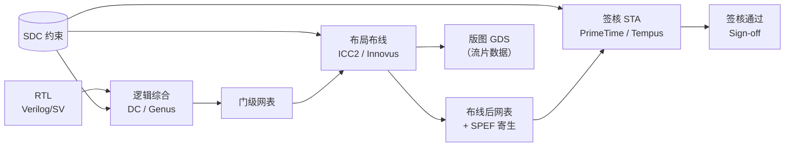
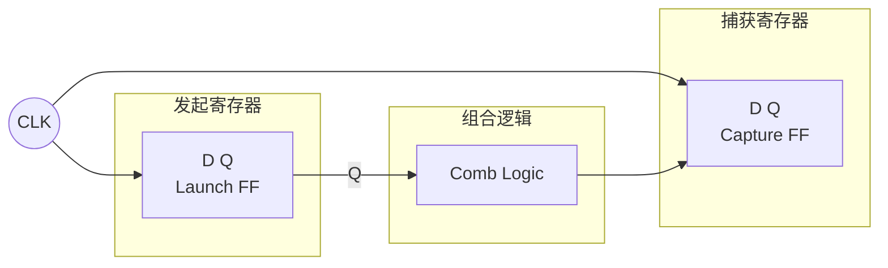
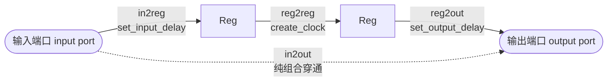
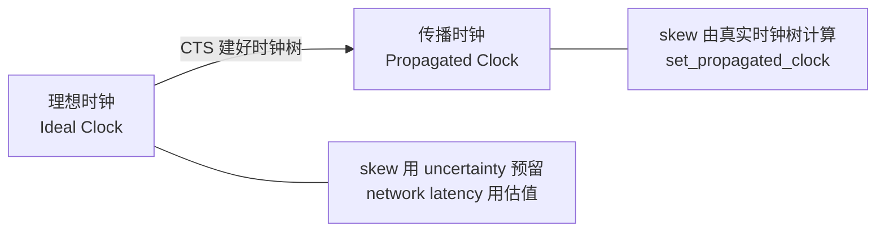
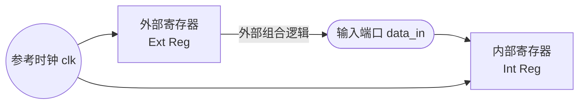
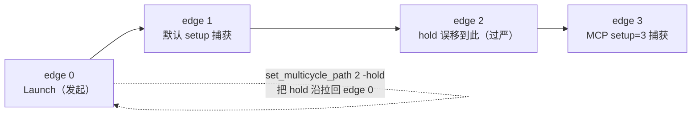
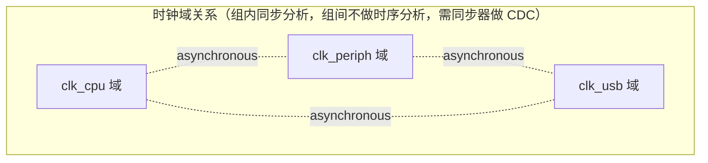
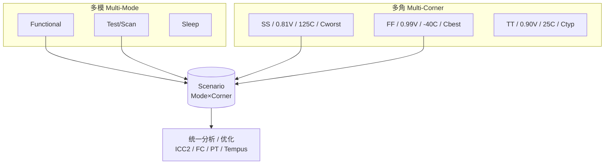

# SDC 时序约束介绍

> 学习笔记 · 对应《芯片设计从RTL到GDS》第27课（设计约束与SDC语法）、第28课（时钟定义与IO约束），并衔接第24–26课（同步时序、STA、关键路径）与第30课（多模多角 MMMC）
> by J.C
> 课程原版 (English source): Adam Teman, *Digital VLSI Design (DVD)*, Bar-Ilan University · Course 83-612 · 对应 DVD Lecture 5 (Static Timing Analysis) · https://enicslabs.com/academic-courses/dvd-english/

---

## 目录

1. [SDC 是什么 & 为什么需要约束](#1-sdc-是什么--为什么需要约束)
2. [STA 基础回顾（建立/保持/裕量/路径组）](#2-sta-基础回顾)
3. [时钟约束](#3-时钟约束)
4. [IO 约束](#4-io-约束)
5. [时序例外 Timing Exceptions](#5-时序例外-timing-exceptions)
6. [模式与时钟域：case analysis / clock groups](#6-set_case_analysis--set_clock_groups)
7. [设计规则约束 DRC](#7-设计规则约束-drc)
8. [工作条件与多模多角 MMMC](#8-工作条件与多模多角-mmmc)
9. [完整 SDC 示例脚本（带中文注释）](#9-完整-sdc-示例脚本带中文注释)
10. [本章小结](#10-本章小结)
11. [易混淆点 / 面试高频考点](#11-易混淆点--面试高频考点)

---

## 1. SDC 是什么 & 为什么需要约束

### 是什么

**SDC（Synopsys Design Constraints，新思科技设计约束）** 是一种基于 **Tcl（Tool Command Language，工具命令语言）** 的文本格式约束文件，最早由 Synopsys 提出，现已成为数字 IC 设计领域**事实上的工业标准**，被各大 EDA 厂商工具广泛支持。

它的核心作用是：用一组命令告诉 EDA 工具**“芯片要跑多快、外部环境长什么样、哪些路径不用管、哪些路径要特殊对待”**，从而让综合、布局布线和时序分析工具有一个统一的“性能目标 + 边界条件”。

SDC 贯穿后端全流程，被同一份（或派生的多份）约束驱动：



> 说明：签核 STA（PrimeTime）是在 PnR 之后、基于**布线后网表 + 寄生参数（SPEF，Standard Parasitic Exchange Format，标准寄生交换格式，由 StarRC / Quantus 提取）** 做的；**GDS 是 PnR 后导出的版图数据，并非 STA 的输入前置**。STA 与 GDS 都是 PnR 后的产物，二者是并列关系，而非“先出 GDS 再签核”。

### 为什么需要约束

| 没有约束会怎样 | 约束解决的问题 |
| --- | --- |
| 工具不知道目标频率，会把电路优化成“能跑多慢就多慢”，面积最小但性能不达标 | `create_clock` 定义频率目标 |
| 工具不知道芯片外部电路的延迟，无法保证芯片**与板级/其他模块**之间正确握手 | `set_input_delay` / `set_output_delay` 建模外部路径 |
| 工具会对**根本不存在的伪路径**反复优化，浪费资源甚至无法收敛 | `set_false_path` 等时序例外 |
| 工具无法判断**多周期路径**，会过度优化或误报违例 | `set_multicycle_path` |
| 没有 DRC 上限，会出现超大扇出/超长 transition，导致信号完整性问题 | `set_max_transition` 等 |

> **一句话总结**：约束是设计意图（design intent）到工具的“翻译层”。**约束不全 → 漏优化漏检查；约束过度（over-constrain）→ 工具瞎使劲，面积功耗暴涨甚至不收敛。** 约束写得对不对，直接决定芯片能不能用、做得好不好。

### 常见坑

- SDC 是 Tcl，**支持变量、循环、过程**，但应保持可读、可移植；避免在 SDC 中写复杂控制流。
- 不同工具对 SDC 的支持有细微差异（如某些选项 PrimeTime 支持而 Design Compiler 不支持），**最终应以签核工具 PrimeTime（PT）的解释为准**。
- 单位默认由库（Liberty）决定（通常时间为 ns、电容为 pF），写约束前务必确认；最佳实践是在脚本头部显式声明 `set_units -time ns -capacitance pF`，避免跨库单位歧义。

---

## 2. STA 基础回顾

> 静态时序分析 **STA（Static Timing Analysis，静态时序分析）** 是 SDC 服务的核心对象。理解 STA 才能理解每条约束在算什么。

### 2.1 建立时间与保持时间

- **建立时间 setup time（建立时间）**：数据必须在**捕获时钟有效沿到来之前**稳定的最短时间。违例 → 数据来不及，频率打不上去（**和周期/速度相关**）。
- **保持时间 hold time（保持时间）**：数据必须在**捕获时钟有效沿之后**保持稳定的最短时间。违例 → 新数据来得太快把当前数据冲掉（**和周期无关，和延迟差相关**）。

### 2.2 发起沿与捕获沿

- **发起沿 launch edge（发起沿）**：发起寄存器（launch FF）在该时钟沿把数据发出。
- **捕获沿 capture edge（捕获沿）**：捕获寄存器（capture FF）在该时钟沿采样数据。
- 对单周期 reg→reg 路径：launch 在第 0 个沿，setup 的 capture 在第 1 个沿（间隔 1 个周期 T）；hold 的 capture 在第 0 个沿（同一沿）。



### 2.3 裕量 slack

$$
\text{Slack} = \text{Required Time（要求到达时间）} - \text{Arrival Time（实际到达时间）}
$$

- **Setup slack** = 要求最晚到达 − 实际最晚到达；**slack ≥ 0 即不违例**。
- **Hold slack** = 实际最早到达 − 要求最早到达。
- Slack 为负 = **违例（violation）**。所有路径中 slack 最差的一条即 **关键路径（critical path，关键路径）**。

**Setup 检查的标准不等式**。先定义各项，再写关系，避免符号记反：

| 符号 | 含义 |
| --- | --- |
| `Tcq` | 发起寄存器 clk→Q 延迟 |
| `Tlogic_max` | 数据路径最大组合延迟 |
| `Tsetup` | 捕获寄存器建立时间 |
| `Tuncertainty` | 时钟不确定度（setup） |
| `Tperiod` | 时钟周期 |
| `Tlaunch_latency` | 发起时钟从源到 launch FF 时钟脚的到达延迟 |
| `Tcapture_latency` | 捕获时钟从源到 capture FF 时钟脚的到达延迟 |

数据到达时间（data arrival）= `Tlaunch_latency + Tcq + Tlogic_max`
数据要求时间（data required）= `Tperiod + Tcapture_latency − Tsetup − Tuncertainty`
要求 **Arrival ≤ Required**，整理后即：

```text
Tcq + Tlogic_max + Tsetup + Tuncertainty <= Tperiod + (Tcapture_latency - Tlaunch_latency)
```

> 注意 `Tuncertainty` 在 setup 检查中**从 required 侧扣除**（使要求更紧）；`(Tcapture_latency − Tlaunch_latency)` 正是两侧时钟到达延迟之差（即理想化的 skew 项），这一项体现了 latency 对时序的真实影响——初学者最易把 uncertainty 的符号和 latency 项漏掉或记反。

### 2.4 四种时序路径组

STA 把所有路径归为四类，约束（尤其 IO 约束）正是按这四类组织：



| 路径组 | 起点 → 终点 | 主要由谁约束 |
| --- | --- | --- |
| **reg→reg**（内部路径） | 寄存器 → 寄存器 | 时钟周期 `create_clock` |
| **in→reg**（输入路径） | 输入端口 → 寄存器 | `set_input_delay` |
| **reg→out**（输出路径） | 寄存器 → 输出端口 | `set_output_delay` |
| **in→out**（穿通路径） | 输入端口 → 输出端口（纯组合） | `set_max_delay` 或 in/out delay 组合 |

---

## 3. 时钟约束

> 时钟是 STA 的“节拍器”。**没有时钟定义，相关时序路径就不会被分析。** 时钟约束是 SDC 的第一要务。

### 3.1 create_clock —— 主时钟

**是什么**：在某个端口或引脚上定义一个**主时钟（master/primary clock，主时钟）**，给出周期、占空比和有效沿位置。

**怎么做**：

```tcl
# 周期 10ns（100MHz），50% 占空比，作用于端口 clk
create_clock -name clk -period 10.0 [get_ports clk]

# 自定义波形：周期 8ns，0ns 上升、3ns 下降（占空比 37.5%）
create_clock -name clk_a -period 8.0 -waveform {0 3} [get_ports clk_a]
```

| 选项 | 含义 |
| --- | --- |
| `-name` | 时钟对象名（建议显式命名，便于后续引用） |
| `-period` | 周期，单位由库决定（通常 ns） |
| `-waveform {rise fall}` | 一个周期内的上升/下降时刻，缺省为 `{0 period/2}` 即 50% |
| `-add` | 在同一对象上**叠加**额外时钟（不覆盖已有时钟），常用于多时钟复用同一引脚 |
| `源（get_ports/get_pins）` | 时钟源对象；省略源对象即为虚拟时钟（见 3.3） |

**常见坑**：
- `-period` 越小 = 频率越高 = 约束越紧；写错小数点会导致严重过/欠约束。
- 时钟源应打在**实际时钟入口**（端口或 PLL 输出 pin），不要打在内部任意网络上。

### 3.2 create_generated_clock —— 生成时钟

**是什么**：由主时钟经过**分频、倍频、反相、相移**等电路（分频器、PLL、时钟门控等）产生的时钟，叫 **生成时钟（generated clock，生成时钟）**。STA 必须知道它和源时钟的精确关系，否则跨这两个时钟的路径会被错误分析。

**为什么重要**：**忘记定义 generated clock 是最高频的约束错误之一**。最常见的后果分两种情形，不可一概而论：

1. **分频器输出 pin 上没有任何时钟定义（最常见）**：该 pin 下游寄存器**没有时钟，相关路径根本不被分析（unconstrained，漏检）**——这是“带病流片”的典型来源，而**不是**“按源时钟偏紧约束”。
2. **源时钟以组合方式传播到下游（某些工具/写法下）**：下游可能沿用**源时钟周期**，从而出现时钟关系错误、虚假违例或约束不合理。

无论哪种情形，正解都是在生成点显式 `create_generated_clock`，让工具知道真实的分频/倍频关系。

**怎么做**：

```tcl
# 二分频：在分频器输出 pin 上定义，周期是源时钟的 2 倍
create_generated_clock -name clk_div2 \
    -source [get_pins u_div/clk_in] \
    -divide_by 2 \
    [get_pins u_div/clk_out]

# 倍频（如 PLL 输出 ×4）
# 注意：generated clock 的 -multiply_by 只是按整数倍“缩放”源时钟边沿、
# 描述频率关系，并不真正建模 PLL 的相位/抖动；PLL 实际行为应由其库模型刻画。
create_generated_clock -name clk_x4 \
    -source [get_pins u_pll/REFCLK] \
    -multiply_by 4 \
    [get_pins u_pll/CLKOUT]

# 时钟门控（ICG）后的时钟：1:1 传递。
# 标准做法是不写 divide/multiply，让工具按 1:1 自动传播；
# 是否需要显式定义取决于流程——很多流程下门控时钟可由源时钟自动传播而无需重定义。
create_generated_clock -name clk_gated \
    -source [get_pins u_icg/CK] \
    [get_pins u_icg/GCK]
```

| 选项 | 含义 |
| --- | --- |
| `-source` | **源时钟对象所在的 pin/port**（注意：是源点，不是名字） |
| `-divide_by N` / `-multiply_by N` | 分频 / 倍频系数 |
| `-edges {...}` / `-edge_shift {...}` | 用边沿列表精确描述复杂波形 |
| `-invert` | 反相 |
| `-master_clock` | 当源 pin 上有多个时钟时指明以哪个为主 |

**常见坑**：
- `-source` 给的应是**网表中真实的 pin**，PLL/分频器换了实现，source pin 名要同步更新。
- 一个 source pin 上若存在多个时钟，必须用 `-master_clock` 消歧。
- 对复杂门控/多路选择的生成时钟，可配合 `set_clock_sense`（或 `set_sense`）指定时钟边沿/传播方向，避免工具推断错误。

### 3.3 虚拟时钟 virtual clock

**是什么**：没有实际源对象（不连任何端口/pin）的时钟，叫 **虚拟时钟（virtual clock，虚拟时钟）**。它只作为 **IO 延迟的参考时钟**而存在——表示“芯片外部那个驱动/采样我的时钟”，但这个时钟并不真正进入本设计。

**为什么重要**：当输入数据由一个**片外时钟**驱动、而这个时钟在本设计里没有对应端口时，用虚拟时钟作为 `set_input_delay -clock` 的参考，能正确建模外部时序关系，又不会污染内部时钟树。

```tcl
# 定义虚拟时钟（无源对象）
create_clock -name vclk -period 10.0

# 输入延迟参考这个虚拟时钟
set_input_delay -clock vclk -max 4.0 [get_ports data_in]
```

> **配套提醒**：虚拟时钟通常与内部时钟之间没有真实物理关系，应通过 `set_clock_groups -asynchronous`（或 `set_false_path`）显式声明二者关系，否则会产生**虚假跨域路径**被误分析。详见第 6 节与第 9 节示例。

### 3.4 set_clock_uncertainty —— 时钟不确定度

**是什么**：用一个**保守数值**为时钟的各种**不理想因素预留裕量**，包括 **抖动（jitter，抖动）**、（理想时钟阶段对尚未实现的）**偏斜（skew，时钟偏斜）的预留**，以及分析裕量（margin）。

> 概念辨析：**uncertainty ≠ skew**。skew 严格指“同一时钟到达不同寄存器时钟脚的到达时间差”；uncertainty 只是用一个悲观数值**为这个差（及 jitter/margin）预留空间**，它不是 skew 本身。CTS 建好真实时钟树后，skew 会被实际计算，uncertainty 中的 skew 预留分量就应去掉（见 3.6）。

```tcl
# 同一时钟内 setup 留 0.2ns，hold 留 0.05ns 不确定度
set_clock_uncertainty -setup 0.20 [get_clocks clk]
set_clock_uncertainty -hold  0.05 [get_clocks clk]

# 跨时钟域不确定度（-from/-to 指定时钟对）
set_clock_uncertainty -setup 0.30 -from [get_clocks clkA] -to [get_clocks clkB]
```

**为什么重要 / 常见坑**：
- **setup 和 hold 检查都会用到 uncertainty**：setup 检查时从 required 侧减去（缩小裕量），hold 检查时加到 required 侧（收紧要求），**两者都使分析更保守**——并非只在 setup 用。
- **综合 & 布局前阶段（理想时钟）**：时钟树还没建，skew 用 uncertainty 整体预留（如 setup 含 jitter+skew 预留+margin，hold 主要含 skew 预留+margin）。
- **CTS 之后（传播时钟）**：真实 skew 由时钟树计算，uncertainty 中应**去掉 skew 分量，只留 jitter + margin**，否则重复扣减、过约束。
- **uncertainty ≠ latency**：uncertainty 是“波动/裕量”，latency 是“延迟”，二者完全不同（见 3.5、面试考点）。

### 3.5 set_clock_latency —— 时钟延迟

**是什么**：时钟从“源头”到达寄存器时钟引脚所经历的延迟，分两段：

- **源延迟 source latency（时钟源到设计端口的延迟）**：时钟源（片外晶振、PLL、板级走线）**到本设计时钟端口之前**的延迟，是“芯片之外”的部分。**注意：source 指的是“时钟源”，与“电源/power”毫无关系。**
- **网络延迟 network latency（片内时钟网络延迟）**：从时钟端口到各寄存器时钟脚，经过**片内时钟树**的延迟。

```tcl
# 源延迟（片外，2ns），用 -source 标志
set_clock_latency -source 2.0 [get_clocks clk]

# 网络延迟（理想阶段对时钟树的估计，1ns），无 -source
set_clock_latency 1.0 [get_clocks clk]
```

**为什么重要 / 常见坑**：
- **CTS 之前**：时钟树未建，需用 `set_clock_latency`（network）**估计**时钟树延迟。
- **CTS 之后**：时钟树已实现，network latency 应由 `set_propagated_clock` **真实传播**计算，此时**不再人为设 network latency**（但 source latency 仍保留，因为片外那段工具算不出来）。

### 3.6 理想时钟 vs 传播时钟：set_propagated_clock



| 阶段 | 时钟模型 | skew 来源 | network latency 来源 |
| --- | --- | --- | --- |
| 综合 / Pre-CTS | **理想时钟（ideal）** | 含在 `set_clock_uncertainty` 中（预留） | `set_clock_latency`（估计） |
| Post-CTS / 签核 | **传播时钟（propagated）** | 真实时钟树计算 | 真实时钟树计算 |

```tcl
# 进入传播时钟模式（CTS 后 / STA 签核必加）
set_propagated_clock [all_clocks]
```

> **配套约束**：对复位、扫描使能等**高扇出网**，理想阶段常用 `set_ideal_network` / `set_ideal_latency` 标记为理想网，避免工具在 CTS/优化中误把它们当普通信号反复 buffer。

### 3.7 时钟 transition

时钟的 **过渡时间（transition / slew，转换时间）** 影响单元延迟。理想时钟阶段可用 `set_clock_transition` 指定一个固定值近似时钟脚的 slew；传播时钟阶段则由实际时钟网络计算。

```tcl
# 理想阶段给时钟一个固定 transition（如 0.1ns）
set_clock_transition 0.1 [get_clocks clk]
```

---

## 4. IO 约束

> IO 约束的本质：把“芯片之外的那段电路”**建模**进来，让边界路径（in→reg、reg→out）有意义。**没有 IO 约束，输入输出路径不会被正确分析。**

### 4.1 set_input_delay —— 输入延迟

**是什么**：描述**外部逻辑**从参考时钟沿出发、到达本设计输入端口所**已经消耗**的时间。



**预算近似**：留给片内的最大组合延迟 ≈ `T − input_delay(max) − Tsetup − Tuncertainty`（再叠加 latency 修正）。**注意这只是直观近似**，精确预算还要扣掉建立时间和不确定度，仅用 `T − input_delay` 估算会偏乐观。

```tcl
# 输入端口 data_in 相对 clk，最大外部延迟 4ns、最小 1ns
set_input_delay -clock clk -max 4.0 [get_ports data_in]
set_input_delay -clock clk -min 1.0 [get_ports data_in]

# 参考时钟的下降沿（源同步接口常见）
set_input_delay -clock clk -clock_fall -max 4.0 [get_ports data_in]
```

| 选项 | 含义 |
| --- | --- |
| `-clock` | **参考时钟（必须正确！）**——表示外部延迟是相对哪个时钟沿计的 |
| `-max` | setup 分析用（外部最长延迟，留给片内最少时间） |
| `-min` | hold 分析用（外部最短延迟） |
| `-clock_fall` | 以参考时钟下降沿为基准 |
| `-add_delay` | 同一端口存在多个时钟参考时**叠加**而非覆盖 |
| `-source_latency_included` / `-network_latency_included` | 声明给定的延迟值中**已经包含**了参考时钟的源/网络延迟，工具不再额外叠加（仅源同步等特殊建模才用） |

**源同步 / DDR 多参考示例（`-add_delay`）**。后写的若不加 `-add_delay` 会覆盖前者，DDR 双沿必须叠加：

```tcl
# DDR 接口：数据相对参考时钟的上升沿与下降沿都建模（双沿）
set_input_delay -clock ddr_clk          -max 1.2 -add_delay [get_ports ddr_dq]
set_input_delay -clock ddr_clk          -min 0.4 -add_delay [get_ports ddr_dq]
set_input_delay -clock ddr_clk -clock_fall -max 1.2 -add_delay [get_ports ddr_dq]
set_input_delay -clock ddr_clk -clock_fall -min 0.4 -add_delay [get_ports ddr_dq]
```

### 4.2 set_output_delay —— 输出延迟

**是什么**：描述本设计输出端口之后，**外部逻辑**到达外部捕获寄存器还需要消耗的时间（含外部建立时间）。即“片内必须在 `T − output_delay` 前把数据送到端口”。

```tcl
# 输出端口 data_out 相对 clk，外部需要 3ns（含外部 setup），最小 0.5ns
set_output_delay -clock clk -max 3.0 [get_ports data_out]
set_output_delay -clock clk -min 0.5 [get_ports data_out]
```

> **记忆法**：input delay 是“别人已经用掉的时间”，output delay 是“留给别人的时间”。在**常规单沿同步接口**下，两者 `-max` 都对应 setup、`-min` 都对应 hold；但存在负延迟、多时钟或双沿参考时这条对应**并不绝对**，需具体分析，不可当作铁律。

### 4.3 set_driving_cell / set_drive —— 输入驱动建模

**是什么**：输入端口的信号由**片外某个单元**驱动，其驱动能力决定输入信号的 transition，进而影响第一级单元延迟。

```tcl
# 推荐：用库中真实单元建模驱动（最准确）
set_driving_cell -lib_cell BUFX4 -pin Z [get_ports data_in]

# 老式：直接给驱动电阻（越小驱动越强），现代流程已少用
set_drive 0.5 [get_ports data_in]

# 也可显式给输入 transition
set_input_transition 0.15 [get_ports data_in]
```

> `set_driving_cell` 优于 `set_drive`：前者用真实单元的非线性延迟模型（NLDM/CCS），更准确。`set_drive` 的参数语义/单位在不同工具差异较大，现代流程基本废弃，保留仅为兼容老脚本。

### 4.4 set_load —— 输出负载建模

**是什么**：输出端口外部要驱动的**电容负载**，影响最后一级单元的延迟与 transition。

```tcl
# 输出端口外接 0.05pF 负载
set_load 0.05 [get_ports data_out]

# 用库中某 pin 的输入电容建模（更真实）
set_load [load_of slow_lib/BUFX4/A] [get_ports data_out]
```

### 4.5 外部环境建模小结

| 边界 | 用什么约束 | 作用 |
| --- | --- | --- |
| 输入时序 | `set_input_delay` | 建模外部路径延迟 |
| 输入驱动 | `set_driving_cell` / `set_input_transition` | 建模输入 slew |
| 输出时序 | `set_output_delay` | 建模外部路径 + 外部 setup |
| 输出负载 | `set_load` | 建模输出电容 |

**常见坑**：
- **`-clock` 参考时钟选错** = IO 路径全错（高频面试/实战坑，见考点）。
- 没设 `set_load` → 输出延迟乐观；没设 `set_driving_cell` → 输入延迟乐观。两者都让 STA 失真。
- input/output delay 漏掉 `-min` → hold 检查不充分。

---

## 5. 时序例外 Timing Exceptions

> 时序例外用来修正“默认单周期、同步、全分析”假设不成立的路径。**例外写错（尤其 multicycle）比不写更危险**——会把真实违例掩盖掉。

### 5.1 set_false_path —— 伪路径

**是什么**：物理上存在、但**逻辑上永远不会发生时序传递**的路径（如静态配置寄存器、异步跨时钟域经过同步器的路径、测试模式专用路径）。声明后 STA **完全不分析**它。

```tcl
# 跨异步时钟域：从 clkA 到 clkB 的所有路径都不检查
set_false_path -from [get_clocks clkA] -to [get_clocks clkB]

# 异步复位的“断言沿”（assert）通常 false_path；但其“释放沿”需 recovery/removal，见下
set_false_path -from [get_ports rst_n]

# 测试模式选择信号
set_false_path -through [get_pins u_mux/sel]
```

> **重要：异步复位不是一律 false_path！** 异步复位**断言（assert，进入复位）** 沿可视为异步、设 false_path；但其**释放（de-assert，撤离复位）** 沿相对于时钟是同步事件，需做 **恢复/移除检查（recovery / removal check）**——它们是复位释放沿对时钟有效沿的 setup/hold 等价检查。若把整个复位路径无脑 false_path，会漏掉复位释放时序，导致功能风险。工程上常见做法是对复位释放做同步（reset synchronizer）后再让工具做 recovery/removal。

**常见坑**：
- 对真正需要 CDC（Clock Domain Crossing，跨时钟域）检查的路径滥用 false_path 会**掩盖亚稳态风险**——CDC 应配合同步器 + `set_clock_groups`/结构化方法，而非无脑 false_path。
- `-through` 用于限定经过某点的路径，可与 `-from/-to` 组合精确定位。

### 5.2 set_multicycle_path —— 多周期路径（最易错点）

**是什么**：数据从 launch 到 capture **允许跨越多个时钟周期**才稳定的路径（如低速数据通路、握手后才采样的数据）。默认所有 reg→reg 是 1 个周期；MCP（Multicycle Path）放宽 setup 的捕获沿。

**核心难点：setup 与 hold 边必须配合**。这是 SDC 中**最易出错**的地方。

- `set_multicycle_path N -setup`：把 **setup 捕获沿**推后到第 N 个周期。
- **但 hold 检查的捕获沿默认锚定在 setup 捕获沿的前一个沿**，即随之移到第 (N−1) 个周期，导致 hold 要求异常严格（要求保持 N−1 个周期），几乎必然 hold 违例。
- 因此**必须同时设** `set_multicycle_path (N-1) -hold` 把 hold 沿拉回原位。



> 时间轴说明：横轴 edge0→edge3 为捕获时钟沿刻度。`setup MCP=3` 把 setup 捕获从 edge1 移到 edge3；若不配 hold，hold 捕获沿会跟到 edge2（过严）；配 `-hold 2` 后 hold 捕获沿回到 edge0（发起沿），恢复正常。

**标准写法（N 周期 setup 的成对配置）**：

```tcl
# 允许 3 个周期完成 setup
set_multicycle_path 3 -setup -from [get_pins u_src/Q] -to [get_pins u_dst/D]
# 必配：hold 设为 (3-1)=2，把 hold 捕获沿拉回发起沿
set_multicycle_path 2 -hold  -from [get_pins u_src/Q] -to [get_pins u_dst/D]
```

**跨时钟域 MCP 的 `-start` / `-end`**：
- `-end`（**默认**）：周期数相对**捕获时钟**计算。
- `-start`：周期数相对**发起时钟**计算。
- 当发起、捕获时钟频率不同（跨域 MCP）时，需明确以哪侧时钟为基准移动捕获/发起沿，此时 `-start`/`-end` 的选择至关重要；同域单时钟时用默认 `-end` 即可。

> **黄金法则**：`set_multicycle_path N -setup` 通常要搭配 `set_multicycle_path (N-1) -hold`（同源同宿）。**忘记配 hold = 几乎必然 hold 违例或被掩盖。**

### 5.3 set_max_delay / set_min_delay —— 路径延迟上下限

**是什么**：直接给一条（组）路径设定**绝对延迟上/下限**，**替换**该路径 setup/hold 的 required 时间（而**不是**替换时钟定义本身）。常用于纯组合 in→out 路径、异步接口或需要精确控制的特殊路径。

```tcl
# 纯组合穿通路径，最大延迟 5ns
set_max_delay 5.0 -from [get_ports async_in] -to [get_ports async_out]

# 设定最小延迟（hold 方向）
set_min_delay 1.0 -from [get_ports async_in] -to [get_ports async_out]
```

**例外优先级（高 → 低）**：

```text
set_false_path  >  set_max_delay / set_min_delay  >  set_multicycle_path  >  周期默认（单周期）
```

> 同一类例外**内部**还按“**指定程度（specificity）**”细分优先级：约束对象越具体越优先，一般为 `-from -to -through` 组合 > 单独 `-from`/`-to` > 仅 `-through`。例如同时存在“`-from A`”与“`-from A -to B`”两条同类例外时，**后者（更具体）生效**。注意 `set_max_delay` 是替换 setup 的 required 时间，**不会覆盖或改变时钟定义**。

### 5.4 set_disable_timing —— 禁用时序弧

**是什么**：禁掉某单元/某 pin 上的**时序弧（timing arc，时序弧）**，让该弧不参与分析。常用于断开组合环路、禁用未使用的功能弧。

```tcl
# 禁用某 MUX 单元从 A 到 Z 的时序弧
set_disable_timing -from A -to Z [get_cells u_mux]

# 打断组合反馈环
set_disable_timing [get_pins u_loop/feedback_cell/Z]
```

---

## 6. set_case_analysis / set_clock_groups

### 6.1 set_case_analysis —— 常量 / 模式选择

**是什么**：把某个 pin/port **固定为常量 0 或 1**，让工具据此**裁剪逻辑、选择数据通路或时钟通路**。常用于配置功能模式（功能/测试）、选定 MUX 选择端、关掉某条时钟。

```tcl
# 测试使能固定为 0（功能模式分析）
set_case_analysis 0 [get_ports test_en]

# 选择 PLL 时钟而非旁路时钟（时钟 MUX 选择端固定）
set_case_analysis 1 [get_pins u_clk_mux/S]
```

**为什么重要**：在**多功能/多时钟源**设计里，case analysis 决定了“当前这个 scenario 下哪些路径、哪些时钟有效”，是 MMMC 模式（mode）划分的关键。

### 6.2 set_clock_groups —— 时钟域关系（CDC）

**是什么**：声明若干时钟组之间的关系，**批量**地告诉 STA 哪些时钟之间“不需要分析时序”。比逐条 `set_false_path` 更简洁、更不易漏。

```tcl
# 异步：组间所有路径互相不分析（典型 CDC，配同步器使用）
set_clock_groups -asynchronous \
    -group {clk_cpu} \
    -group {clk_periph} \
    -group {clk_usb}

# 互斥：两个时钟物理上不会同时有效（如时钟 MUX 二选一）
set_clock_groups -physically_exclusive \
    -group {clk_pll} \
    -group {clk_ref}
```

| 选项 | 含义 | 串扰（crosstalk）分析行为 | 典型场景 |
| --- | --- | --- | --- |
| `-asynchronous` | 组间时钟**异步**，互相不做时序分析 | 仍可能做串扰分析 | 不同晶振/PLL 的真异步域，配同步器做 CDC |
| `-logically_exclusive` | 组间时钟**逻辑互斥**（不会逻辑上同时被选） | **仍做串扰分析**（物理上线网可能并存） | 共享物理资源的互斥时钟 |
| `-physically_exclusive` | 组间时钟**物理互斥**（物理上不会同时存在） | **不做串扰分析** | 时钟 MUX 选择、同一引脚二选一 |

> 说明：`set_clock_groups` 没有泛化的 `-exclusive` 选项，互斥关系必须显式写成 `-physically_exclusive` 或 `-logically_exclusive` 之一；二者唯一区别就是上表中的**串扰分析行为**。

> **注意**：`-physically_exclusive` / `-logically_exclusive` **并非 PrimeTime 专有**，ICC2 / Fusion Compiler 等 Synopsys 工具同样支持。两者的核心区别在于**串扰分析**：logically exclusive 仍做串扰分析，physically exclusive 不做——这是 CDC/SI 高频考点。



**常见坑**：
- `-asynchronous` ≠ “不用管 CDC”。它只是让 STA 不报时序违例；**亚稳态/数据一致性仍需结构上的同步器、握手或异步 FIFO 保证**。
- `-physically_exclusive` 与 `-asynchronous` 用错：物理互斥时钟若误用 asynchronous，会让本不应做的串扰分析变得过悲观/乐观。

---

## 7. 设计规则约束 DRC

> 设计规则约束 **DRC（Design Rule Constraints，设计规则约束，注意区别于版图 DRC/Design Rule Check）** 是来自工艺库 / 设计目标的**电气合法性硬性要求**，优先级**高于**时序优化——工具会先满足 DRC 再优化时序。

| 约束命令 | 是什么 | 为什么重要 |
| --- | --- | --- |
| `set_max_transition` | 限制信号**最大过渡时间（slew）** | transition 过大 → 延迟失准、短路功耗大、信号完整性差 |
| `set_max_capacitance` | 限制 net/pin 最大**负载电容** | 超载 → transition 恶化、驱动不动 |
| `set_max_fanout` | 限制单元最大**扇出数** | 扇出过大 → 负载过重、需插 buffer |

```tcl
# 全局：所有路径 transition 不超过 0.3ns
set_max_transition 0.30 [current_design]

# 对时钟路径单独施加更严的 transition（-clock_path 限定只作用于时钟网络）
set_max_transition 0.15 -clock_path [current_design]

# 最大电容 0.2pF
set_max_capacitance 0.20 [current_design]

# 最大扇出 16
set_max_fanout 16 [current_design]
```

> 关于 `-clock_path`：它是 `set_max_transition` 的一个**类别修饰符**，表示该限制只作用于**时钟路径**（而非数据路径）；对象仍应是设计/端口范畴（如 `[current_design]`）。不同工具对“限定到某具体时钟”的写法略有差异，使用前请核对工具手册。

**常见坑**：
- 库本身（Liberty 的 `default_max_transition` 等）也带 DRC，SDC 中的设置会**覆盖/收紧**库值，取两者更严者。
- DRC 违例常常是时序违例的“根因”——修时序前先看 DRC 是否干净。

---

## 8. 工作条件与多模多角 MMMC

### 8.1 set_operating_conditions —— 工作条件

**是什么**：指定分析所用的 **PVT（Process/Voltage/Temperature，工艺/电压/温度）工作条件**，对应 Liberty 库中定义的 operating condition。

```tcl
# 使用慢库的 worst operating condition 做 setup 分析
set_operating_conditions -library slow_lib WORST

# OCV（On-Chip Variation，片内偏差）模式：min/max 库应分别指定
# （注意：同一条命令里写两个 "-library ... <cond>" 在多数工具中不被支持）
set_operating_conditions -analysis_type on_chip_variation \
    -max_library slow_lib -max WORST \
    -min_library fast_lib -min BEST
```

| corner 缩写 | 含义 | 主要查什么（传统工艺） |
| --- | --- | --- |
| **SS / WORST**（慢） | 慢工艺、低压、高温 | **setup**（延迟最大） |
| **FF / BEST**（快） | 快工艺、高压、低温 | **hold**（延迟最小） |
| **TT**（典型） | 典型 | 功耗/参考 |

> **温度反转（temperature inversion）警示**：上表的“高温 setup / 低温 hold”是**传统工艺**的经验。在**先进低压工艺节点**，由于温度反转，**最差 setup 角可能出现在低温（如 −40°C）、最差 hold 角可能出现在高温**，corner ↔ 温度的简单对应不再成立。**实际以库（Liberty）标定的 corner 为准，签核必须做多温度角覆盖**，不能想当然。

### 8.2 MMMC —— 多模多角

**是什么**：**MMMC（Multi-Mode Multi-Corner，多模多角）** 是现代签核的标准方法论：

- **多模 Multi-Mode（多模式）**：同一芯片有多种工作模式（功能 functional、测试 scan/test、低功耗 sleep、DFT shift…），**每种模式对应一套 SDC**（不同时钟、不同 case_analysis、不同例外）。
- **多角 Multi-Corner（多工艺角）**：每种模式都要在多个 PVT corner + RC corner 下验证（SS/FF/TT × C-best/C-worst × 电压档/温度角…）。

**为什么重要**：芯片必须在**所有模式 × 所有 corner**组合下都满足时序，才能保证量产良率。逐个跑太慢，MMMC 让工具在一次会话里**并行加载多套场景**统一分析与优化。



**场景 scenario / view 的概念**：`Mode × Corner` 的一个组合叫一个 **scenario（场景）**（Cadence 叫 view）。寄生提取产物（SPEF/TLUPlus）与库、SDC 一起被绑定到 scenario。下面给出**示意脚本（非可直接运行，仅示概念）**：

```tcl
# ICC2 / Fusion Compiler 风格：创建 mode / corner / scenario（示意，命令需按实际版本调整）
create_mode    -name func
create_corner  -name ss_cworst
create_scenario -name func_ss_setup -mode func -corner ss_cworst
current_scenario func_ss_setup

# 该 mode 的 SDC
read_sdc ./constraints/func.sdc

# operating condition 通过 -library + PVT 名指定（注意：set_operating_conditions 没有 -corner 选项，
# corner 关联由上面的 create_corner / create_scenario 完成）
set_operating_conditions -library slow_lib WORST

# 该 corner 的 RC 提取技术文件：现代 ICC2/FC 多用 read_parasitic_tech / set_parasitic_parameters；
# 较老的 ICC/DC 流程才用 set_tlu_plus_files
read_parasitic_tech -tlup ./rc/cworst.tluplus -layermap ./rc/layer.map -name cworst
```

```tcl
# PrimeTime 风格签核：DMSA（Distributed Multi-Scenario Analysis，分布式多场景分析）
# 下为示意伪代码，真实 DMSA 需在 master/worker 框架下、create_scenario 配 -name 等参数
create_scenario -name func_ss_setup ...
create_scenario -name func_ff_hold  ...
# ...绑定库/SDC/SPEF，再 current_session/分发到 worker 并行分析
```

---

## 9. 完整 SDC 示例脚本（带中文注释）

下面是一份覆盖**时钟、生成时钟、不确定度、IO 延迟、驱动/负载、false path、multicycle path** 的可直接参考的 SDC 模板（理想时钟阶段）。

```tcl
#==============================================================
#  顶层模块 chip_top 的功能模式 SDC 约束（带中文注释）
#  单位：时间 ns / 电容 pF
#  对应工具：DC / ICC2 / PrimeTime
#==============================================================

#--------------------------------------------------------------
# 0. 单位与变量定义
#--------------------------------------------------------------
# 显式声明单位（最佳实践，避免跨库单位歧义；最终仍以 Liberty 为准）
set_units -time ns -capacitance pF

set CLK_PERIOD      10.0        ;# 主时钟周期，100MHz
set CLK_UNCERT_SU   0.20        ;# setup 不确定度（jitter + skew预留 + margin）
set CLK_UNCERT_HO   0.05        ;# hold 不确定度
set IN_DELAY_MAX    4.0         ;# 输入路径外部最大延迟
set IN_DELAY_MIN    1.0
set OUT_DELAY_MAX   3.0         ;# 输出路径外部最大延迟（含外部 setup）
set OUT_DELAY_MIN   0.5

#--------------------------------------------------------------
# 1. 主时钟定义 create_clock
#--------------------------------------------------------------
# 系统主时钟，作用于端口 clk，50% 占空比
create_clock -name clk -period $CLK_PERIOD [get_ports clk]

# 虚拟时钟：作为某些纯片外接口 IO 延迟的参考（不进入设计）
create_clock -name vclk -period $CLK_PERIOD

#--------------------------------------------------------------
# 2. 生成时钟 create_generated_clock
#--------------------------------------------------------------
# 片内二分频时钟（50MHz），在分频器输出 pin 上定义
create_generated_clock -name clk_div2 \
    -source [get_pins u_clkdiv/clk_in] \
    -divide_by 2 \
    [get_pins u_clkdiv/clk_out]

# 时钟门控（ICG）输出（1:1 传递），保证门控后路径有时钟
create_generated_clock -name clk_gated \
    -source [get_pins u_icg/CK] \
    [get_pins u_icg/GCK]

#--------------------------------------------------------------
# 3. 时钟不确定度 / 延迟 / 过渡（理想时钟阶段）
#--------------------------------------------------------------
foreach c {clk clk_div2 clk_gated} {
    set_clock_uncertainty -setup $CLK_UNCERT_SU [get_clocks $c]
    set_clock_uncertainty -hold  $CLK_UNCERT_HO [get_clocks $c]
}
# 片外源延迟（板级 + PLL），片内网络延迟估计值
set_clock_latency -source 1.5 [get_clocks clk]   ;# 源延迟（片外，签核时保留）
set_clock_latency        0.8 [get_clocks clk]    ;# 网络延迟（CTS 前估计）
# 理想阶段给时钟脚一个固定 transition
set_clock_transition 0.10 [get_clocks clk]

# 注意：CTS 之后 / STA 签核版需删去上面的 network latency 估值（0.8）与 uncertainty 中的
# skew 预留分量，改用 set_propagated_clock 让真实时钟树计算（source latency 仍保留）。
# set_propagated_clock [all_clocks]

#--------------------------------------------------------------
# 4. 时钟域关系 set_clock_groups
#--------------------------------------------------------------
# clk 域 与 vclk 域 视为异步（外部接口与内核异步，配同步器做 CDC）
# —— 这一步消除虚拟时钟与内部时钟之间的虚假跨域路径
set_clock_groups -asynchronous \
    -group {clk clk_div2 clk_gated} \
    -group {vclk}

#--------------------------------------------------------------
# 5. 输入约束 set_input_delay + 驱动建模
#--------------------------------------------------------------
# 同步输入（参考内部 clk）
set_input_delay -clock clk -max $IN_DELAY_MAX [get_ports {data_in[*]}]
set_input_delay -clock clk -min $IN_DELAY_MIN [get_ports {data_in[*]}]
# 用真实库单元建模片外驱动
set_driving_cell -lib_cell BUFX4 -pin Z [get_ports {data_in[*]}]

# 纯片外异步输入（参考虚拟时钟 vclk）
set_input_delay -clock vclk -max 4.5 [get_ports cfg_in]

#--------------------------------------------------------------
# 6. 输出约束 set_output_delay + 负载建模
#--------------------------------------------------------------
set_output_delay -clock clk -max $OUT_DELAY_MAX [get_ports {data_out[*]}]
set_output_delay -clock clk -min $OUT_DELAY_MIN [get_ports {data_out[*]}]
# 输出端口外接负载电容
set_load 0.05 [get_ports {data_out[*]}]

#--------------------------------------------------------------
# 7. 时序例外：false path
#--------------------------------------------------------------
# 异步复位断言沿不做时序；释放沿需 recovery/removal（通常对复位做同步后再检查）
set_false_path -from [get_ports rst_n]
# 静态配置寄存器到数据通路（配置稳定后不变）
set_false_path -from [get_cells u_cfg_reg/*] -to [get_cells u_datapath/*]

#--------------------------------------------------------------
# 8. 时序例外：multicycle path（注意 setup/hold 成对！）
#--------------------------------------------------------------
# 低速数据通路允许 2 个周期完成 setup
set_multicycle_path 2 -setup \
    -from [get_pins u_slow_src/Q] -to [get_pins u_slow_dst/D]
# 必配 hold = setup-1 = 1，把 hold 捕获沿拉回发起沿
set_multicycle_path 1 -hold \
    -from [get_pins u_slow_src/Q] -to [get_pins u_slow_dst/D]

#--------------------------------------------------------------
# 9. 纯组合穿通路径：set_max_delay
#--------------------------------------------------------------
set_max_delay 5.0 -from [get_ports bypass_in] -to [get_ports bypass_out]
set_min_delay 0.5 -from [get_ports bypass_in] -to [get_ports bypass_out]

#--------------------------------------------------------------
# 10. 设计规则约束 DRC
#--------------------------------------------------------------
set_max_transition  0.30 [current_design]
set_max_capacitance 0.20 [current_design]
set_max_fanout      16   [current_design]

#--------------------------------------------------------------
# 11. 工作条件（签核多 corner 时由 MMMC 的 scenario 统一管理）
#--------------------------------------------------------------
set_operating_conditions -library slow_lib WORST   ;# setup 用慢角

#==============================  END  ==========================
```

---

## 10. 本章小结

- **SDC** 是基于 Tcl 的工业标准约束格式，是设计意图到 EDA 工具的“翻译层”，贯穿**综合 → PnR → STA** 全流程；约束的质量直接决定芯片**能不能用、好不好**。签核 STA 还依赖布线后的寄生参数（**SPEF**，由 StarRC/Quantus 提取）。
- 约束围绕 **STA 四要素**展开：建立/保持检查、launch/capture 沿、slack、四类路径组（reg→reg / in→reg / reg→out / in→out）。
- **时钟约束**是地基：`create_clock`（主时钟）、`create_generated_clock`（生成时钟，**最易漏**，漏定义会导致下游路径 unconstrained 漏检）、虚拟时钟（IO 参考，需配 clock_groups）；`set_clock_uncertainty`（为 jitter+skew+margin 预留，setup/hold 都用）、`set_clock_latency`（source=时钟源到端口 / network=片内时钟树）、`set_propagated_clock`（理想→传播）。
- **IO 约束**把片外电路建模进来：`set_input_delay`/`set_output_delay`（**参考时钟必须对**、常规接口 `-max`→setup、`-min`→hold，多沿用 `-add_delay`）、`set_driving_cell`、`set_load`。
- **时序例外**修正默认假设：`set_false_path`（注意复位释放需 recovery/removal）、`set_multicycle_path`（**setup/hold 成对、N 配 N−1**，跨域注意 `-start`/`-end`）、`set_max/min_delay`（替换 required，不改时钟）、`set_disable_timing`。
- **模式与时钟域**：`set_case_analysis`（选模式/通路）、`set_clock_groups`（`-asynchronous`/`-physically_exclusive`/`-logically_exclusive`，注意串扰差异）。
- **DRC**（`set_max_transition`/`capacitance`/`fanout`）是电气硬约束，优先级高于时序。
- **MMMC**（多模多角）是现代签核标准：`Mode × Corner = Scenario`，必须全场景满足时序；注意先进工艺的温度反转。
- 工具命名速记：
  - Synopsys：**Design Compiler（DC，综合）/ Fusion Compiler（FC，综合+布局布线一体）/ IC Compiler II（ICC2，布局布线）/ PrimeTime（PT，签核 STA）/ StarRC（寄生提取）**。
  - Cadence：**Genus（综合）/ Innovus（布局布线）/ Tempus（签核 STA）/ Quantus（寄生提取）**。
  - 注意 FC 与 ICC2 定位不同：FC 是综合+PnR 一体化平台，ICC2 是纯 PnR 工具。

---

## 11. 易混淆点 / 面试高频考点

### 11.1 约束不全 vs 过约束（over-constrain）

| | 约束不全（under-constrain） | 过约束（over-constrain） |
| --- | --- | --- |
| 现象 | 漏定义时钟/IO delay/generated clock | 周期设太紧、uncertainty/IO delay 加太多 |
| 后果 | 路径不被分析、**带病流片**；STA 漏报 | 面积/功耗暴涨、**难以收敛**、工具瞎使劲 |
| 排查 | `check_timing`、`report_clock`、看 unconstrained 路径 | 对照规格核实周期/裕量/IO delay |

> 常用健全性命令：`check_timing`（报告未约束端口、缺时钟、缺 IO delay 等）、`report_clock`/`report_clocks`（核对时钟）、`all_registers`/`all_clocks`（列举对象）、`report_timing`（看具体路径）。**流片前 `check_timing` 必须干净。**

### 11.2 忘记定义 generated clock

- 分频器/PLL 输出后若不 `create_generated_clock`，**最常见后果是该输出 pin 无时钟、下游路径 unconstrained（漏检）**；在源时钟以组合方式传播的某些情形下，则会沿用源周期导致时钟关系错误。两种后果都需用显式生成时钟修正。
- 检查手段：`report_clock`、`all_clocks` 确认所有时钟点都已定义。

### 11.3 I/O delay 参考时钟选错

- `set_input_delay -clock <X>` 的 X **必须是真正驱动该接口的时钟**。若接口是源同步、由片外某时钟驱动，却误填内部 clk，**整条 IO 路径的发起/捕获沿全错**。
- 对 DDR/源同步接口尤其要注意 `-clock_fall`、`-add_delay`（双沿、多参考）。

### 11.4 MCP 的 setup / hold 边配置（最高频考点）

- **`set_multicycle_path N -setup` 默认会把 hold 捕获沿推到第 (N−1) 个周期**，导致 hold 要求“保持 N−1 个周期”——几乎必 hold 违例。
- **为什么 hold 默认跟随？** 因为 hold 检查的捕获沿**锚定在 setup 捕获沿的前一个时钟沿**；setup 捕获沿被推到第 N 沿后，hold 捕获沿自然移到第 (N−1) 沿。理解这一点就能推导出“hold 配 N−1”而非死记。
- **正确做法**：成对设置 `set_multicycle_path (N−1) -hold`，把 hold 沿拉回发起沿。
- 面试常问：“设了 setup MCP=3 不设 hold 会怎样？” → **答：hold 捕获沿被推到第 2 沿，等于要求数据保持 2 个周期，产生大量 hold 违例或掩盖真实问题。**

### 11.5 uncertainty 与 latency 的区别

| | `set_clock_uncertainty` | `set_clock_latency` |
| --- | --- | --- |
| 含义 | 时钟的**波动/裕量预留**（jitter + skew预留 + margin） | 时钟的**延迟**（source=时钟源到端口 / network=片内时钟树） |
| 作用 | setup/hold 检查时**扣裕量**，使分析保守 | 影响 launch/capture 沿的**实际到达时刻** |
| CTS 前后 | 含 skew 预留 → CTS 后去掉 skew 只留 jitter+margin | network latency 估计 → CTS 后由真实时钟树取代（source 保留） |
| 一句话 | “时钟有多不稳” | “时钟到得有多晚” |

### 11.6 其他高频小考点

- **setup 与 hold 各看哪个 corner**：传统工艺 setup 看慢角（SS/WORST，延迟大、高温）、hold 看快角（FF/BEST，延迟小、低温）；hold 与周期无关。**先进低压工艺存在温度反转**，最差角需以库实际标定为准、多温度覆盖。
- **理想时钟 vs 传播时钟**：综合/Pre-CTS 用理想（skew 进 uncertainty），签核用 `set_propagated_clock`（真实 skew）。
- **`-asynchronous` 不等于 CDC 安全**：它只让 STA 不报违例，亚稳态仍需同步器/异步 FIFO/握手保证。
- **物理互斥 vs 逻辑互斥**：`-physically_exclusive` 不做串扰分析，`-logically_exclusive` 仍做串扰分析。
- **复位不是一律 false_path**：异步复位释放沿需 recovery/removal 检查。
- **例外优先级**：`false_path` > `set_max/min_delay` > `multicycle_path` > 默认单周期；同类内更具体的 `-from -to -through` 组合优先。
- **`set_load` / `set_driving_cell` 漏设** → IO 路径延迟乐观、STA 失真。
- **DRC 优先于时序**：工具先满足 `max_transition/capacitance/fanout` 再优化时序；DRC 脏常是时序违例根因。

---

> 速查提示：定义顺序建议 **单位 → 时钟 → 生成时钟 → 不确定度/延迟 → 时钟组 → IO 延迟 → 驱动/负载 → 例外 → DRC → 工作条件**；写完用 `check_timing` 自检，签核记得 `set_propagated_clock` 并删去 network latency 估值。
> —— J.C 学习笔记
