# 布图规划（Floorplan）介绍

> 《芯片设计从 RTL 到 GDS》学习笔记
> 适用读者：已具备数字电路与逻辑综合基础的工科学生 / 初级数字 IC 后端工程师
> 用途：理解布图规划（floorplan）决策如何影响布局（placement）、布线（routing）、时序收敛（timing closure）与电源签核（power signoff）
> 说明：文中命令与 Tcl/UPF/LEF 片段均为工程骨架，真实项目以对应工具版本用户手册 / `man` 为准。

---

## 目录

1. [认识 Floorplan：从逻辑网表到物理骨架](#1-认识-floorplan从逻辑网表到物理骨架)
2. [几何、可布线性与空间约束](#2-几何可布线性与空间约束)
3. [层次化接口与时序预算](#3-层次化接口与时序预算)
4. [电源规划与完整性](#4-电源规划与完整性)
5. [工具流程与调试收束](#5-工具流程与调试收束)

---

## 1. 认识 Floorplan：从逻辑网表到物理骨架

### 1.1 本讲主线：从逻辑网表到物理骨架

布图规划（floorplan）是数字后端从“逻辑世界”进入“物理世界”的第一层承诺。综合后的门级网表（gate-level netlist）只说明实例（instance）和网络（net），并不说明任何单元（cell）、宏单元（macro）、IO 或电源结构应该放在芯片的什么位置。Floorplan 的任务，就是把这张逻辑网表落成可实现的物理骨架。

这一层骨架至少包括：

- 晶粒（die）边界和核心区（core）；
- IO / 焊盘（pad）/ 凸点（bump）的大致位置；
- 硬宏（hard macro）的位置、朝向和固定状态；
- 标准单元可放置区（standard cell placement area）；
- 电源环（power ring）、电源条带（power stripe）、电源网格（power grid）和标准单元供电轨（standard-cell rail）；
- 阻挡（blockage）、留边（halo）、区域约束（region）等物理约束。

后续布局、CTS、布线与电源签核都会沿着这个骨架继续细化。Floorplan 阶段改动成本低，签核阶段再改动则可能牵一发而动全身。

### 1.2 本讲路线：按工程决策顺序展开

本章按工程决策顺序组织，先回答 Floorplan 的定位、目标、输入输出和设计导入（design import）前提；再进入晶粒 / 核心区尺寸、IO 环（IO ring）、利用率（utilization）、试布线（trial route）、宏单元、布局区域（placement region）和阻挡；随后讨论层次化实现中的时序预算（timing budget）、ILM、引脚分配（pin assignment）与穿通（feedthrough）；最后进入电源规划（power planning）、IR 压降（IR drop）、EM、电源网格创建，以及一条典型 Innovus 流程如何串起来。

理解这条主线后，遇到问题可以沿着同一条路径反查：

| 现象 | 优先反查 |
|------|----------|
| 布线拥塞 | 利用率、宏通道、引脚可达性、布线阻挡 |
| 时序变差 | 宏单元 / 引脚位置、层次化时序预算、长绕线 |
| IR 压降超标 | 电源焊盘、电源网格、过孔（via）、高功耗宏单元位置 |
| EM 风险 | 电流密度、金属宽度（metal width）、过孔阵列（via array）、高功耗集中区 |

### 1.3 Floorplan 的目标


Floorplanning 本质上是一个映射：

- 逻辑描述：netlist，描述“谁和谁相连”；
- 物理描述：floorplan，描述实例、IO、宏单元和电源网络在芯片上如何摆放、连接和供电。

这一步要同时服务三个目标：

1. 减小芯片面积；
2. 减小关键路径延迟；
3. 减小布线拥塞。

这三个目标天然冲突。面积压得太紧会拥塞，通道（channel）留得太宽会浪费面积，电源网格做得过强又会抢走信号布线资源。也就是说，Floorplan 是在面积、时序、拥塞和供电可靠性之间做第一轮工程取舍。

### 1.4 全芯片设计视角


从全芯片（full-chip）视角看，floorplan 需要同时考虑：

| 对象 | Floorplan 阶段要回答的问题 |
|------|----------------------------|
| 芯片尺寸（chip size） | 晶粒 / 模块有多大，长宽比（aspect ratio）如何 |
| 核心放置区（core placement area） | 标准单元可放置区在哪里，利用率多少 |
| 对外接口 | IO 焊盘 / 凸点 / 封装引脚（package pin）如何对应 |
| Hard IP / Macros | SRAM、ROM、PLL、模拟 IP 等硬块放在哪里 |
| 电源传输（power delivery） | 电源焊盘数量和位置，电源网格、环、条带怎么建 |
| 多电压 | 电源域（power domain）、电压岛（voltage island）、always-on 资源如何预留 |
| 时钟方案 | 时钟分布（clock distribution）是否需要特殊通道或宏单元位置配合 |
| 扁平 / 层次化 | 整颗芯片一次实现，还是切成多个模块（block）实现 |

这些对象会互相抢空间。IO 区在外圈，核心区在内部，宏单元会切割标准单元区域，电源网格又要从焊盘把电送到每个单元。一个好的 floorplan，要让这些对象抢得有秩序。

### 1.5 输入、输出与设计导入前提


Floorplan 的输入至少需要：

| 输入 | 作用 |
|------|------|
| 设计网表（design netlist） | 提供实例和连接关系 |
| 面积需求（area requirements） | 估算核心区尺寸、利用率和宏单元空间 |
| 电源需求（power requirements） | 决定电源焊盘、电源网格、高功耗宏单元位置 |
| 时序约束（timing constraints） | 影响模块划分、引脚分配、宏单元数据流 |
| 物理分区（physical partitioning） | 层次化设计中的模块边界和约束 |
| IO / 宏单元提示 | 减少初期迭代成本 |

输出也必须具体到工具数据库可以继续使用：

- 晶粒或模块面积；
- IO 已摆放；
- 硬宏已摆放并固定；
- 电源网格初步设计完成；
- 必要的电源预布线（power pre-routing）已完成；
- 标准单元可放置区已定义；
- 阻挡、留边、区域约束等已落入数据库；
- 可布线性（routability）、时序和电源完整性（power integrity）已有早期评估。

---

## 2. 几何、可布线性与空间约束

### 2.1 IO 环与芯片尺寸


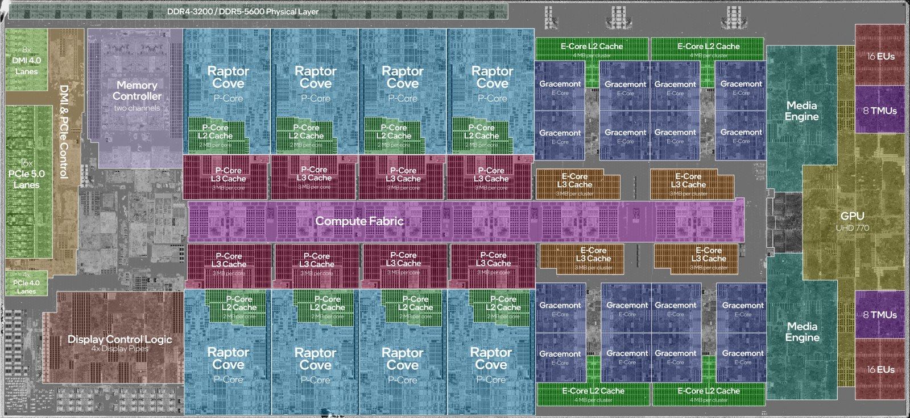
> 图片来源：Intel Core i9-13900K die shot — Fritzchens Fritz / JmsDoug, CC0, via Wikimedia Commons。

芯片几何可以先按由外到内理解：

```text
晶粒（Die） ⊃ IO / 焊盘环（Pad Ring） ⊃ 核心区（Core） ⊃（宏单元 + 标准单元行）
```

IO 引脚分配往往由前端、系统或封装侧先提出，但物理设计（physical design）必须参与评审。原因有两个：

1. I/O 不像逻辑晶体管那样随工艺快速缩小，IO 单元（IO cell）和焊盘面积非常贵；
2. I/O 不只传信号，还负责供电，电源焊盘（power pad）和地焊盘（ground pad）的数量、位置会直接影响 IR 压降和 EM。

选择芯片尺寸时，先判断设计是核心受限（core limited）还是焊盘受限（pad limited）：

| 类型 | 尺寸由谁决定 | 优化重点 |
|------|--------------|----------|
| 核心受限 | 逻辑规模、宏单元、布线资源决定芯片大小 | 利用率、宏单元摆放、布线资源 |
| 焊盘受限 | IO 数量、焊盘间距（pad pitch）、封装引脚分配决定晶粒不能再小 | IO 环、焊盘 / 凸点分配、封装协同 |

### 2.2 利用率（Utilization）与试布线（Trial Route）

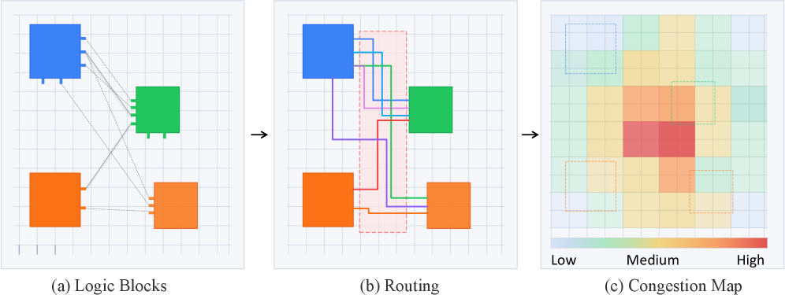
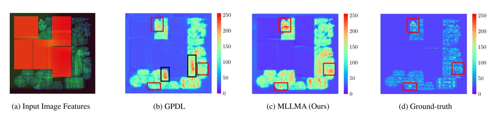
> 图片来源：VeriHGN, R. Hu et al., arXiv:2603.11075, CC BY 4.0；Y.-D. Tsai et al., arXiv:2510.15872, CC BY 4.0。

Floorplan 阶段的利用率通常指标准单元占核心区面积的比例，常见初值可能是 70%。

利用率太高会导致：

- 布线拥塞上升；
- 布局合法化（placement legalization）和优化自由度不足；
- 引脚密集单元（pin-dense cell）周围局部拥塞；
- 电源网格与信号布线抢资源；
- 时序优化难以插入缓冲器（buffer）或调整位置。

利用率太低也不是好事，会浪费晶粒 / 模块面积，并拉长平均互连。

工程上还要区分两个口径：

```text
总利用率（Total Util）= (Σ标准单元面积 + Σ宏单元面积) / 核心区面积
有效利用率（Effective Util）= Σ标准单元面积 / (核心区面积 - 阻挡 - 宏单元留边 - 禁布区 - ...)
```

不能只凭利用率决定晶粒尺寸。完成初始面积估算后，需要跑快速试布线或全局布线（global routing）估计，检查拥塞，再决定是否放大核心区、调整综合结果、移动宏单元、修改引脚分配或重新分配布线资源。

### 2.3 网表唯一化（Netlist Uniquify）

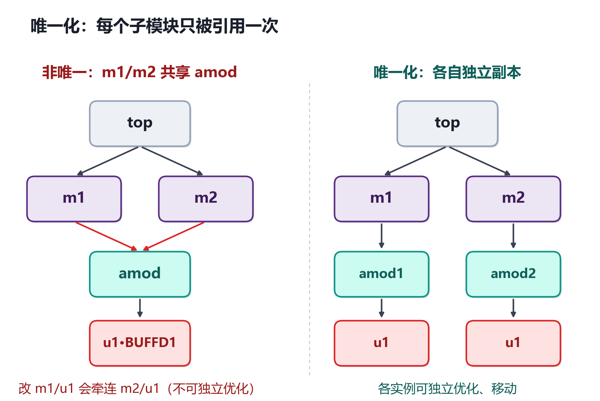

进入物理域前，网表必须唯一化。唯一化网表的意思是每个子模块只被引用一次。

为什么这件事和 floorplan 有关？因为物理优化要按实例独立移动、插缓冲器、优化。如果两个实例共享同一个模块定义（module definition），工具想优化 `m1/u1` 时，就可能同时改变 `m2/u1`。

一个简化例子：

```text
top
  m1: amod
    u1: BUFFD1
  m2: amod
    u1: BUFFD1
```

不做唯一化时，`m1/u1` 和 `m2/u1` 的物理优化边界不够清晰。综合后的网表必须在布局之前完成唯一化，可以由综合工具完成，也可以在设计导入阶段完成。

### 2.4 硬宏摆放（Hard Macro Placement）

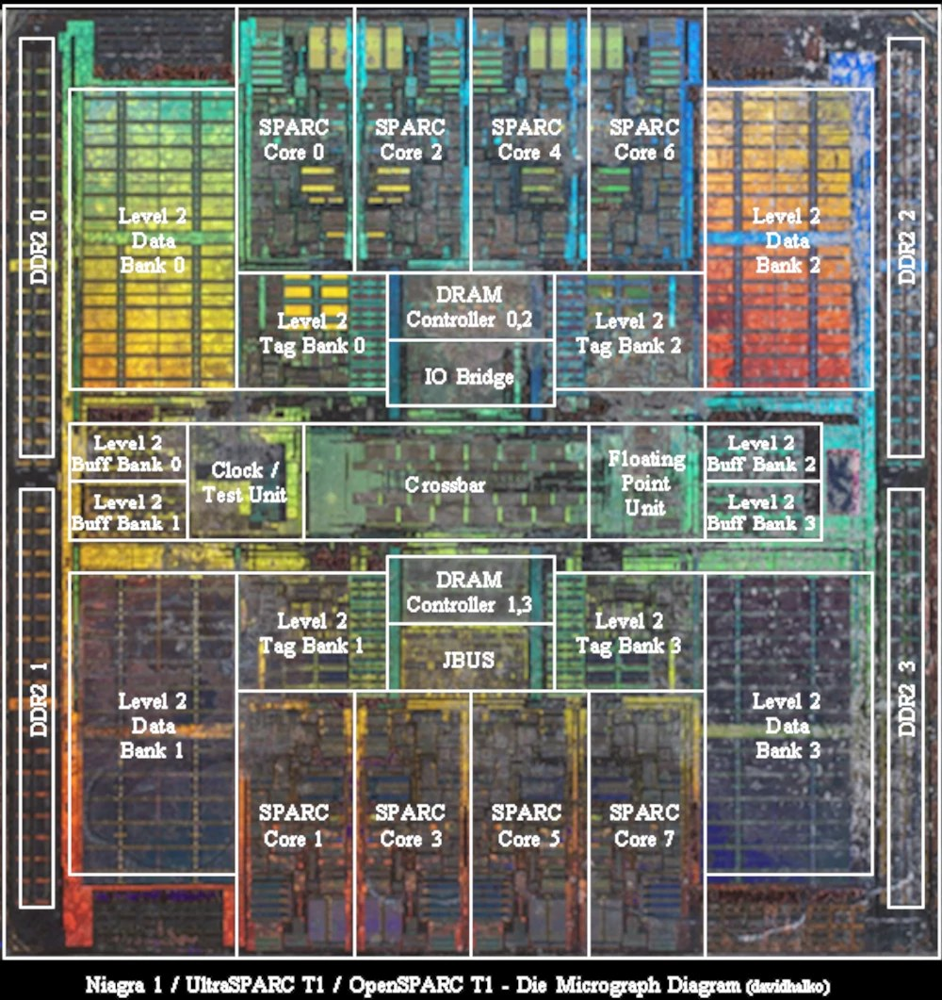
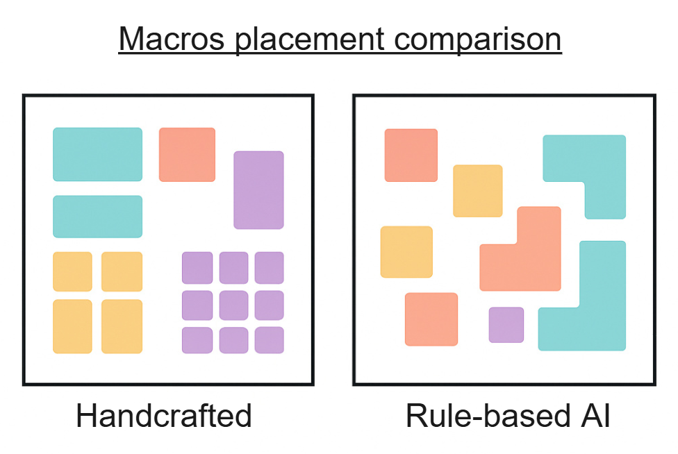
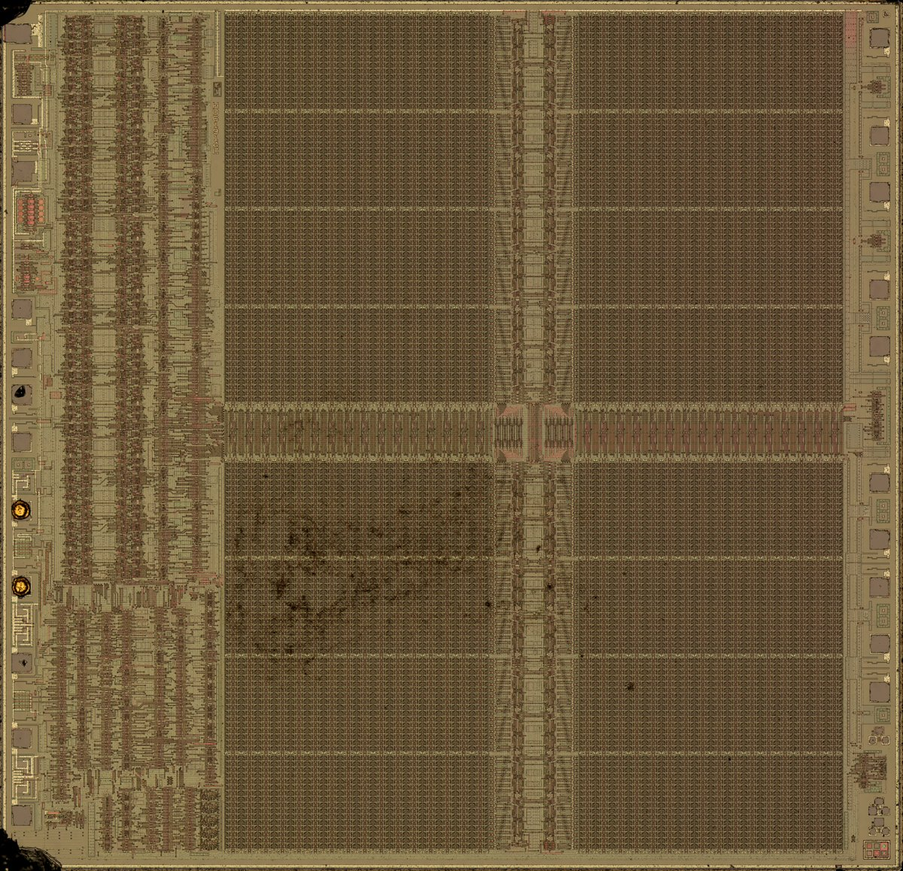
> 图片来源：UltraSPARC T1 die — ZyMOS / Fritzchens Fritz, CC BY-SA 3.0；Macros placement comparison — Copparihollmann, CC BY-SA 4.0；Hitachi HD61914 SRAM die — Seanriddle, CC BY-SA 4.0（均 via Wikimedia Commons）。

硬宏包括 SRAM、ROM、PLL、模拟 IP、第三方 hard IP 等。它们面积大、形状固定、引脚固定、内部不可被摆放器（placer）任意拆开，对布线、时序和电源都有强影响。

宏单元摆放的主线是：把大宏推到边缘或角落，让标准单元区域保持一个尽量完整的大矩形。

常用原则：

1. 沿边 / 沿角：大宏尽量靠核心区边界或角落，不在中心挖洞；
2. 按数据流（dataflow）就近：让强连接的宏单元 / 逻辑靠近，用飞线（flyline）看连接权重；
3. 保留布线通道：宏单元与宏单元、宏单元与边界之间要留足信号、电源、时钟通道；
4. 改善引脚可达性（pin accessibility）：必要时旋转宏单元，让引脚面向更开放的区域；
5. 避免引脚对着窄通道或角落；
6. 摆好后固定：硬宏位置确定后通常标记为固定。

对引线键合（wire-bond）设计，高功耗宏单元不宜放在芯片中心太深的位置，因为电源焊盘通常在边缘，供电路径越长，IR 压降压力越大。

### 2.5 布局区域（Placement Region）：表达放置意图

布局区域是帮助布局布线工具（P&R tool）表达设计意图的方式，用来引导或限制某些单元的摆放区域。

| 类型 | 含义 | 强度 |
|------|------|------|
| 软引导（soft guide） | 希望这些单元聚在一起，但无固定区域 | 最软 |
| 引导区域（guide） | 尽量放在指定区域 | 较软 |
| 区域约束（region） | 指定单元必须放在该区域，其他单元也可进入 | 较硬 |
| 围栏约束（fence） | 指定单元必须放在该区域，其他单元不可进入 | 最硬 |

越硬的约束越容易制造局部拥塞，因此区域约束 / 围栏约束应当只用于必要的结构性意图，而不是用来“替工具做布局”。

### 2.6 布局阻挡（Placement Blockage）与留边（Halo）

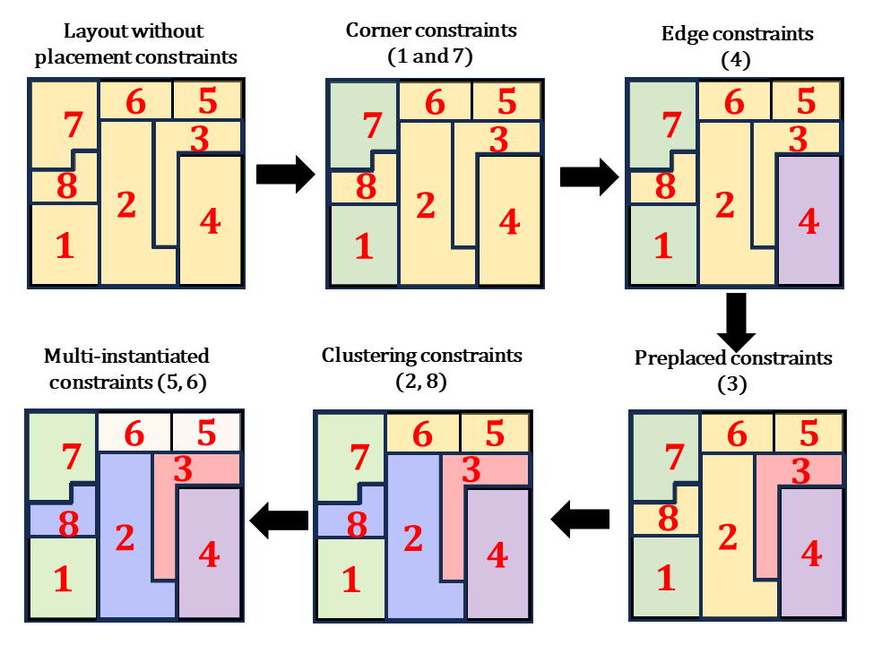
> 图片来源：FloorSet, U. Mallappa et al., arXiv:2405.05480, CC BY 4.0。

布局阻挡用于限制标准单元摆放：

| 类型 | 作用 |
|------|------|
| 硬阻挡（hard blockage） | 完全禁止放置标准单元 |
| 软阻挡（soft blockage） | 初始布局阶段禁用，优化阶段可用于缓冲器 / 反相器 |
| 部分阻挡（partial blockage） | 限制区域最大密度，例如最多 40% |

留边（halo），也叫 padding / keepout margin，是宏单元外围保留的一圈空白区域。它主要用于改善宏引脚可达性，给缓冲器 / 反相器插入、电源布线和信号布线留近宏通道。

高频区别：

```text
留边（halo）   -> 跟随宏单元移动
阻挡（blockage）-> 多为固定坐标区域
```

### 2.7 布线阻挡（Routing Blockage）与好 Floorplan

布线阻挡限制的是走线，而不是单元摆放。它可以指定某个布线层（routing layer）或层范围，例如禁止 M1-M3 在某个区域走线。

常见用途包括：

- 保护宏单元上方特殊区域；
- 给电源结构预留资源；
- 避免低层金属被不合适的信号占用；
- 保护噪声敏感模拟区。

好的 floorplan 有几个图上就能看出来的特征：

- 保持单个大的核心放置区；
- RAM 这类大块尽量放在角落或边缘；
- 保留宽布线通道；
- 避免收缩狭窄通道；
- 不让大量引脚对着窄通道；
- 必要时旋转宏单元改善引脚可达性；
- 引脚不挤在模块角落；
- 用阻挡 / 留边提前保护可布线性。

---

## 3. 层次化接口与时序预算

### 3.1 扁平设计与层次化设计

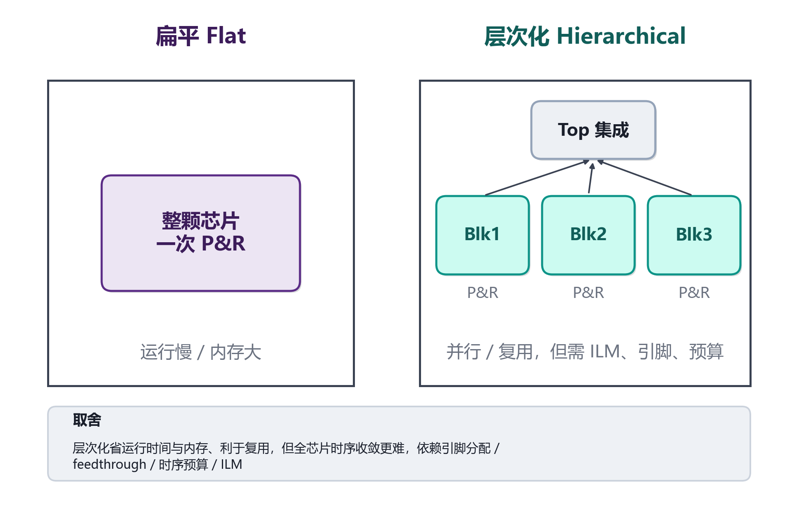

如果设计太大，扁平流程（flat flow）一次跑完整颗芯片会遇到运行时间（runtime）和内存压力。层次化设计（hierarchical design）把全芯片切成多个模块，每个模块独立做布局布线（P&R），再在顶层做全芯片时序和验证。

优点：

- EDA 运行时间更短；
- 内存更少；
- ECO 周期更快；
- 有利于设计复用。

代价：

- 全芯片时序收敛更难；
- 引脚分配和穿通更关键；
- 时序约束预算更复杂；
- 模块抽象 / ILM / ETM 需要维护。

### 3.2 时序预算（Timing Budget）与 ILM

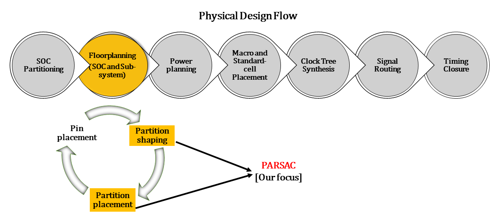
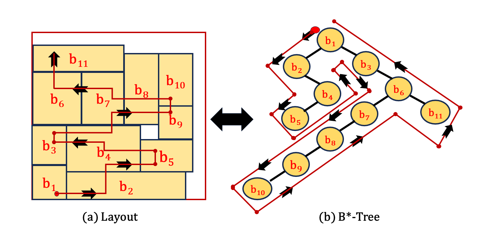
> 图片来源：PARSAC, H. Mostafa et al., arXiv:2405.05495, CC BY-SA 4.0。

芯片级约束（chip-level constraints）必须映射成模块级约束（block-level constraints）。例如顶层某个输入到模块的路径预算为 1.5 ns，模块实现时就需要在模块边界建立对应的输入延迟（input delay）、输出延迟（output delay）、时钟不确定性（clock uncertainty）、负载（load）和驱动单元（driving cell）等约束。

```tcl
create_clock -name clk -period 2.0 [get_ports clk]
set_input_delay  0.6 -clock clk [get_ports data_in]
set_output_delay 0.7 -clock clk [get_ports data_out]
set_clock_uncertainty 0.10 [get_clocks clk]
set_driving_cell -lib_cell BUFX4 [get_ports data_in]
set_load 0.05 [get_ports data_out]
```

预算合理，各模块独立收敛后全芯片才容易收敛；预算不合理，单个模块看似通过，全芯片仍然可能失败。

接口逻辑模型（Interface Logic Model，ILM）保留模块边界附近与接口时序相关的逻辑，同时隐藏模块内部大量细节。抽取时序模型（Extracted Timing Model，ETM）也用于提供模块的抽象时序模型。它们的目的都是让全芯片时序分析更快、更可控。

### 3.3 引脚分配（Pin Assignment）与穿通（Feedthrough）

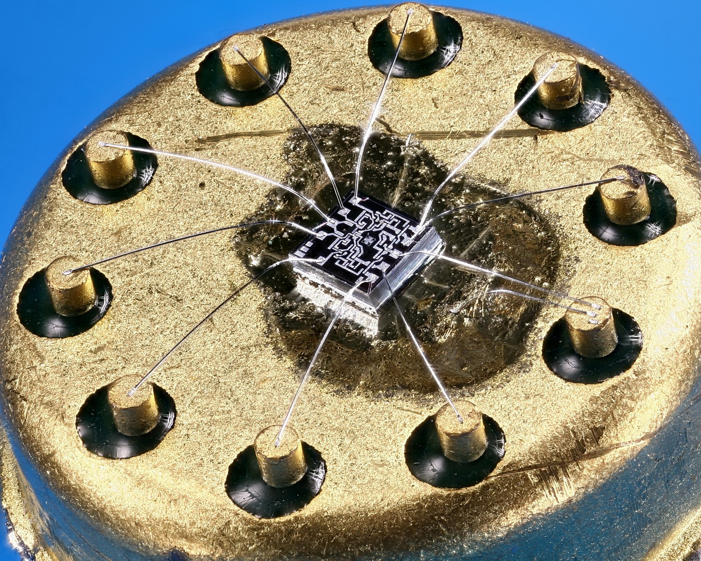
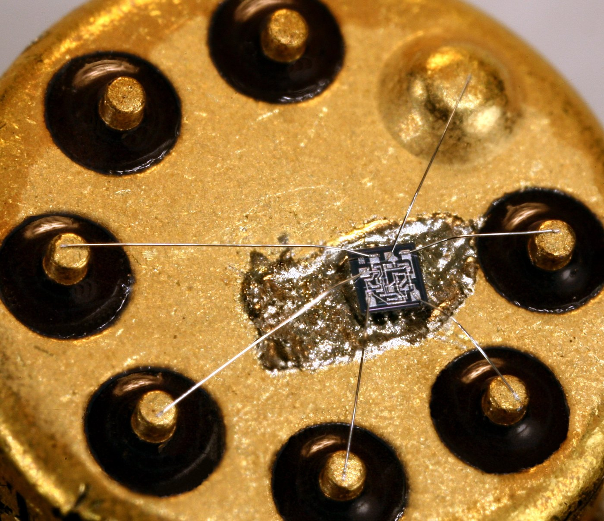
> 图片来源：Wire-bonding 与开盖芯片 — Mister rf, CC BY-SA 4.0, via Wikimedia Commons。

顶层 IO 摆放决定芯片对外接口位置；模块级引脚分配决定层次化模块之间怎么连接。两者都属于 floorplan，但影响点不同：

- 顶层 IO 影响封装、ESD、电源焊盘、芯片边界；
- 模块引脚影响模块间布线、时序预算、feedthrough 和全芯片收敛。

模块级引脚的约束常包括布线层、引脚间距、引脚尺寸、重叠规则、网络分组、引脚引导区域（pin guide）、数据流方向和试布线边界穿越情况。

在无通道（channel-less）或通道资源紧张的设计中，feedthrough 很关键。若信号从分区 A 到分区 C，中间隔着分区 B，而 B 没有 feedthrough，信号可能被迫绕过整个模块。解决办法是在 B 上生成 feedthrough 引脚 / feedthrough 网络，把跨越 B 的连接拆成几段。

---

## 4. 电源规划与完整性

### 4.1 电源规划（Power Planning）：功耗与可靠性

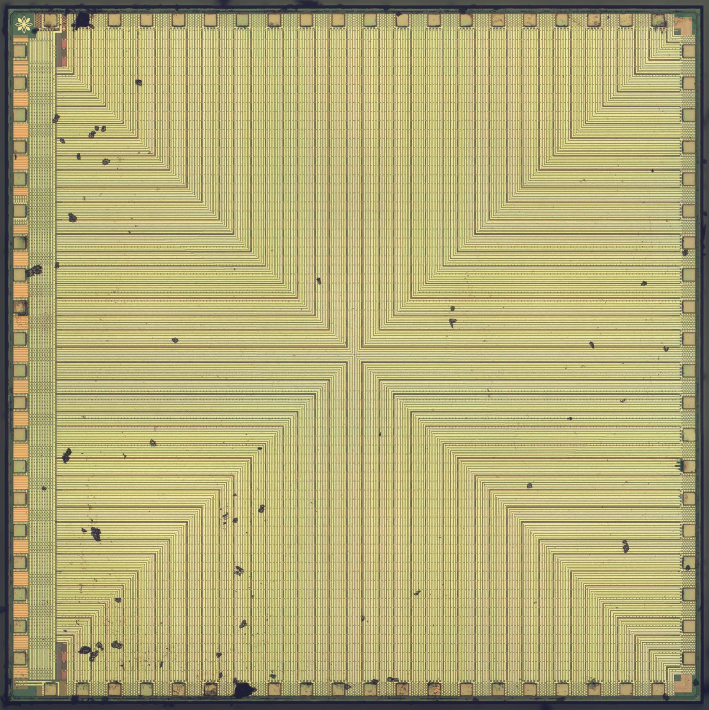
> 图片来源：Bitfury 55 nm 芯片顶层金属供电网 — ZeptoBars, CC BY 3.0, via Wikimedia Commons。

电源规划要解决的不只是“连上 VDD/GND”。它同时关系到动态功耗（dynamic power）、静态漏电（static leakage）、IR 压降、电压跌落（voltage drop）、电迁移（electromigration）和自热磨损（self-heating wearout）。

电源分布网络（Power Distribution Network，PDN）需要：

- 把电流从焊盘 / 凸点送到晶体管；
- 保持稳定、低噪声的电压；
- 提供平均和峰值功耗需求；
- 为信号提供返回路径；
- 避免电迁移和自热磨损；
- 合理占用芯片面积和布线资源。

电源规划从 floorplan 阶段就开始，而不是布线后的补救。

### 4.2 IR 压降（IR Drop）

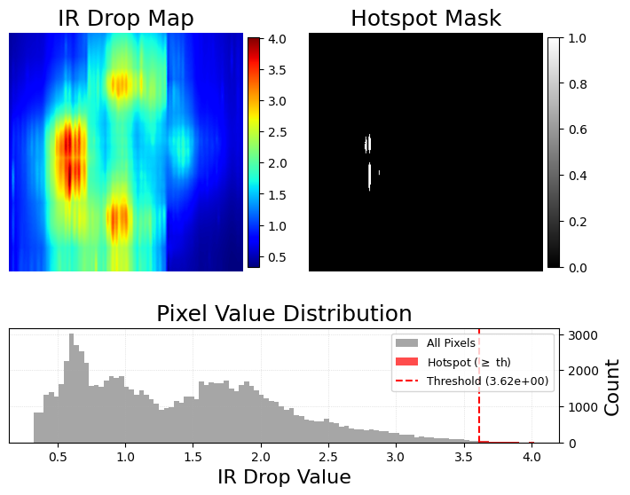
> 图片来源：WACA-UNet, Y. Seo et al., arXiv:2507.19197, CC BY 4.0。

IR 压降是供电线上的电压下降：

```text
ΔV = I · R
```

芯片上的电源网格是一个巨大网络，工具会建立电阻矩阵，结合每个门的平均电流，求解每个节点的电压。若实际电压低于容差下限，单元延迟会增加，时序可能失败，严重时功能错误。

一个典型估算能说明问题：1 mm 长、100 nm 宽的 M1 电源轨，若方块电阻（sheet resistance）为 0.1 ohm/square，线电阻可达约 1000 ohm；若承载约 0.1 mA，IR 压降可达约 100 mV。这说明细而长的低层电源线无法单独承担供电，必须用更宽、更厚、更高层、多路径、多过孔的结构。

### 4.3 电迁移（Electromigration，EM）

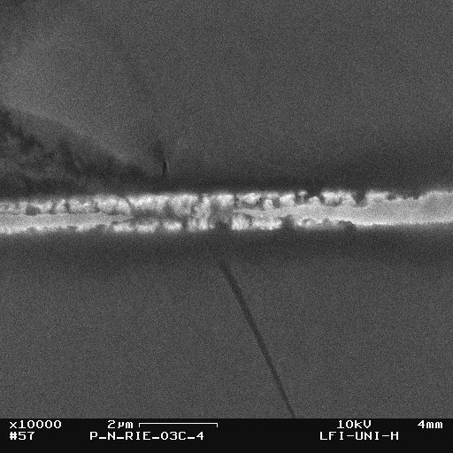
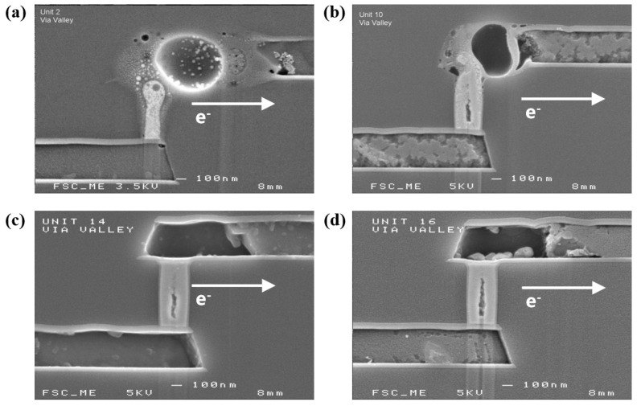
> 图片来源：铜互连 EM 失效 SEM — P.-E. Zörner, CC BY-SA 3.0, via Wikimedia Commons；AlCu 空洞 — Liu et al., Micromachines, doi:10.3390/mi16040458, CC BY 4.0。

电迁移（EM）是电流长期流过导体时，电子动量推动金属原子迁移，可能导致：

- 开路（open）：单根线上形成空洞（void）；
- 短路（short）：相邻线之间桥接（bridging）；
- RC 改变：即使没开短路，也可能造成性能退化。

IR 更偏“瞬时电压够不够”，EM 更偏“长期电流密度能不能扛住”。两者都与 floorplan 有关，因为电源焊盘、高功耗宏单元位置、网格宽度 / 间距 / 过孔都是在早期 floorplan 里决定或预留的。

### 4.4 电源分布网络（PDN）的基本取舍

电源线越强，IR / EM 风险越低，但信号布线资源越紧张。

| 选择 | 好处 | 代价 |
|------|------|------|
| 更宽电源线 | 降低电阻与 IR 压降 | 占用布线轨道 |
| 更多电源条带 | 提供更多电流路径 | 增加信号拥塞 |
| 更多过孔阵列 | 降低垂直连接电阻与 EM 风险 | 占用局部布线资源 |
| 更靠近电源焊盘 | 缩短供电路径 | 可能牺牲数据流 |

一个好的 PDN 要让电源轨尽量宽、尽量厚、尽量多路径，但不能把信号布线资源全部吃光。

### 4.5 电源/地布线（P/G Routing）方式

常见电源结构自上而下包括：

| 结构 | 作用 |
|------|------|
| 电源焊盘 / 凸点（power pads / bumps） | 从封装引入 VDD/VSS |
| 电源环（power ring） | 围绕芯片 / 核心区 / hard IP 的主干环 |
| 电源条带（power stripe） | 横跨核心区分担电流 |
| 电源网格（power mesh） | 纵横条带互连，降低等效电阻 |
| 标准单元供电轨（std-cell rail） | 沿标准单元行连接每个单元的 VDD/VSS |
| 专用布线（special route） | 连接焊盘、环、条带、模块引脚、核心区引脚和 follow-pin rail，并打过孔 |

标准做法是用上层厚金属做网格或条带，下层连接到标准单元 follow-pin rail，中间用多重过孔和过孔堆栈（via stack）连起来。

### 4.6 电源网格创建（Power Grid Creation）

电源网格创建的本质，是在 IR 压降、EM 和布线资源之间取舍。开始之前，需要功耗预算和初始功耗估算，知道平均电流、最大电流密度，再决定总体网格结构。

需要决定的参数包括：

- 总体网格结构；
- 是否有电源门控（power gating）或多电压；
- 每个电压域（voltage domain）的电源焊盘数量和位置；
- 使用哪些金属层；
- 电源条带的宽度 / 间距；
- 过孔堆栈如何放、会占掉多少布线轨道；
- 要不要电源环；
- 层次化模块是否需要屏蔽（shielding）；
- 初始电源网络分析。

参考 Innovus 命令骨架：

```tcl
globalNetConnect VDD -type pgpin -pin VDD -all
globalNetConnect VSS -type pgpin -pin VSS -all

addRing   -nets {VDD VSS} -type core_rings \
          -layer {top M9 bottom M9 left M8 right M8} -width 3

addStripe -nets {VDD VSS} -layer M9 -direction vertical \
          -width 2 -set_to_set_distance 40

sroute    -nets {VDD VSS} \
          -connect {corePin floatingStripe blockPin padPin}
```

### 4.7 电源网格与宏单元摆放

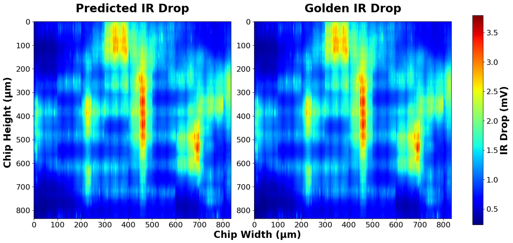
> 图片来源：CFIRSTNET, Y.-T. Liu et al., arXiv:2502.12168, CC BY 4.0。

高性能、高功耗模块的宏单元摆放不能只看数据流，还要看供电路径。

实用规则：

- 高功耗模块靠近边界电源焊盘；
- 高功耗模块之间不要过度集中；
- 宏通道不仅给信号布线，也要给电源条带、过孔、时钟预留空间；
- 电源焊盘、宏单元位置和网格密度必须一起迭代。

IR 压降通常用颜色图（color map）找热点（hot spot）。修复不一定是全局加密，有时只需要在热点附近加一条电源线、增加过孔阵列、加宽电源条带、移动高功耗宏单元，或增加 / 重分配电源焊盘。

---

## 5. 工具流程与调试收束

### 5.1 Innovus 流程：从初始化到阻挡


实践中可以按以下工具无关步骤串起 floorplan 流程：

```text
1. 初始化设计（Init Design）
   - 读入网表 / LEF / MMMC / SDC / IO 摆放信息

2. 指定布图规划（Specify Floorplan）
   - 布图尺寸
   - 长宽比
   - 目标利用率

3. 摆放硬宏（Place Hard Macros）
   - 绝对坐标或相对位置摆放
   - 标记为固定
   - 定义留边和阻挡

4. 定义区域与阻挡（Regions & Blockages）
   - 布局区域
   - 布局阻挡
   - 布线阻挡

5. 定义全局电源网络（Define Global Nets）
   - 将顶层 VDD/GND 名称映射到 IP 的电源/地引脚

6. 创建电源环（Create Power Rings）
   - 芯片外围电源环
   - 必要时为 hard IP 创建电源环

7. 建立电源网格（Build Power Grid）
   - 标准单元 follow-pin 供电轨
   - 电源条带 / 网格
   - 可靠连接 hard IP 电源

8. 分配引脚（Assign Pins）
   - 层次化实现中的模块边界引脚
```

从而形成反复调整的闭环。

### 5.2 本讲收束：判断一个好 Floorplan

一个好 floorplan 的判断标准很简单：让后面的布局、CTS、布线和电源签核都有路可走。

| 问题 | 反查方向 | 常见动作 |
|------|----------|----------|
| 布线绕不出 | 利用率、宏通道、引脚可达性 | 降利用率、拓宽通道、调引脚、改阻挡 |
| 时序收不回 | 宏单元 / 引脚位置、时序预算 | 按数据流重摆宏单元，重新预算接口路径 |
| IR 压降超标 | 电源焊盘、网格、过孔、高功耗宏单元 | 加密网格、增加过孔、移动高功耗宏单元 |
| EM 违例 | 电流密度、金属宽度、过孔阵列 | 加宽金属、并联过孔、分散高功耗模块 |
| PG 未连通 | 全局电源名、宏单元电源/地引脚、专用布线 | 校正 VDD/GND 命名并补专用布线 |

Floorplan 的工作方式可以总结为：

```text
布图规划（floorplan）
  -> 试布局 / 试布线
  -> 拥塞 / 时序 / IR 早期分析
  -> 调整利用率 / 宏单元 / 通道 / 引脚 / PG
  -> 重复直到可接受
  -> 详细布局
```

后续进入布局时，不再重新回答“芯片骨架是什么”，而是在这个骨架上把标准单元放到合法、可优化、可收敛的位置。
