# Floorplan 布图规划 · 教案

> 课程原版 (English source): Adam Teman, *Digital VLSI Design (DVD)*, Bar-Ilan University · Course 83-612 · 对应 DVD Lecture 6 (Moving to the Physical Domain - Floorplan) · <https://enicslabs.com/academic-courses/dvd-english/>
> 中文转述：《芯片设计从RTL到GDS》 · 整理：**J.C**
>
> **用法**：本文为「教案」——每节对应配套 PPT 的一页，**知识点写在页面上**（“知识点”小节，便于学生自学），`备注` 只留一句教学提示。配套可编辑幻灯片 [`slides/05_Floorplan.pptx`](slides/05_Floorplan.pptx)；逐句口语讲稿 [`lecture_scripts/05_Floorplan.md`](lecture_scripts/05_Floorplan.md)。
> 说明：文中 Tcl/UPF/SDC/LEF 片段均为**示意骨架**，命令选项随工具版本而异，以官方 User Guide / `man` 为准。

---

## Slide 1 · 封面：Floorplan 布图规划

**一句话定位**

- Floorplan = 把“逻辑上的网表”映射成“物理上的布局骨架”
- 它是物理实现（P&R）中**第一个确定版图骨架**的主要步骤
- 贯穿全讲的主线：**Floorplan 决定 PPA 上限，一步错、步步错**

> 备注：开场点题，强调“上游决定下游天花板”。

---

## Slide 2 · 本讲导览

**全讲脉络（13 个主题）**

1. 什么是 Floorplan / 为什么重要
2. 芯片几何：Die / Core / IO；利用率与长宽比；Row / site / 翻转供电轨
3. 宏摆放原则；halo / blockage；物理专用单元（endcap / well-tap / filler）
4. IO / Pad / Bump 与引脚分配
5. 电源规划（ring/stripe/mesh/rail/sroute）；IR drop 与 EM；电源门控
6. 多电压域与 UPF；时序预算与分块
7. 拥塞/IR 早期预估与迭代闭环；指标、文件、命令、小结、课后自测

> 备注：先给地图，强调 Floorplan 是 floorplan→试布局/GR→评估→回退 的**迭代闭环**，不是一遍过。

---

## Slide 3 · 什么是 Floorplan

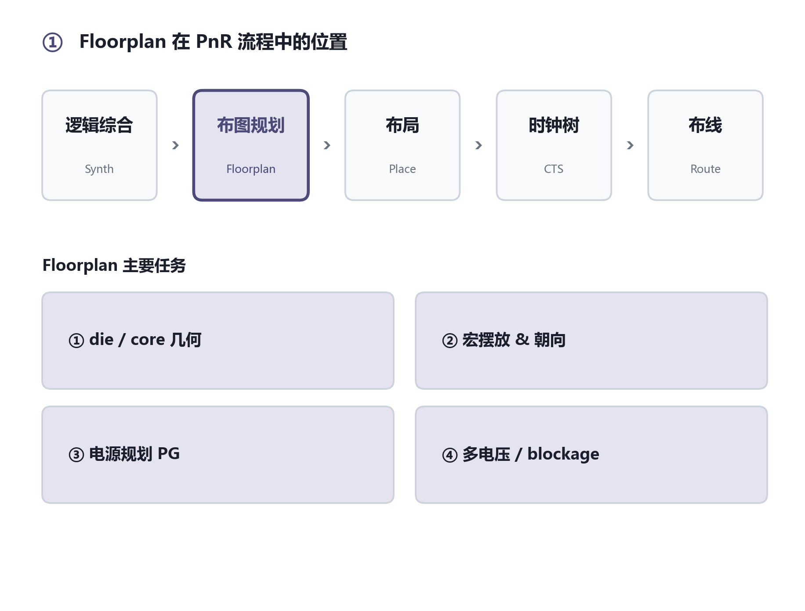

**知识点**

- 物理实现（P&R）中**第一个确定版图骨架**的主要步骤
- 之前还有“设计导入 / 初始化”：读库（LEF / Liberty / NDM）、读网表、加载 **SDC** 约束与 **UPF/CPF** 功耗意图、初始化设计
- **网表唯一化（uniquify）**：物理实现前网表必须**唯一**——每个子模块只被引用一次，否则无法独立优化（如改 `m1/u1` 会牵连 `m2/u1`）；综合或 import 时完成
- 位置：综合产出**门级网表之后**、详细 **Placement 之前**
- 主要任务（6 项）：① die/core **几何**；② **宏（Macro/Hard IP）**位置与朝向；③ **IO/Pad/Bump** 与引脚分配；④ **PG 电源网络**骨架（环/条/网）；⑤ **多电压域**划分与电压岛边界；⑥ 各类 **blockage** 与 **halo/keepout** 预留
- 一句话：把“逻辑网表”映射成“物理布局骨架”，为 Placement / CTS / Routing 划定边界条件

> 备注：工具辨析——综合用 DC / Genus；**Fusion Compiler** 是综合 + P&R 一体实现工具。

---

## Slide 4 · 为什么重要：一步错，步步错

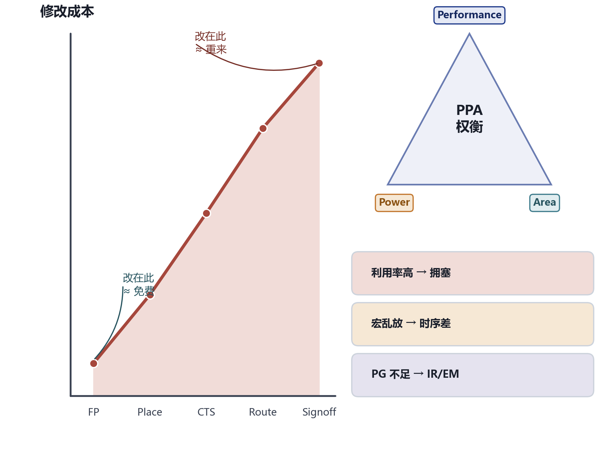

**知识点**

- Floorplan 决定一颗芯片 **PPA（性能 / 功耗 / 面积）的上限**；后端“上游决定下游天花板”
- 三类典型代价：
  - **利用率定高** → Placement 再优秀也**拥塞绕不出**
  - **Macro 摆放不合理** → 关键路径被迫绕远，**时序怎么优化都收不回**
  - **PG 规划不足** → 签核（Signoff）才发现 **IR drop / EM** 超标，往往推倒重做
- 成本规律：**Floorplan 阶段改几乎“免费”**，到布线后 / 签核阶段改成本急剧上升
- “七分布局、三分布线”是经验俗语、**非量化指标**，用来强调早期版图决策的份量

> 备注：把“成本曲线”讲透——越晚改越贵，是本页的灵魂。

---

## Slide 5 · 芯片几何：Die / IO / Core / Rows

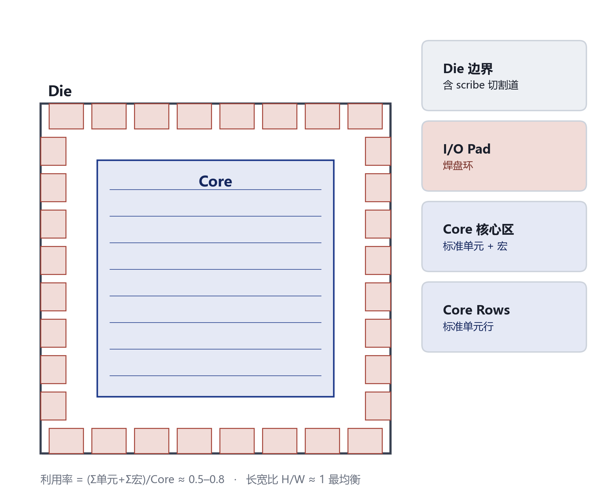

**知识点**

| 概念 | English | 说明 |
|------|---------|------|
| 晶粒区 | Die Area | 整颗芯片最外边界，含 scribe（切割道），包含一切 |
| 核心区 | Core Area | 放标准单元（Standard Cell）与宏的内部区域 |
| IO 区 | IO Area / Pad Ring | Die 与 Core 之间的环形区，放 IO 单元与 Pad |
| 核心到 IO 间距 | Core-to-IO Spacing | Core 边界到 Pad 内沿的距离，留给电源环 / IO 走线 |

- 嵌套关系：**Die ⊃ Pad Ring ⊃ Core ⊃ (Macro + 标准单元行 Rows)**
- **Core-limited vs Pad-limited**：芯片尺寸由 **core 面积**决定（核受限）还是由 **IO/Pad 环周长**决定（焊盘受限）——IO 不随摩尔定律缩小，pad 受限时面积很“贵”

> 备注：让学生记住“层层嵌套、由外到内”。

---

## Slide 6 · 标准单元行 / site / 翻转共享供电轨

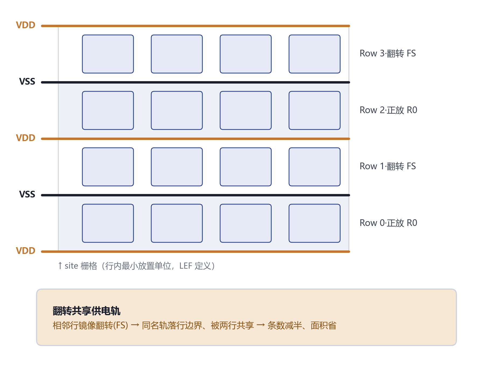

**知识点**

- **Row（行）**：Core 切成等高水平行；行高 = 库单元高度（9-track / 7-track），**行高 ≈ track 数 × M2 pitch**（9T 行高 > 7T）
- **Site（站位）**：行内最小放置栅格，定义于 LEF；**单元宽度必须是 site 宽度的整数倍**
- **翻转共享供电轨**：相邻行**镜像翻转（FS，绕水平中线）** → 同名电源轨落在**行边界**、被上下两行共享 → **供电轨条数减半、面积更省**，且 follow-pin rail 连续

```lef
SITE core
  CLASS CORE ;
  SYMMETRY Y ;          # 单元允许的镜像方式；翻转使行边界处共享同名供电轨
  SIZE 0.190 BY 1.260 ; # site 宽 × 行高(um)；行高 ≈ track 数 × M2 pitch（示意）
END core
```

- `SYMMETRY` 取值（X/Y/R90）描述单元自身镜像方式；行间共享靠**相邻行上下镜像**，具体轴向以工具/库文档为准

> 备注：关键机关——“同名轨落行边界、被两行共享”。

---

## Slide 7 · 利用率与长宽比

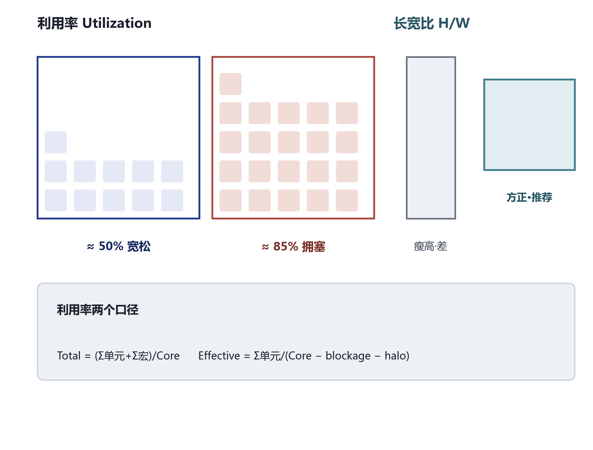

**知识点**

- 利用率分**两个口径**（务必分清）：

```text
Total Util     = (Σ std_cell_area + Σ macro_area) / Core_area
Effective Util = Σ std_cell_area / (Core_area − blockage − macro_halo − keepout − …)
```

- **工具报告的 “utilization” 多指有效利用率**（更贴近实际可放置密度）
- 经验初值 **0.5–0.8**，并非固定 60–75%：高 macro 占比 / IP 密集 / datapath 可 >0.8；高拥塞 / 高活动留余量可低至 0.5–0.6
- 易混点：**目标利用率 ≠ placement 后的局部实际密度（placement density）**
- **长宽比 Aspect Ratio** = core 的高/宽；**约定各工具可能相反**（宽/高 vs 高/宽），以工具文档为准
- 比值 **≈ 1.0**（方正）最利于布线均衡与时钟树平衡；长条形长边易拥塞、skew 难控
- 工具参数：ICC2 `initialize_floorplan -side_ratio {1 1}`；Innovus `floorPlan -r 1.0 ...`

> 备注：利用率“过高拥塞、过低浪费”，是常考题。

---

## Slide 8 · 宏单元摆放原则

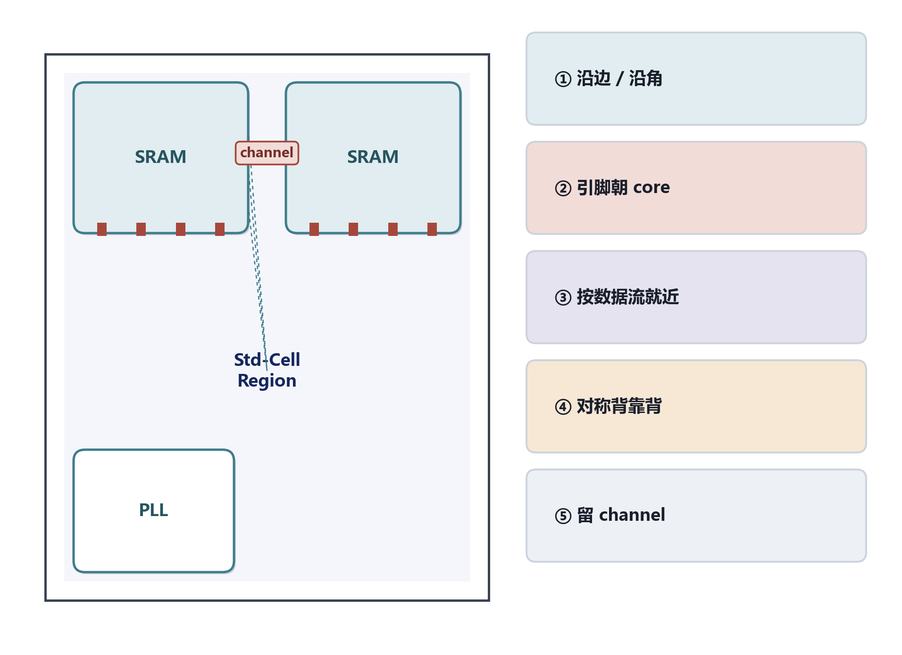

**知识点**

- 宏（Macro）= SRAM / ROM / PLL / ADC / IP 核等硬核，**尺寸大、形状固定、引脚固定**，是 floorplan 核心难点
- 摆放五原则：
  1. **沿边 / 沿角**：大宏靠 core 边界/角落，中间连续区留给标准单元，避免“挖洞”
  2. **按数据流就近（dataflow-driven）**：用 **flyline 飞线**指导；现代工具有 **auto macro placer**（按 connection weight 自动布大块 IP）
  3. **预留 channel**：宏间留通道走 PG/时钟/信号；另有 **channel-less（紧贴 abutted）** 风格，省面积但对 pin access 要求高
  4. **引脚朝 core**：避免信号绕过整个 macro 本体
  5. **朝向与对称**：R0/R90/R180/R270 + 镜像 MX/MY 共 8 种朝向；常把两块对称宏引脚相对、背靠背摆放，共享 channel、对齐成规整阵列
  6. **摆好后标记 FIXED**；功耗大的宏（wire-bond）远离芯片中心、靠近边界电源 pad（降 IR drop），且彼此拉开（避 EM）

> 备注：摆放不当 = 绕线障碍 + 长走线 → 拥塞与时序。摆放手法常优于自动。

---

## Slide 9 · halo / keepout 与各类 blockage

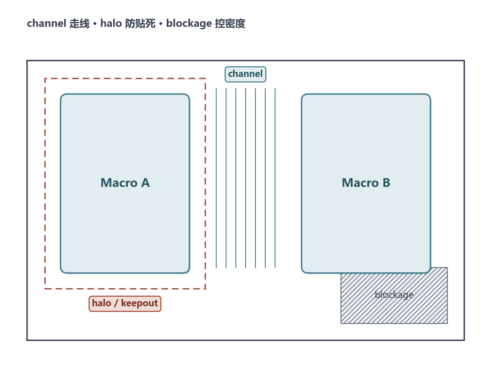

**知识点**

- **Halo / Keepout Margin**：macro 四周“无标准单元”边带，留给 pin access / 电源 / 缓冲；**跟随 macro 移动**
- **Placement Blockage**：**固定坐标**的禁放区，细分：
  - **hard**：完全禁放任何标准单元
  - **soft**：粗放（coarse）阶段禁放，但优化/合法化阶段可放 buffer/inverter
  - **partial**：按密度上限限制（如该区最多 40%）；与 density screen 概念相近，但实现/命名因工具而异，**不等价**
- **Routing Blockage**：禁某些层布线，可指定层范围（如 M1–M3），有 hard/partial
- **Placement Region（聚类约束，区别于 blockage）**：`soft guide`（尽量聚拢，无固定区）/ `guide`（尽量放指定区）/ `region`（必须放该区，他人亦可）/ `fence`（必须放该区且排他）——用来“帮”工具把某类逻辑放一起
- 经验：macro 引脚一侧加 halo，给 pin access 留空间，避免 pin 拥塞/绕不出

> 备注：halo 跟着 macro，blockage 钉在坐标——区分清楚。

---

## Slide 10 · 物理专用单元：endcap / well-tap / filler

**知识点**

- physical-only cell：不参与逻辑功能，但与 **row/site、供电轨连续、N-well 连续**强相关，需在 **floorplan / 早期 placement** 阶段规划
- **Endcap / Boundary Cell**：放每行两端及 macro/void 边界，保证行边界处 **well/implant 连续**与 DRC 合规
- **Well-tap / Tap Cell**：周期性插入提供 well 偏置接触；间距须满足工艺的 **max well-tap distance(DRC)**，否则 **latch-up（闩锁）**风险与 DRC 报错；tap 间距要在 floorplan 早期按规则规划
- **Filler Cell**：布线前/流程末期插入，填行内空隙、保证供电轨与 well 连续；**引入时机晚于 tap/endcap**

> 备注：考点——tap 间距违规会 latch-up；filler 最后才放。

---

## Slide 11 · IO / Pad、Bump 与引脚分配（上）

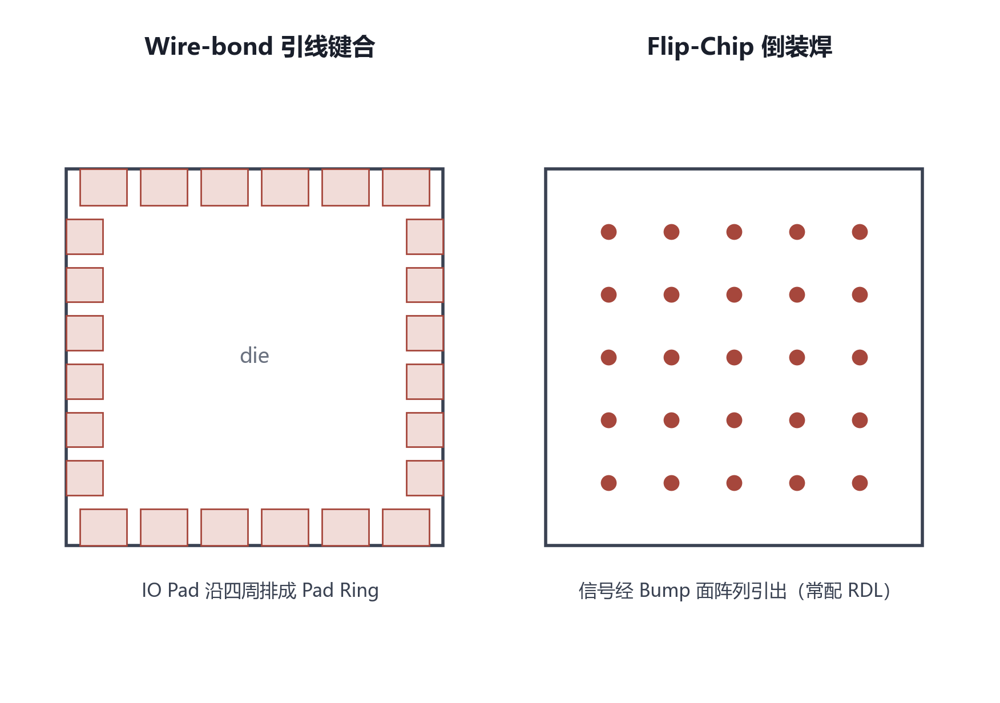

**知识点**

- **Wire-bond（引线键合）**：IO Pad 沿 die 四周排成 **Pad Ring**；需考虑信号/电源 Pad 交替、**ESD**、**Corner Pad**
- **Flip-Chip（倒装焊）**：信号经**凸点（Bump）阵列**（area array）从 die 表面引出；常配 **RDL（重布线层）**，但**是否需要完整 RDL 取决于封装/凸点布局**（部分 flip-chip / WLCSP 直接落顶层金属/UBM，不一定需要）
- bump 摆放需对齐封装 **bump map**、控制 bump 间距与电源/信号比例

> 备注：wire-bond 走四周 pad ring，flip-chip 走面阵列 bump。

---

## Slide 12 · 引脚分配 Pin Assignment（下）

**知识点**

- **顶层（Top-level）**：IO buffer 位置决定芯片对外引脚位置
- **块级 / 分区（hierarchical）**：partition 对外端口需分配到块边界具体位置，**pin 位置直接决定块间走线长度与时序**
- 块级 pin 核心约束：
  - 落在**合法 routing track** 上，并与该层布线方向一致
  - 沿**数据流方向**分布（相连逻辑在左则 pin 放左边界），避免长绕线
  - 注意 **feedthrough（穿通）**：信号穿过无关 block 需预留穿通端口/缓冲，否则被迫绕过整个 block
  - 工具支持 pin 自动优化，但**关键总线常需手工约束**

```tcl
# ICC2 块级 pin 约束（示意）
set_individual_pin_constraints -ports {data_in[*]} -side left -layers {M3 M5}
set_block_pin_constraints -self -allowed_layers {M3 M4 M5} -pin_spacing 0.5
place_pins -self
```

> 备注：pin 离逻辑越远，块内走线越长、budget 越紧（与下文时序预算耦合）。

---

## Slide 13 · 电源规划：Ring → Stripe → Mesh → Rails

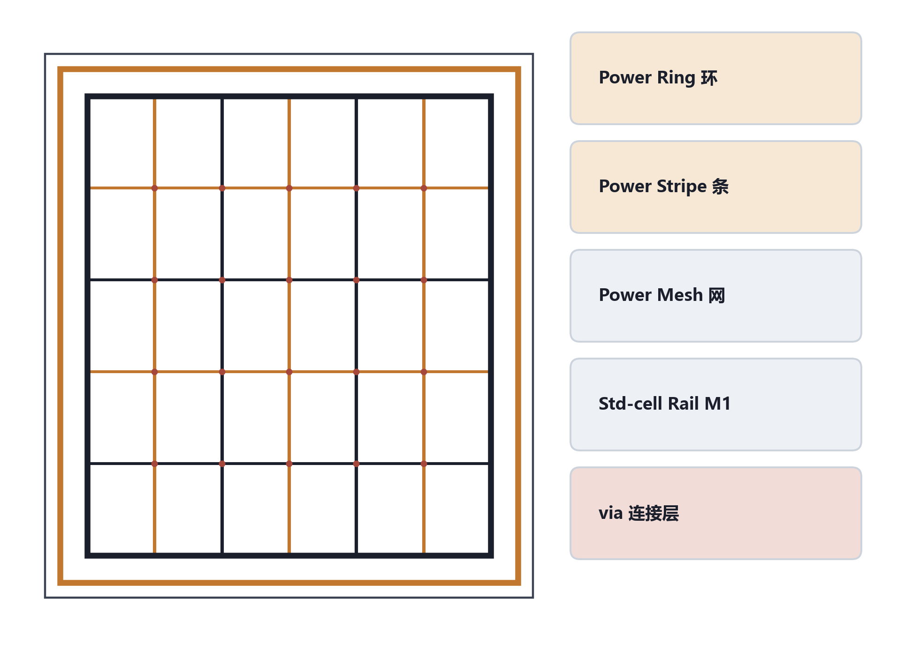

**知识点**

- PG Network 自上而下：

| 结构 | English | 说明 |
|------|---------|------|
| 电源环 | Power Ring | 沿 core/macro 边界的闭合环，主干供电（顶层粗金属） |
| 电源条 | Power Stripe | 横跨 core 的粗金属条，分担电流 |
| 电源网格 | Power Mesh | stripe 纵横交织成网，降等效电阻 |
| 单元供电轨 | Std-cell Rail (follow-pin) | 沿标准单元行的 M1 供电轨 |
| 特殊布线 | Special Route (sroute) | 生成 follow-pin rail，并连接 ring/stripe/core pin/block pin/pad 并打 via |

- **sroute 范围广**，不只是“连 mesh 到 rail”，是 PG 网络成型的关键步骤

```tcl
# Innovus（示意）
addRing   -nets {VDD VSS} -type core_rings -layer {top M9 bottom M9 left M8 right M8} -width 3
addStripe -nets {VDD VSS} -layer M9 -direction vertical -width 2 -set_to_set_distance 40
sroute    -nets {VDD VSS} -connect {corePin floatingStripe blockPin padPin}
globalNetConnect VDD -type pgpin -pin VDD -all
```

> 备注：ICC2 侧用 `create_pg_ring/mesh/std_cell_conn_pattern + compile_pg`。

---

## Slide 14 · IR drop 与 电迁移 EM

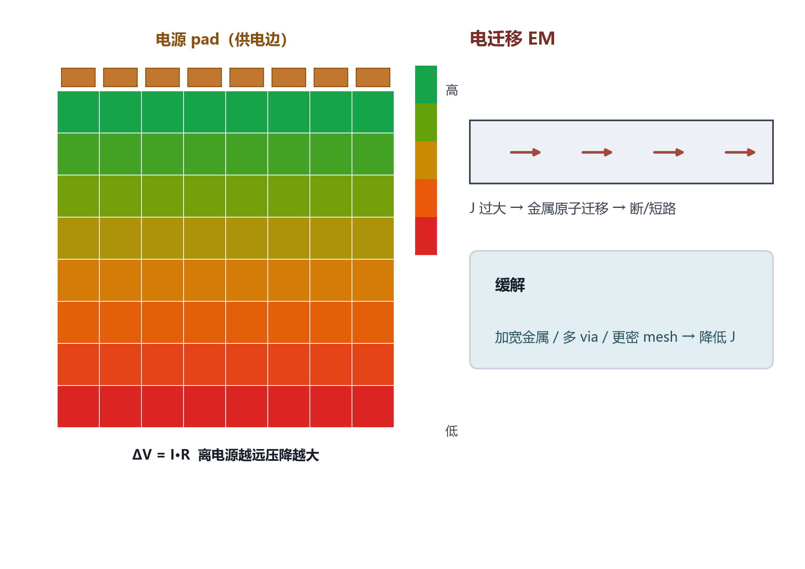

**知识点**

- **IR Drop**：ΔV = I·R，电流流过电阻产生压降 → 单元实际电压低于标称 → **延迟增大、时序变差，严重时功能失效**
  - 预算随工艺/电压而异，常为标称 VDD 的**百分之几（如 3–5%，先进工艺更严）**，且 **static / dynamic 分别约束**
- **EM（电迁移）**：长期大电流使金属原子迁移 → **开路/短路**，影响可靠性/寿命；需保证线宽承载电流密度
  - **PG 网络（单向大电流）**与**高翻转信号线/时钟线（自热+高活动）**都有 EM，机理与约束不同，**分别评估**
- 缓解：加密 mesh、加宽 stripe、增加 via array、多层并联、合理 bump/pad
- 签核工具：**Voltus**（Cadence）、**RedHawk / RedHawk-SC**（**Ansys**，非 Cadence）、**PrimeRail**（Synopsys，IR/EM）；PrimePower 做动态功耗/活动率，非 IR 签核

> 备注：IR = 瞬时电压不够（影响时序）；EM = 长期电流太猛（影响寿命）。

---

## Slide 15 · 电源门控：power switch / header / footer

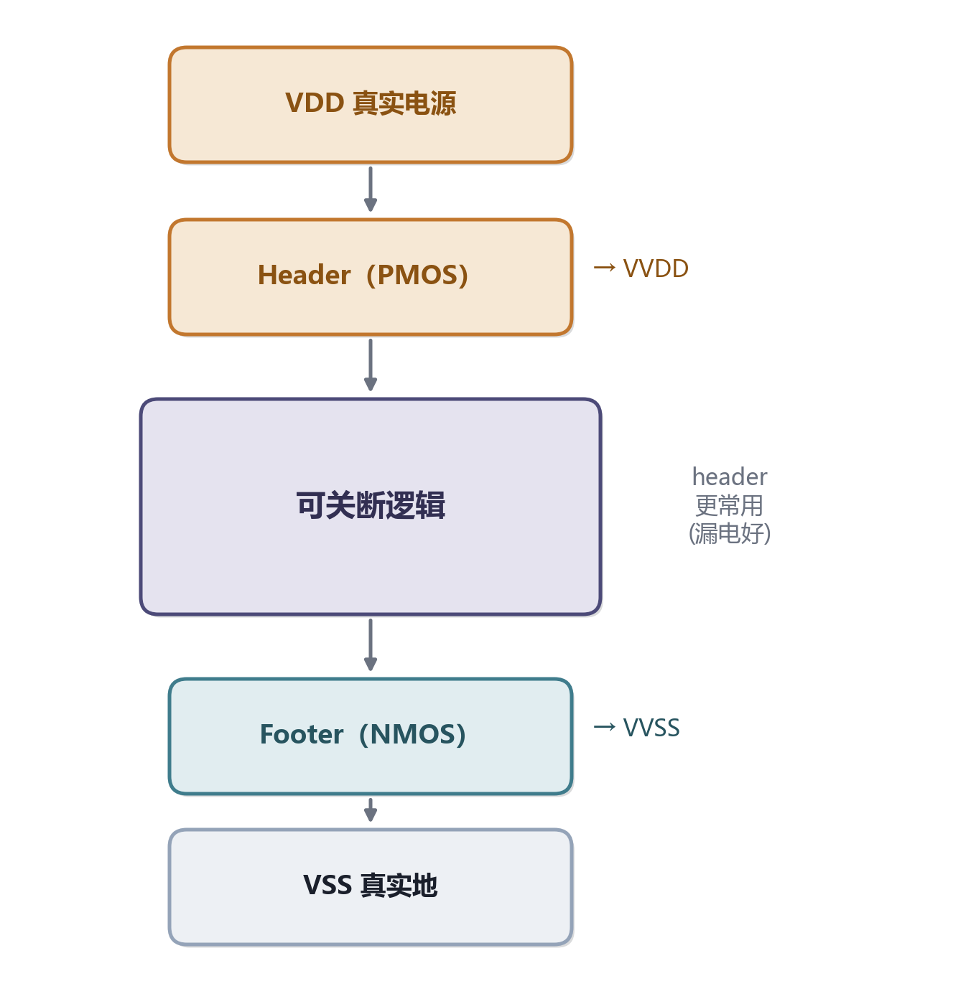

**知识点**

- 对可关断模块插 **Power Switch** 实现 **Power Gating（功率门控）**
- **Header（头开关）**：**PMOS**，置于真实 VDD 与模块虚拟电源 **VVDD** 之间；关断时切断正轨；**工程更常用**（漏电控制好）
- **Footer（脚开关）**：**NMOS**，置于模块虚拟地 **VVSS** 与真实 VSS 之间；关断时切断接地回路；**较少单独使用**
- header + footer 同时使用更罕见
- floorplan 阶段要规划：switch **阵列布局**（ring-style 或 grid/column-style）、**enable 信号菊花链（daisy-chain）**走向（控**冲击电流 inrush** 与唤醒时间），以及 **secondary / always-on PG** 连接

> 备注：唤醒冲击电流大 → enable 菊花链**分时**开启。

---

## Slide 16 · 多电压域与 UPF

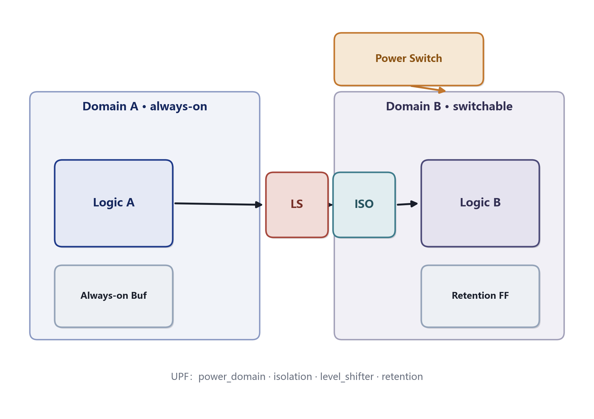

**知识点**

- 不同模块工作在不同电压（高性能高压、低功耗低压或可关断）；每个独立电压/电源状态区域 = **电压岛 / 电源域**
- 关键专用单元：

| 单元 | 作用 | 何时需要 |
|------|------|----------|
| Level Shifter | 转换跨电压域信号电平（0.8V↔1.0V） | 信号跨不同电压域 |
| Isolation Cell | 某域关断时把其输出**钳位**到已知值(0/1)，防下游浮空 | 信号从可关断域进常开域 |
| Retention FF | 域断电时低漏电“影子锁存”保状态，上电恢复 | 需状态保持的可关断域 |
| Always-on Buffer | 关断域内但接**常开电源**，保证 enable/retention 控制信号有效 | 控制信号穿过关断域 |
| Power Switch | 门控供电（见上页） | 可关断域 |

- 顺序：常**先 isolation 后 level shift**（先钳位再转电平），但**非绝对**（取决信号方向与隔离单元供电域；ELS 合并二者则无先后）
- **UPF**（IEEE 1801，Synopsys 主推）/ **CPF**（Cadence 主推）描述功耗意图；floorplan 据此 `create_voltage_area`、规划独立 PG 与 secondary/always-on 网、放 switch、预留 LS/ISO 位置

```tcl
# UPF（示意）
create_power_domain PD_CPU -elements {u_cpu}
create_power_switch sw_cpu -domain PD_CPU -input_supply_port {vin VDD} \
    -output_supply_port {vout VDD_CPU} -control_port {ctrl pwr_en} -on_state {ON vin {ctrl}}
set_isolation iso_cpu -domain PD_CPU -clamp_value 0 -applies_to outputs \
    -isolation_power_net VDD -isolation_ground_net VSS
set_level_shifter ls_cpu -domain PD_CPU -rule low_to_high -location self
create_voltage_area -power_domain PD_CPU -region {{100 100} {400 400}} VA_CPU
```

> 备注：LS 管“电压不同”，ISO 管“关断后输出乱”——常考区别。

---

## Slide 17 · 时序预算与模块划分

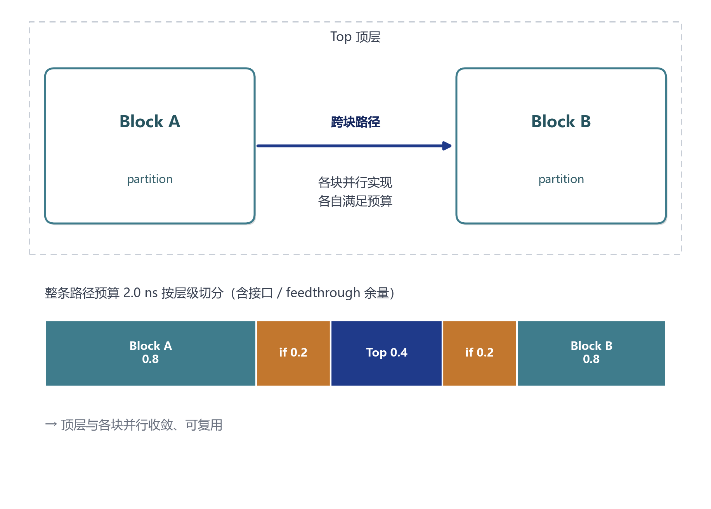

**知识点**

- 层次化设计中顶层切成 **Partition / Block** 分别实现；每个 block 对外端口需 **Timing Budget**——把顶层路径约束拆到各 block 边界，生成每个 block 的 **SDC**
- 预算合理 → 各 block 独立收敛后顶层即可收敛；不合理 → 反复迭代
- **pin 位置与 budget 耦合**：pin 离驱动/接收逻辑越远，块内走线越长、可用 budget 越少
- 自动预算：ICC2 `allocate_budgets` / `estimate_timing`；Innovus `deriveTimingBudget`；或 `create_block_abstraction` + ETM（Extracted Timing Model）
- **ILM（Interface Logic Model）**：只保留**接口逻辑**、抽掉块内部，简化并加速顶层时序收敛（层次化设计常用）
- block SDC budget 不只 input/output delay，还含时钟不确定度、时钟延迟、驱动单元/输入转换、负载：

```tcl
create_clock -name clk -period 2.0 [get_ports clk]
set_input_delay  0.6 -clock clk [get_ports data_in]
set_output_delay 0.7 -clock clk [get_ports data_out]
set_clock_uncertainty 0.10 [get_clocks clk]
set_driving_cell -lib_cell BUFX4 [get_ports data_in]
set_load 0.05 [get_ports data_out]
```

> 备注：预算 = 把一条总约束“切蛋糕”分给各层级。

---

## Slide 18 · 拥塞 / IR 早期预估与迭代闭环

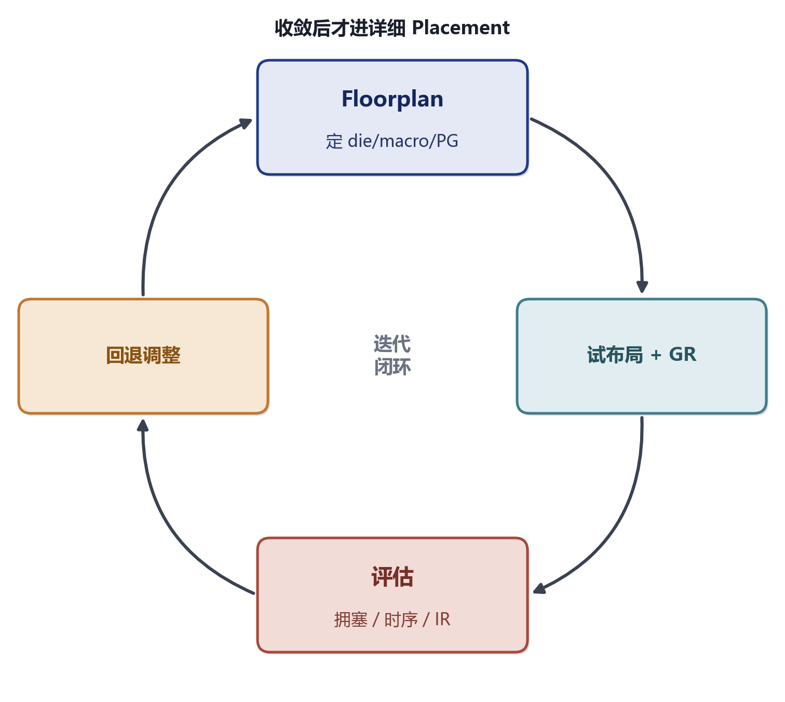

**知识点**

- **拥塞早期预估**：用全局布线（GR）估每个 GCell 的布线需求/资源比 → **拥塞图 + Overflow**
  - 两类拥塞：**全局拥塞**（区域整体需求超资源，如利用率高、stripe 过密占布线资源）；**局部/pin-access 拥塞**（引脚密集处可达性，全局充裕也可能堵）
  - 热点成因：macro **notch（凹角）**、macro 间窄 channel、pin 密集区、高 pin density 单元
  - 缓解：降利用率、加宽 channel、调 macro 朝向/位置、加 partial blockage、优化 pin
- **IR/EM 早期**：floorplan 阶段用**静态 PG 分析**评估 mesh 是否足够，定位高压降区加密 mesh/via；精确签核在布线后（Voltus / RedHawk-SC / PrimeRail）
- **迭代闭环**：`floorplan → 试布局 + GR → 评估拥塞/时序/IR → 回退调 floorplan（利用率/macro/channel/PG）→ 收敛后进详细 Placement`

> 备注：核心态度——Floorplan 是回环，不是一遍过。

---

## Slide 19 · 输入 / 输出 与 文件作用

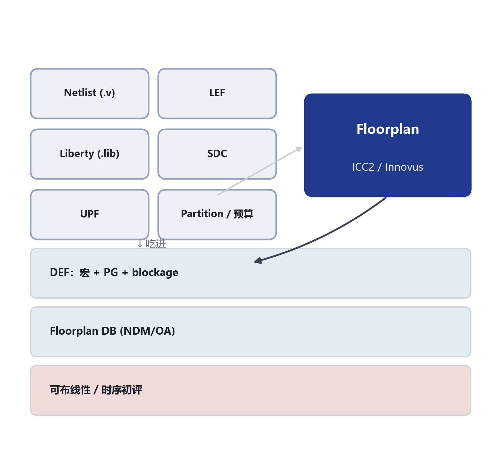

**知识点**

- **输入**：门级网表 `.v`、Tech/Cell **LEF**、Timing **Liberty(.lib)**、**SDC**、**UPF/CPF**、划分/时序预算
- **输出**：带**宏摆放 + PG + blockage** 的 **DEF**、Floorplan 数据库（NDM/OA）、可布线性/时序初评
- 文件作用速查：

| 文件 | 类型 | 在 floorplan 的角色 |
|------|------|---------------------|
| LEF | 抽象库 | site / layer / 布线规则 / 单元·macro 抽象（尺寸/pin/obstruction） |
| DEF | 交换格式 | 导出/导入 die/core、row、macro 位置、pin、PG |
| Liberty(.lib) | 时序/功耗库 | 时序预算与 STA |
| SDC | 约束 | 时钟、IO delay；时序预算据此拆分 |
| UPF / CPF | 功耗意图 | 电源域、switch、isolation、level shifter、retention |
| NDM | ICC2/FC 库与设计 DB | 新数据模型；Milkyway 为旧 DB |

> 备注：把 Floorplan 当“吃进设计/约束/库、吐出物理骨架”的黑盒记。

---

## Slide 20 · 衡量指标与常见问题

**知识点 · 关键指标**

| 指标 | 经验目标 |
|------|----------|
| Core Utilization | 0.5–0.8（视 macro/拥塞/时序） |
| Aspect Ratio | ≈ 1.0（约定方向以工具为准） |
| Congestion Overflow | 趋近 0，无大面积红区 |
| WNS / TNS | ≥ 0（收敛） |
| Static / Dynamic IR | 标称 VDD 的百分之几（静/动分别约束） |
| EM margin | 满足 foundry 电流密度规则 |

**知识点 · 常见问题 → 对策**

- 绕不出/拥塞 → 降利用率、加宽 channel、partial blockage、改 pin/macro 朝向
- 时序收不回 → 按 dataflow 重摆 macro、用 flyline、优化 pin
- IR drop 超标 → 加密 mesh、加宽 stripe、加 via array、补 bump
- EM 违例 → 加宽线、并联 via、降电流密度
- Pin 拥塞 → 加 halo、调 pin 层/间距、对齐 track
- switch 唤醒冲击大 → enable 菊花链分时开启

> 备注：每个问题都能反查到前面某页知识点。

---

## Slide 21 · EDA 命令速查（ICC2 / Innovus 对照）

**知识点**

| 任务 | Synopsys ICC2 / FC | Cadence Innovus |
|------|--------------------|-----------------|
| 初始化 floorplan | `initialize_floorplan` | `floorPlan` |
| 从 DEF 恢复 | `read_def` | `defIn` |
| 利用率/尺寸/AR | `initialize_floorplan -core_utilization 0.7 -side_ratio {1 1}` | `floorPlan -r 1.0 0.7 <L> <B> <R> <T>` |
| macro halo | `create_keepout_margin -outer {l b r t}` | `addHaloToBlock {l b r t}` |
| 布局阻挡 | `create_placement_blockage -type hard/soft/partial` | `createPlaceBlockage -type ...` |
| 引脚分配 | `place_pins / set_block_pin_constraints` | `editPin / assignIoPins` |
| 电源环/条/轨 | `create_pg_ring/mesh/std_cell_conn_pattern + compile_pg` | `addRing / addStripe / sroute` |
| 电压区域 | `create_voltage_area` | `createPowerDomain` |

- **易错点（margin 四值顺序）**：Innovus `floorPlan -r AR util <left> <bottom> <right> <top>` 为 **LBRT**，初学者常误填 LTRB；`addHaloToBlock` 同为 `{l b r t}`；ICC2 `-outer {l b r t}`——**务必核对手册**
- `defIn` ≠ `floorPlan`：前者读入已有 DEF（从 DEF 恢复），后者交互创建，语义不同

> 备注：命令/选项随版本而异，以官方手册为准。

---

## Slide 22 · 本章小结

**知识点（8 点）**

1. Floorplan 是 P&R 第一个确定版图骨架的步骤：定 die/core 几何、macro 摆放与朝向、IO/bump、电源骨架、电压域，**决定 PPA 上限**
2. 几何：区分**总利用率/有效利用率**（0.5–0.8）、长宽比（≈1、约定以工具为准）、row 与 site、**行翻转共享供电轨**
3. Macro：沿边/沿角、按 dataflow、留 channel（或 channel-less）、pin 朝 core、选朝向与对称；配 flyline、auto placer、halo、blockage（hard/soft/partial）、endcap/well-tap/filler
4. IO/bump 与引脚分配：wire-bond pad ring vs flip-chip bump array；块级 pin 须落合法 track、注意 feedthrough
5. 电源：ring→stripe→mesh→rail→sroute，控 **IR drop**（百分之几、静/动）与 **EM**（PG 与信号分别评估）；含 power switch/header/footer 与 secondary/always-on PG
6. 多电压域：level shifter / isolation / retention FF / always-on buffer / power switch，由 **UPF/CPF** 描述并落地为电压区域
7. 时序预算：层次化把顶层约束拆到各 block；预算含 IO delay、时钟不确定度、驱动/负载；pin 位置与 budget 强耦合
8. 早期预估与迭代：GR 估拥塞（全局/局部）、静态 PG 估 IR，**floorplan → trial place/GR → 评估 → 回退**，迭代闭环

> 备注：小结回扣开篇主张。

---

## Slide 23 · 易混淆点 · 课后自测

**知识点（16 题）**

1. **Utilization 过高 vs 过低**：高→拥塞/IR 恶化；低→面积浪费/走线变长。区分总/有效利用率
2. **Halo vs Placement Blockage**：halo 跟随 macro；blockage 固定坐标
3. **Hard / Soft / Partial Blockage**：全禁 / 优化阶段可放 buffer / 按密度上限
4. **Placement Blockage vs Routing Blockage**：限制“放单元” vs 限制“走线”（可指定层）
5. **Level Shifter vs Isolation**：电压不同（电平转换）vs 电源关断（输出钳位）
6. **Retention FF vs Always-on Buffer**：保断电域“状态” vs 保穿过的“控制信号”
7. **Header vs Footer**：PMOS 门控 VDD（更常用）vs NMOS 门控 VSS
8. **IR Drop vs EM**：瞬时电压不足→时序 vs 长期电流→可靠性
9. **Ring / Stripe / Mesh / Rail / sroute**：边界主干 / 横跨条 / 纵横成网 / M1 follow-pin / 连接打 via
10. **Flylines 作用**：可视化连接关系（可带 weight）指导 dataflow 摆 macro，非实际布线
11. **Core Utilization vs Placement Density**：floorplan 初始目标（含 macro）vs placement 后局部实际密度
12. **UPF vs CPF**：IEEE 1801（Synopsys）vs Cadence；都描述 power intent
13. **Aspect Ratio 为何偏好 1.0**：方正利于布线均衡与 CTS；长条易拥塞、skew 难控（约定方向以工具为准）
14. **为什么相邻行翻转**：使同名供电轨落行边界、被两行共享，条数减半、保 follow-pin rail 连续
15. **defIn vs floorPlan**：读入已有 DEF vs 交互创建 floorplan，语义不同
16. **签核工具厂商**：Voltus=Cadence；RedHawk/-SC=Ansys；PrimeRail=Synopsys（IR/EM）；PrimePower=Synopsys（动态功耗）

> 备注：这 16 题可当课后自测。

---

## Slide 24 · 结束

**速查口诀**

- 绕不出 → 看**利用率 / channel**
- 时序差 → 看 **macro / pin**
- IR 超标 → 看 **mesh / stripe / via**
- 记住：Floorplan 是**迭代回环**，不是一遍过；每个决定都在为后端整条流程“定调”

> 备注：收束，过渡到下一讲 Placement / CTS。

---

> 配套：可编辑幻灯片 [`slides/05_Floorplan.pptx`](slides/05_Floorplan.pptx) · 论文插图 [`assets/floorplan/`](assets/floorplan/) · 口语讲稿 [`lecture_scripts/05_Floorplan.md`](lecture_scripts/05_Floorplan.md) · 配图/出片脚本 [`_SlideKit/`](../_SlideKit/) · 整理 **J.C**
