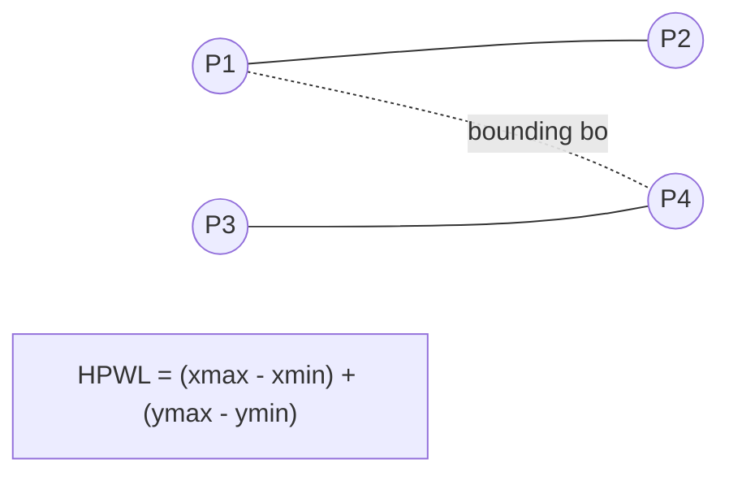
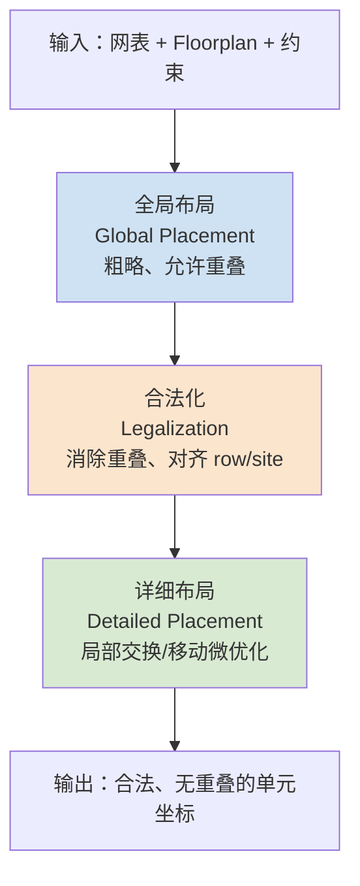
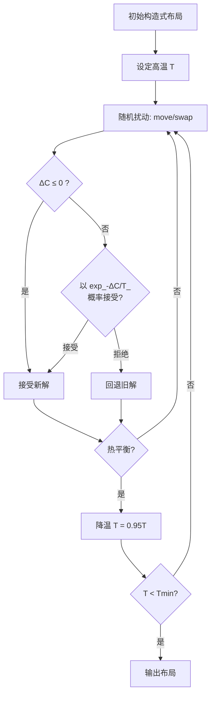
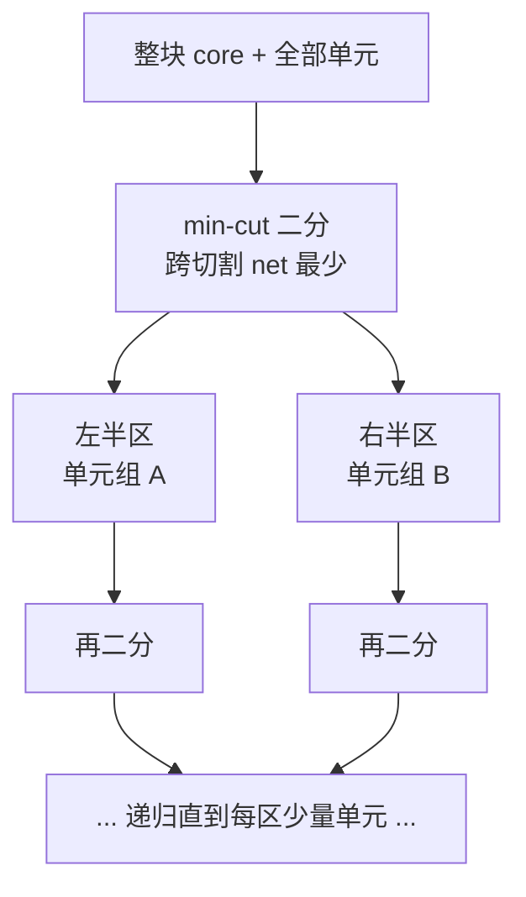
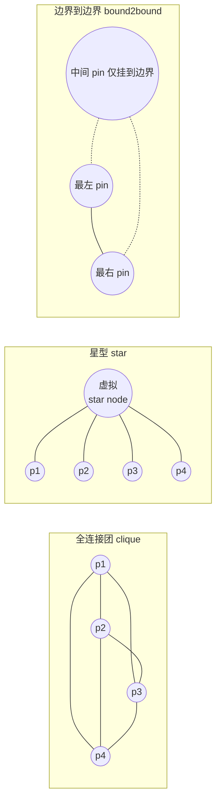
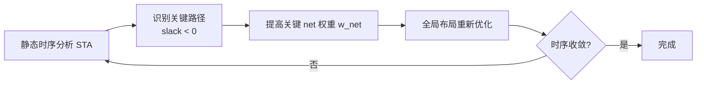
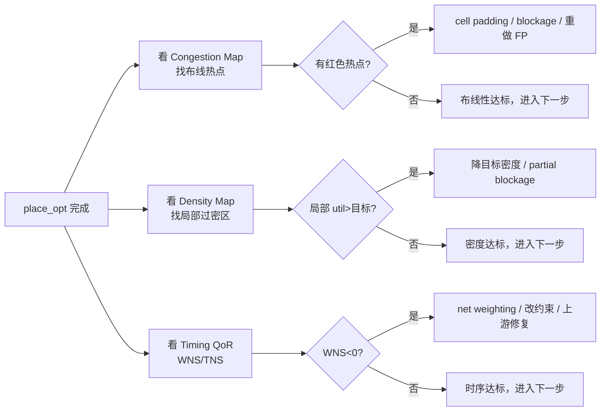
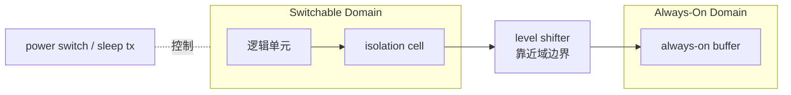
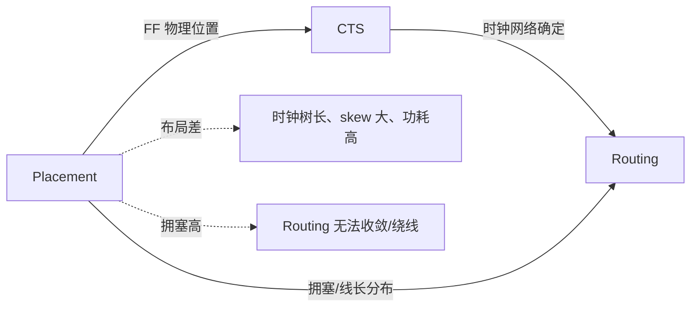
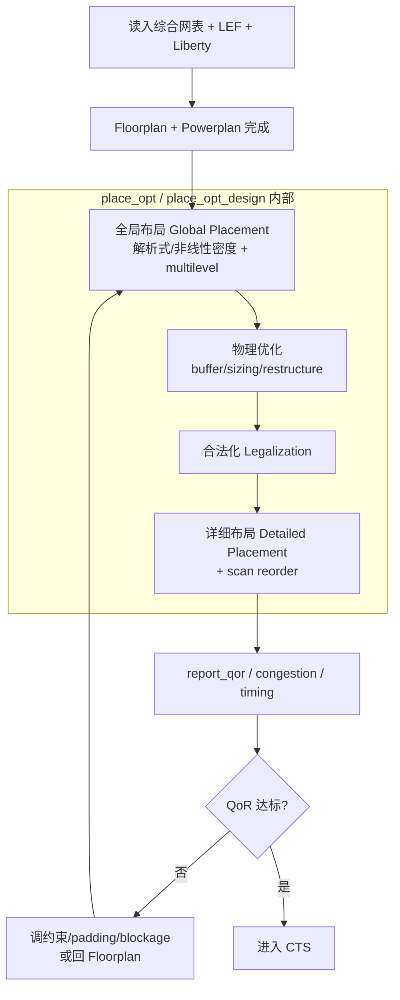

# Placement 布局介绍

> 《芯片设计从RTL到GDS》学习笔记 · 对应课程第36–40课
> 适用读者：已具备数字电路与逻辑设计基础的工科学生 / 初级数字 IC 后端工程师
> 用途：系统复习 + 工程速查
> 课程原版 (English source): Adam Teman, *Digital VLSI Design (DVD)*, Bar-Ilan University · Course 83-612 · 对应 DVD Lecture 7 (Standard Cell Placement) · https://enicslabs.com/academic-courses/dvd-english/

---

## 0. 本篇导读

布局（Placement）是数字后端物理实现（Physical Implementation）中承上启下的关键步骤：它把综合（Synthesis）后得到的、已经过布图规划（Floorplan）确定边界与宏单元（Macro）位置的网表，逐个把**标准单元（Standard Cell）**精确地摆放到芯片版图的合法位置上。布局质量直接决定了后续时钟树综合（Clock Tree Synthesis, CTS）与布线（Routing）的成败，是“线长、时序、拥塞、功耗”四者博弈的核心战场。

本篇覆盖：定义与目标、优化度量（HPWL 与 RSMT/FLUTE）、三阶段划分、三大经典算法族（模拟退火 / 划分式 / 解析式）、多层次（multilevel）加速、时序驱动与拥塞驱动思想、功耗与多电压域约束、物理综合并行优化、扫描链重排与各类物理单元、阻挡与密度控制、主流工具实践，以及与前后阶段的耦合关系。

---

## 1. 什么是布局（Placement）

### 1.1 定义

**布局（Placement）** 指在已完成布图规划的芯片版图上，为网表中每一个**标准单元（standard cell）**确定一个精确的物理坐标 (x, y)，使其落在版图的**行（row）**所定义的**合法格点（legal site）**上，且单元之间互不重叠、满足设计规则与各类约束的过程。


### 1.2 在流程中的位置

- **上游：Floorplan 之后。** Floorplan 已经确定了芯片尺寸（die/core 面积）、IO/PAD、宏单元（如 SRAM、PLL）的摆放、电源网络（Power Mesh）、以及 row 与 site 的定义。Placement 在这些“既定边界”内填入标准单元。
- **下游：CTS 之前。** 布局后标准单元位置初步确定，但这并非“冻结”：CTS 会插入大量时钟缓冲器/反相器并触发增量布局与合法化（incremental placement / legalization），postCTS、postRoute 优化也会继续移动、增删单元。因此应理解为“位置初步定型，后续阶段仍会做增量调整”。

### 1.3 row 与 site 的概念（合法位置的来源）

标准单元高度统一（如 N 倍布线轨道 track 高度），版图被横向切分成一条条等高的 **行（row）**；每行又按放置最小步进切成 **格点（site）**。单元的合法摆放必须满足：

- 底边对齐到某一 row；
- 左边界对齐到 site 边界。**site 宽度由 LEF 定义**，是单元放置的最小水平步进（通常等于 1 个或数个制造/poly pitch）。而 **placement grid（放置栅格）是工具内部用于放置单元的栅格，二者概念不同、数值常不相等**；placement grid 通常可设为 site 宽度的整数倍。
- 上下相邻行交替做 **X 轴镜像**（朝向 N / FS 交替），使相邻行边界处共享同一条 VDD（或 VSS）电源轨（power rail abutment）。注意这是“上下相邻两行之间”的镜像，而非同一行内部的左右翻转。

```text
# LEF 中 SITE 与 ROW 定义片段（示意）
SITE coreSite
    SIZE 0.09 BY 0.576 ;     # site 宽 0.09um，高 0.576um（标准单元行高）
    CLASS CORE ;
    SYMMETRY Y ;             # 允许绕 Y 轴镜像(FN)；若库靠 N/FS 翻转做行间电源轨共享，则应含 X(即 SYMMETRY X Y)
END coreSite

# DEF 中的 ROW 定义（自动生成）
# 约定：DEF UNITS DISTANCE MICRONS 1000，即 1000 DBU/µm，故坐标与步进单位均为 DBU。
# site 宽 0.09µm → 90 DBU；行高 0.576µm → 576 DBU。
ROW ROW_0 coreSite 5000 6000 N DO 9000 BY 1 STEP 90 0 ;
#         |site    |x0   |y0  |朝向  |       |       |
#                                    DO 9000 = X 方向 9000 个 site
#                                            BY 1   = Y 方向 1 个（单行）
#                                                   STEP 90 = X 步进 90 DBU(=0.09µm)
#                                                          0 = Y 步进 0
```

> **常见坑：** DEF ROW 标准语法为 `ROW rowName siteName origX origY orient DO numX BY numY STEP stepX stepY`。`DO/BY` 是 X/Y 方向**数量**，`STEP` 是 X/Y 方向**步进**；务必保证坐标、step 与 LEF 的单位（DBU）一致，否则会出现单元错位。

---

## 2. 优化目标与度量指标

布局是一个**多目标优化（multi-objective optimization）**问题，工具内部用加权代价函数权衡以下指标：

| 优化目标 | 度量指标 (English) | 度量方式 | 工程含义 |
|---------|-------------------|---------|---------|
| 线长 | 总线长 (total wirelength) | HPWL（快、下界）/ RSMT（更准） | 影响延迟、功耗、布线资源 |
| 可布线性 | 拥塞 / overflow (congestion) | 各 GCell 分方向 demand/capacity | 决定 Routing 能否 100% 完成 |
| 时序 | 时序裕量 (timing slack) | WNS / TNS（建立时间为主） | 决定能否收敛到目标频率 |
| 密度 | 利用率 (density / utilization) | bin 内单元面积占比 | 影响布线、散热、可制造性 |
| 功耗 | 动态功耗 (dynamic power) | P ∝ α·C·V_dd²·f | 缩短高翻转 net 线长以降 C，进而降功耗 |

> **功耗度量正解：** 动态功耗 **P_dyn ≈ α·C·V_dd²·f**（开关活动率 switching activity × 负载电容 × 电源电压平方 × 频率）。布局阶段能直接影响的是 **C**（线长 → 负载电容）：把高翻转率（high-toggle）net 的线长缩短即可降低 C 从而降功耗。注意不能只写“电容×频率”，遗漏电压平方项与活动率会严重失真。术语上应使用规范的“**开关活动率 α × 负载电容 C**”，而非“翻转电容”。

### 2.1 HPWL 半周长线长模型（核心度量）

**HPWL（Half-Perimeter Wire Length，半周长线长）** 是布局阶段估算线长最常用的模型：对一个连接多个引脚（pin）的 net，取所有引脚坐标的最小/最大包围盒（bounding box），线长 = 包围盒的半周长。

$$
\text{HPWL}(net) = (x_{max} - x_{min}) + (y_{max} - y_{min})
$$

- **为什么用 HPWL：** 计算极快（只需 min/max），对 2~3 引脚 net 接近真实布线长度。
- **精度边界：** HPWL 是布线树长度（矩形斯坦纳最小树 RSMT）的**下界**（包围盒半周长 ≤ Steiner 树长度）。对 2–3 引脚 net 接近真实值；对**高扇出 net 会明显低估**，与 RSMT 偏离较大，并非“良好估计”。
- **总目标：** 最小化 $\sum_{net} w_{net} \cdot \text{HPWL}(net)$，其中 $w_{net}$ 为时序驱动赋予的权重。



> **常见坑：** HPWL 低估高扇出 net 的实际布线长度，也不反映拥塞绕线。

### 2.2 RSMT / FLUTE：更接近真实布线的线长估计

- **是什么：** 布线后真实线长更接近**矩形斯坦纳最小树（Rectilinear Steiner Minimum Tree, RSMT）**——允许引入斯坦纳点（Steiner point）的最短直角连接树。RSMT 精确求解是 NP-hard。
- **怎么做：** 工业界用 **FLUTE（Fast Lookup Table Estimation）**：对低引脚数（典型 ≤ 9 pin）的 net 用预计算的查找表（look-up table）极快地估出近似 RSMT 线长，高引脚数 net 递归拆分处理。
- **取舍：** HPWL **快**但偏下界，适合全局布局内层海量迭代；RSMT/FLUTE **更准**，适合 congestion-aware（拥塞感知）的线长/布线资源估计与试布线评估。现代工具二者并用：内层迭代用 HPWL，评估/拥塞建模用 FLUTE 或 trial route。

| 度量 | 速度 | 精度 | 典型用途 |
|------|------|------|---------|
| HPWL | 极快 | 下界、低估高扇出 | 全局布局内层迭代目标 |
| RSMT / FLUTE | 快（查表） | 接近真实布线 | 拥塞感知估计、线长报告 |
| Trial / Global Route | 较慢 | 最接近真实 | 拥塞热点判定、布线性评估 |

---

## 3. 布局的三阶段划分

主流工具（ICC2 / Innovus）都把 Placement 拆成三个递进阶段：



### 3.1 全局布局（Global Placement）

- **是什么：** 不强制单元落在合法 site 上、允许暂时重叠，先求得使全局代价（线长+密度+拥塞）最小的“大致位置分布”。
- **为什么重要：** 它决定了整体布局的质量上限——后续合法化与详细布局只能在此基础上局部修补。
- **怎么做：** 解析式（二次/非线性，见第 6 节）或划分式迭代，且普遍叠加多层次（multilevel）加速（见 §6.5）。输出是带重叠的浮点坐标。

### 3.2 合法化（Legalization）

- **是什么：** 将全局布局产生的、可能重叠且未对齐的单元，以**尽可能小的位移（启发式近似最小化总位移，而非保证全局最优——精确最小总位移是 NP-hard）**移动到合法 row/site 上，消除所有重叠。
- **经典算法：** Tetris（贪心填行）、Abacus（按行用动态规划最优分配单元，位移更小）。两者均为**启发式**。
- **还须满足的合法性约束（易被忽略）：**
  - **单元朝向与 row 极性一致**：单元的 N/FS 翻转必须与所在行电源轨极性匹配，否则 VDD/VSS 接反。
  - **避让固定/预放置单元（preplaced/fixed cell）与各类 blockage**。
  - **同行相邻单元的 implant / min-spacing 规则**：不同阈值电压（Vt）/ well / implant 层之间需满足最小间距，相邻单元不能任意紧贴。
  - **多行高单元（见 §3.4）的跨行对齐**。
- **常见坑：** 合法化会破坏全局布局的时序/拥塞优化结果，位移过大会引入意外的长 net，需要详细布局补救。

### 3.3 详细布局（Detailed Placement）

- **是什么：** 在已合法的位置上做**局部、保持合法性**的微优化：相邻单元交换（swap）、单行内滑动、镜像翻转、间隙压缩。
- **典型手段：** 全局/局部 cell swap、单行重排（optimal interleaving）、median 改善、白空间（whitespace）再分配。
- **与合法化的边界：** 合法化只负责“消重叠 + 落合法位”；详细布局在“已合法”前提下改善 QoR，二者目标不同但在工具中常连续执行。
- **目标：** 进一步降低 HPWL、缓解局部拥塞热点、为后续填充 filler/decap 留出合理间隙。

### 3.4 多行高（multi-height）单元的合法化难点

现代标准单元库不再全部等高：除常规 1-row 单元外，常含 **2-row / 3-row height** 单元（如大驱动 buffer、复杂触发器）。这给合法化与详细布局带来额外难点：

- 多行高单元必须**跨多行对齐**，且每一行的电源轨极性都要正确匹配（朝向受多行约束，自由度更低）。
- 单行算法（Tetris/Abacus 原型）无法直接处理跨行单元，需扩展为多行约束下的合法化（混合行高 legalization 是当前研究热点）。
- 与等高假设不同，**本篇其余小节为简化默认单元等高**，工程中务必意识到多行高单元的存在与额外约束。

---

## 4. 经典算法族之一：构造式 + 模拟退火（Simulated Annealing）

### 4.1 是什么

**模拟退火（Simulated Annealing, SA）** 借鉴金属退火过程：高温时允许“变差”的移动以跳出局部最优，随温度降低逐渐收敛。代表工具是 1980s 的 **TimberWolf**。

代价函数（cost）综合多目标：

$$
\text{Cost} = \alpha \cdot \text{Wirelength} + \beta \cdot \text{Overlap} + \gamma \cdot \text{Congestion}
$$

### 4.2 接受概率与温度

每次随机扰动（move/swap/rotate）后计算代价变化 $\Delta C$：

- $\Delta C \le 0$（变好）：**无条件接受**；
- $\Delta C > 0$（变差）：以概率 $P = e^{-\Delta C / T}$ 接受（Metropolis 准则）。

温度 $T$ 按降温调度（如 $T_{k+1} = 0.95\,T_k$）逐步下降，接受坏解的概率随之减小。



> 图中 `CD` 表示“降温（cooling down）”步骤，刻意与温度符号 T 区分以免混淆。内层 `M→…→EQ` 为热平衡循环，外层 `CD→E→M` 为降温循环，二者共用入口 `M`。

### 4.3 优缺点

| 优点 | 缺点 |
|------|------|
| 能跳出局部最优，理论上趋向全局最优 | 收敛慢，运行时间随规模急剧上升 |
| 代价函数灵活，易加入多目标 | 难以扩展到百万门级现代设计 |
| 实现概念简单 | 参数（降温曲线、扰动）敏感、难调 |

> **现状：** SA 因可扩展性差，已不用于现代大规模全局布局；但其思想仍存活于**详细布局的局部优化**和 FPGA 布局中。

---

## 5. 经典算法族之二：划分式 min-cut / 递归二分

### 5.1 是什么

**划分式布局（partitioning-based / min-cut placement）** 把“放置单元”转化为“反复二分电路 + 二分版图区域”的问题：每次用**最小割（min-cut）**把单元分成两组，使跨越切割线的 net 数最少，再把两组分别指派到版图的左右（或上下）两半，递归直到每个区域只剩少量单元。



### 5.2 核心算法：KL 与 FM

- **Kernighan-Lin (KL)：** 通过成对交换两侧节点、累积增益（gain）寻找使割数下降的交换序列。**单遍（pass）优化实现约 $O(n^2\log n)$**（每步需扫描/排序选最佳交换对），且需多遍迭代至无改善；朴素实现可达 $O(n^3)$。注意这是单遍而非总复杂度。
- **Fiduccia-Mattheyses (FM)：** KL 的改进，单节点移动 + 增益桶（gain bucket）数据结构，**单遍约线性 $O(\text{pins})$**，并支持面积平衡约束，是工业界 partitioning 的基础。

```text
FM 算法骨架（伪代码）
1. 初始二分 (A, B)，满足面积平衡
2. 计算每个 cell 的 gain = 移到对侧后割数减少量
3. 用 gain bucket 选最高 gain 且不破坏平衡的 cell，移动并锁定
4. 更新邻居 gain；重复直到全部锁定
5. 回溯到累积 gain 最大的前缀，作为本遍结果
6. 解锁，重复多遍直到无改善
```

### 5.3 优缺点

| 优点 | 缺点 |
|------|------|
| 天然分治、可扩展性好、运行快 | 切割线决策“一次性”，早期错误难纠正 |
| 直接优化 cut（与拥塞相关） | 线长非直接优化，结果常逊于解析式 |
| 与层次化设计契合 | 区域边界处易产生不连续 |

---

## 6. 经典算法族之三：解析式布局（Analytical Placement）

解析式布局是**现代全局布局的主流**。核心思想：把布局写成一个连续可微的数学优化问题，用数值方法求解。

### 6.1 二次布局（Quadratic Placement）

**是什么：** 用线长的**平方**作为目标函数。net 的平方线长是各引脚坐标的二次型，对坐标求偏导得到一组**稀疏线性方程组**，可用**共轭梯度法（Conjugate Gradient, CG）**高效求解。

$$
\Phi = \sum_{net} w_{ij}\big[(x_i - x_j)^2 + (y_i - y_j)^2\big]
\;\;\Rightarrow\;\;
\frac{\partial \Phi}{\partial x} = 0 \Rightarrow Q\mathbf{x} = \mathbf{b}
$$

其中 $Q$ 是网表的拉普拉斯矩阵（Laplacian），$\mathbf{b}$ 由固定引脚（IO/macro pin）提供边界条件。

> **CG 可解的关键前提：** CG 要求 $Q$ **对称正定（SPD）**。网表 Laplacian 本身只是**半正定**（存在零特征值，对应整体平移自由度）。**正是固定的 IO/macro pin 作为锚点（anchor）注入边界条件，才把半正定的 Laplacian 变为正定**，使 $Q\mathbf{x}=\mathbf{b}$ 有唯一解、CG 才适用。

> **为什么用平方而非 HPWL：** HPWL 不可微（min/max 带折点），而平方线长处处可微、对应线性方程组，求解极快。代价是平方会过度惩罚长 net、低估短 net，需多引脚 net 模型修正。

### 6.2 多引脚 net 的模型：clique / star / bound2bound

二次模型只能描述两点间“弹簧”，对超过 2 个引脚的 net 需要等效成两两连接。三种常见模型：



> 上图的 `subgraph id["显示名"]` 写法需较新版 Mermaid 渲染器支持；若使用旧版渲染器，请改为 `subgraph 显示名`（不带 id 与方括号）。bound2bound 仅把当前最外侧两 pin 直接相连，中间 pin 以动态权挂到边界，详见下表。

| 模型 | 中文(English) | 连接方式 | 权重 | 特点 |
|------|--------------|---------|------|------|
| Clique | 全连接团 (clique) | 引脚两两相连，$\binom{k}{2}$ 条边 | 每条边权 $w/(k-1)$ 归一化 | 精度高，但 $O(k^2)$ 边，高扇出爆炸 |
| Star | 星型 (star) | 引入虚拟星点，$k$ 条边 | $w$ | $O(k)$ 边，引入额外变量 |
| Bound2Bound | 边界到边界 (bound2bound) | 仅连接当前最外侧引脚 | 动态权 $\propto 1/\text{距离}$ | 二次线长精确逼近 HPWL，主流选择 |

> **工程结论：** 现代二次布局器（如 Kraftwerk2、FastPlace）多采用 **bound2bound** 模型，使二次目标的最优解最接近真实 HPWL。

### 6.3 密度问题与力导向（Force-Directed）

纯二次解会让单元**向固定锚点（IO/macro pin）质心方向拉拢、严重聚集与重叠、密度极不均匀**（注意：并非“所有单元重叠到一点”，而是大量重叠、密度严重不均）。必须加入**扩散力（spreading force）**把单元推开：

- **力导向布局（force-directed placement）：** 把单元间重叠建模为排斥力，net 建模为吸引力（弹簧），迭代求力平衡。代表是 **Kraftwerk**，通过“恒定附加力 + 重解方程”迭代展开。
- **谱系定位（避免误解）：** 力导向**并非独立于二次布局的另一套方法**，而是**在二次布局基础上、用附加力/迭代手段解决密度问题的一类实现**，与二次布局同属**解析式同一谱系**的演进。
- 直观图景：吸引力（线长）拉拢，排斥力（密度）推开，平衡态即为期望布局。


### 6.4 现代非线性密度法（ePlace / RePlAce）

当前学术与工业界 SOTA 的全局布局算法把密度约束建模为**静电场（electrostatics）**：

- **核心比喻：** 每个单元看作带电粒子，电荷量 ∝ 单元面积；同号电荷相互排斥，自然实现“均匀铺开”。
- **求解机制（区分两层，勿混为一谈）：**
  - **密度惩罚的势/场**：每次迭代中，密度分布对应的电势能/场由**泊松方程（Poisson equation）**在 **Neumann 边界**下求解；ePlace 用 **DCT（离散余弦变换，基于 FFT 实现）**而非普通 FFT/DFT，以匹配 Neumann 边界条件，从而高效得到密度梯度。
  - **整体目标**：外层用 **Nesterov 加速梯度下降**最小化 $\text{WL}(x) + \lambda \cdot D(x)$，其中 $D(x)$ 为电势能（密度惩罚），$\lambda$ 逐步增大以收紧密度。
- **天然支持 mixed-size placement：** 非线性密度法把宏单元与标准单元**统一为带面积的可移动对象**，天然支持 **mixed-size placement（大宏 + 标准单元混合布局）**，可同时优化 movable macro 与 std cell，这是 ePlace/RePlAce 的重要贡献之一。
- **代表工作：** **ePlace**、**RePlAce**（非线性、电荷密度），以及 GPU 加速的 **DREAMPlace**（把布局表达为深度学习框架中的张量运算，速度提升数十倍）。

| 算法族 | 全局布局可扩展性 | 线长质量 | 现状 |
|--------|----------------|---------|------|
| 模拟退火 SA | 差（百万门不可行） | 中 | 仅详细布局 / FPGA |
| 划分式 min-cut | 好 | 中 | 历史主流，现少用 |
| 二次 / 力导向 | 好 | 良 | 商用工具基础 |
| 非线性密度 (ePlace 类) | 很好（GPU 可加速） | 优 | 当前 SOTA |

### 6.5 多层次（multilevel / coarsening）加速框架

现代 placer（含解析式）普遍采用**多层次（multilevel）**框架加速，而非直接对全网表（动辄千万对象）一次性求解：

1. **粗化（coarsen / clustering）**：把强连接的单元聚类成簇（cluster），逐层缩小问题规模，形成由细到粗的层级。
2. **顶层求解（solve）**：在最粗层上快速求解全局布局。
3. **细化（refine / uncoarsen）**：逐层展开簇、把解传播回更细层并局部优化，直至原始网表。

> **要点：** “coarsen → solve → refine” 显著降低求解规模与运行时间，是把解析式布局扩展到超大规模设计的关键工程手段。初学者勿误以为工具直接对全网表一次求解。

---

## 7. 时序驱动布局（Timing-Driven Placement）

### 7.1 是什么 / 为什么重要

仅最小化总线长 ≠ 时序最优——关键路径（critical path）上的 net 即使很短，若不优先缩短也可能违例。**时序驱动布局**让工具感知 SDC 约束与时序裕量，优先压缩关键 net。

### 7.2 两种主流方法

1. **网权重法（net weighting）：** 给关键路径上的 net 赋更高权重 $w_{net}$，在 HPWL/二次目标中被优先缩短。简单高效，工具默认采用。
   $$\min \sum_{net} w_{net}\cdot \text{HPWL}(net),\quad w_{net}\uparrow \text{ if slack}<0$$
2. **路径法（path-based）：** 直接对关键路径施加延迟约束（如在二次规划中加路径延迟上界），更精确但计算量大。



> **常见坑：** 权重过高会把关键 net 压短，却把其他单元挤开造成拥塞；net weighting 需迭代且与拥塞驱动联合权衡。

### 7.3 SDC 约束示例

```tcl
# SDC：定义时钟与关键约束，驱动 timing-driven placement
# 假设时间单位为 ns（由 Liberty/库单位决定），period 1.0ns = 1GHz
create_clock -name CLK -period 1.0 [get_ports clk]   ;# 1.0ns = 1GHz
set_input_delay  0.2 -clock CLK [all_inputs]
set_output_delay 0.2 -clock CLK [all_outputs]

# 全局电气约束：以下作用于整个 current_design
set_max_transition 0.15 [current_design]   ;# 全局最大转换时间约束(ns)
set_max_fanout     32   [current_design]   ;# 全局最大扇出约束(单位：fanout 负载数)

# 让 SDC 更完整真实：补充驱动与负载，使时序估计更准
set_driving_cell -lib_cell BUFX4 [all_inputs]
set_load 0.05 [all_outputs]                ;# 输出端负载电容(pF)
```

---

## 8. 拥塞驱动布局（Congestion-Driven Placement）

### 8.1 是什么

**拥塞（congestion）** 指某局部 net 的布线需求超过可用布线轨道（track）容量，导致 Routing 无法完成或绕线（detour）。**拥塞是按 GCell（global routing cell）分水平 / 垂直方向、并分金属层统计 demand 与 capacity 的——overflow 是逐方向、逐层计算的，并非笼统“某区域内”的标量。** 拥塞驱动布局通过快速**全局布线（global route）/试布线**估计每个 GCell 各方向的 overflow，反过来引导布局把高连接密度的单元铺散开。

$$
\text{Overflow}(g, dir) = \max\big(0,\ \text{demand}(g, dir) - \text{capacity}(g, dir)\big)
$$

> 其中 $g$ 为某 GCell，$dir \in \{\text{H}, \text{V}\}$（并可按金属层细分）。

### 8.2 怎么做

- **试布线反馈：** 全局布局中周期性调用 trial route，得到 congestion map，对热点区域增加“虚拟密度惩罚”使单元疏散。
- **cell padding / 单元留白：** 对引脚密集的单元周围预留空白 site，降低局部 pin density。
- **GR-based density adjustment：** 把布线 overflow 折算成等效密度，纳入解析式目标。

```tcl
# Innovus：实例级 padding 缓解局部拥塞（在高引脚密度单元周围留白）
# 较新版本推荐 setInstancePadding；specifyInstPad 为旧命令。单位为 site 数。
setInstancePadding -inst u_alu_core -left 1 -right 2   ;# 左留1 site、右留2 site

# 全局布局考虑拥塞（effort 选项名以工具版本手册为准）
setPlaceMode -place_global_cong_effort high            ;# {low|medium|high|auto}
```

> **权衡：** 拥塞驱动会把单元铺得更散 → 线长/时序变差；时序驱动会把关键 net 压紧 → 局部拥塞加剧。二者是一对此消彼长的矛盾，工具通过 effort 等级折中。

---

## 9. 物理综合阶段在布局中并行做的优化

现代布局**不只是摆单元**，而是**布局 + 优化（place + optimize）一体**。在全局/合法化/详细布局过程中并行执行物理感知（physical-aware）的逻辑/电气优化：

| 优化手段 | 中文(English) | 作用 |
|---------|--------------|------|
| Buffer 插入 | 缓冲器插入 (buffer insertion) | 修复长 net 的 transition/delay，驱动远端负载 |
| 单元尺寸调整 | 尺寸调整 (gate sizing) | 上调驱动力修时序，下调省功耗/面积 |
| 物理感知综合 | physical-aware synthesis | 基于真实位置重映射逻辑、重做 mapping |
| 逻辑重构 | restructuring / cloning | 复制高扇出单元、改写逻辑树缩短关键路径 |
| Pin swap | 引脚交换 | 利用对称引脚（如与门输入）缩短关键 net |

```tcl
# ICC2 / Fusion Compiler：布局+优化一体命令
place_opt                       ;# 含 global place, legalize, opt(buffer/size), detail place

# 物理引导：让综合阶段产生的 Synopsys Physical Guidance(SPG / DC-Graph 物理引导数据)
# 协同布局，提升 PPA 一致性。具体 app_option 名以工具版本手册为准。
set_app_options -name place_opt.flow.do_spg -value true   ;# 启用 Physical Guidance(版本相关)
report_qor                      ;# 查看布局后 timing/area/congestion QoR

# Innovus 对应命令
place_opt_design                ;# 布局并做物理优化
```

> **要点：** `place_opt` / `place_opt_design` 是后端工程师在 Placement 阶段最核心的命令——它不是单纯放单元，而是一次性完成 global place → optimization（buffer/sizing/restructure）→ legalize → detailed place 的闭环。
>
> **SPG 术语澄清：** SPG = **Synopsys Physical Guidance**，指 Design Compiler 在综合阶段产生的物理引导数据（亦称 DC-Graph），供 ICC2/Fusion Compiler 复用以提升收敛一致性，并非“DC-graph 图算法”之意。

---

## 10. 扫描链重排、各类物理单元与布局阻挡 / 密度控制

### 10.1 扫描链重排（Scan Reorder / Scan Chain Reordering）

- **是什么：** DFT 插入的扫描链（scan chain）在综合时按逻辑顺序串接，物理上可能跨越整个芯片，scan 连线极长。布局后按**触发器物理位置就近重连**扫描链，大幅缩短 scan net 线长、缓解拥塞。
- **前提：** 必须保留 SCANDEF（描述允许重排的链结构与约束），且不破坏 scan-in/scan-out 顺序约束。

```text
# SCANDEF 片段（示意）：声明一条可重排扫描链及其 START/STOP/ORDERED 关系
SCANCHAINS 1 ;
- chain_0
  + START PIN scan_in
  + FLOATING
      u_ff_0 ( IN SI ) ( OUT Q )
      u_ff_1 ( IN SI ) ( OUT Q )
      u_ff_2 ( IN SI ) ( OUT Q )
  + STOP PIN scan_out ;
END SCANCHAINS
```

```verilog
// scan flop 串接示意（重排前的逻辑顺序）：SI ← 前级 Q，工具据 SCANDEF 按物理位置重连
// 用扫描 D 触发器 SDFF（含 SI/SE 扫描端口）；避免用 DFFSR(隐含未接的 S/R 端口)
SDFF u_ff_0 (.D(d0), .SI(scan_in),  .SE(se), .CK(clk), .Q(q0));
SDFF u_ff_1 (.D(d1), .SI(q0),       .SE(se), .CK(clk), .Q(q1));
SDFF u_ff_2 (.D(d2), .SI(q1),       .SE(se), .CK(clk), .Q(scan_out));
```

```tcl
# ICC2：读入 SCANDEF 并在布局阶段做 scan reorder（选项名以版本手册为准）
set_app_options -name place.legalize.enable_scan_reorder -value true
# Innovus（选项名随版本变化，以版本手册为准）：
defIn design.scandef
setPlaceMode -place_global_reorder_scan true
```

### 10.2 Spare Cell（备用单元）

预先散布在版图中的未使用逻辑单元（与非门、触发器、buffer 等），用于后期 **ECO（Engineering Change Order）** 时不重做布局即可改逻辑（metal-only ECO）。布局阶段需保证 spare cell **均匀分布**。

### 10.3 各类物理单元（tap / tie / filler / decap / endcap）与插入时机

各类“物理单元”角色与插入时机不同，初学者常混淆：

| 物理单元 | 中文(English) | 作用 | 典型插入时机 |
|---------|--------------|------|-------------|
| Well Tap | 阱接触 (well tap) | 按最大间距规则**均匀插入**，给 well 提供偏置、防 latch-up | 布局阶段（与标准单元一同/紧随，须满足 max tap distance） |
| Tie Cell | 上拉/下拉单元 (tie-high/tie-low) | 给恒定 0/1 输入提供安全电平源，避免直连电源轨 | 布局/优化阶段 |
| Endcap | 端帽单元 (endcap / boundary cell) | 行两端 / 区域边界封口，满足边界规则 | Floorplan 末 / 布局前期 |
| Filler | 填充单元 (filler) | 填补行内空隙，连续 N-well/implant、保证 DRC 连续 | **通常在布局完成之后**（CTS/Route 前后） |
| Decap | 去耦电容单元 (decap) | 提供局部电荷储备，抑制电源噪声/IR-drop | **通常在布局之后**（电源分析后定点补充） |
| Spare | 备用单元 (spare) | 备 ECO 用，均匀散布 | 布局阶段（须保证分布） |

> **澄清要点：** well tap / tie cell 需满足**均匀/最大间距**插入约束；**filler 与 decap 通常在布局完成后（CTS 前后或布线前后）插入，而非全局布局阶段**——切勿把它们等同于布局阶段任务。

### 10.4 布局阻挡（Placement Blockage）与密度控制

| 类型 | 中文(English) | 作用 |
|------|--------------|------|
| Hard blockage | 硬阻挡 | 区域内完全禁止放标准单元（如宏单元上方、IP 周围） |
| Soft blockage | 软阻挡 | 全局布局禁止、但允许 buffer/优化单元落入 |
| Partial blockage | 部分阻挡 | 限制区域内最大密度（如 50%），疏散拥塞热点 |
| Density screen | 密度控制 | 设定目标 utilization，控制全局/局部密度 |

```tcl
# ICC2：宏单元四周用 halo(keepout margin) 控制其周围禁布带，
#       区域级禁布/限密则用 placement blockage —— 二者用途不同，勿混用。
create_keepout_margin -type hard -outer {5 5 5 5} [get_cells u_macro_sram]

create_placement_blockage -type hard -boundary {{100 100} {200 200}}
create_placement_blockage -type partial -blocked_percentage 50 \
    -boundary {{300 300} {500 500}}
set_app_options -name place.coarse.target_routing_density -value 0.85
```

> **halo vs blockage：** **宏单元周围**的禁布带推荐用 **halo / keepout margin（create_keepout_margin）**，它随宏移动；**任意区域**的禁布或限密用 **placement blockage**。二者用途不同，不可混为一谈。

---

## 11. 现代工具实践与 Debug

### 11.1 主流工具命令对照

> **统一免责声明：** 下表 `set_app_options` / `setPlaceMode` 等选项名随工具版本变化较大，请以对应版本的官方手册为准，切勿直接复制当真命令。

| 任务 | Synopsys ICC2 / Fusion Compiler | Cadence Innovus |
|------|-------------------------------|-----------------|
| 布局+优化（完整） | `place_opt` | `place_opt_design` |
| 初始/粗布局 | `create_placement`（或 `place_opt -from initial_place -to initial_place`） | `place_design`（`-concurrent_macros` 为并发宏布局选项，非“仅粗布局”） |
| 合法化 | `legalize_placement` | `refinePlace`（兼做 detailed/legalize；Innovus 无独立“仅合法化”常用命令） |
| 布 IO pin | `place_pins` | `editPin` / `assignIoPins`（注意：place_pins 是布 IO，不是粗布局） |
| 查 QoR | `report_qor` / `report_timing` | `report_qor` / `timeDesign -preCTS` |
| 拥塞分析 | `report_congestion` + GUI map | GUI congestion map / `report_congestion`（trial route 后亦可 `dumpCongestArea`） |
| 密度分析 | GUI density map / `report_utilization` | GUI density map / 相应 density 报告 |

> **更正要点：**（1）`place_pins` 是布 IO pin，**不是**粗布局；（2）Innovus 粗/全布局统一用 `place_design`，`-concurrent_macros` 仅是并发宏布局选项；（3）`refinePlace` 实为详细布局/合法化合并；（4）原“`report_route -congestion`”非标准 Innovus 命令，已更正；（5）`dumpToGIF` 只是把 GUI 截图导出为 GIF，**不是**密度分析命令，已移除。

### 11.2 三张关键 Debug 图



- **Congestion Map（拥塞图）：** 颜色越红表示 overflow 越严重。热点常源于宏单元摆放不当、引脚密集 IP、或局部逻辑过密 → 用 cell padding / blockage / 调整 Floorplan 解决。
- **Density Map（密度图）：** 显示各 bin 的 utilization。局部过密会导致后续布线失败。
- **Timing QoR：** preCTS 的 WNS（Worst Negative Slack）/TNS（Total Negative Slack）。布局后若大面积违例，往往是 Floorplan 或综合的根因，需上游修复。

### 11.3 常见警戒阈值经验值（随工艺 / 库 / 流程变化，仅供参考）

| 指标 | 经验警戒线 | 解读 |
|------|-----------|------|
| Global Route overflow | 应趋近 0（少量、可收敛） | 持续非零 overflow 预示布线难收敛 |
| 整体 utilization | 一般 65%–80%（视库/工艺） | 过高（>80%）布局无回旋空间、拥塞恶化 |
| 局部 bin util | 警戒 > 90% | 局部过密 → 布线失败热点 |
| pin density | 视库经验值偏高即预警 | 高 pin density 区易拥塞，需 padding |
| preCTS WNS | 接近 0 或正裕量为佳 | 大面积负 slack 多为 FP/综合根因 |

> 上述阈值强依赖具体工艺节点、标准单元库与设计风格，**仅作量级参考**，请以项目签核标准为准。

```tcl
# ICC2 布局后标准 Debug 流程示例
place_opt
report_qor                                  ;# 总览
report_timing -max_paths 10 -delay_type max ;# 看关键路径
report_congestion                           ;# 拥塞热点（配合 GUI congestion map）
report_utilization                          ;# 整体/局部密度
# 若拥塞严重，针对性加 padding 后重跑（选项名以版本手册为准）
set_app_options -name place.coarse.congestion_driven_max_util -value 0.80
place_opt
```

---

## 12. 布局与功耗 / IR-drop / 多电压域（UPF）的关系

布局对功耗的影响不止于度量表中的一行，还深度关联电源完整性与低功耗设计意图：

- **IR-drop（电源压降）：** 局部高密度、高翻转区域电流集中，易造成 IR-drop。布局需配合电源规划，避免高活动单元过度聚集；必要时在布局后按电源分析结果补 **decap**。
- **多电压域 / power domain（UPF/CPF 描述）：** 布局必须**遵守 power domain 的物理边界**，不同电压域单元不可越界混放。
  - **Level Shifter（电平转换器）：** 跨电压域信号必须经 level shifter，且其摆放受**域边界**约束（通常靠近边界）。
  - **Isolation Cell（隔离单元）：** 用于 power gating 域接口，钳位被关断域的输出，摆放须在正确域侧。
  - **Always-on buffer：** 在被关断域内传递常通信号的 buffer 必须放在 always-on 区/接 always-on 电源轨，布局需识别并约束其供电与位置。
- **Power Gating（电源门控）：** 含 sleep transistor / power switch 的设计，其开关单元阵列与 always-on 逻辑的布局须与电源网络协同。



> **要点：** 低功耗设计（UPF）会显著约束布局——域边界、特殊单元（level shifter / isolation / always-on buffer）的位置与供电不可随意，违反会导致功能错误或电源完整性问题。

---

## 13. 与前后阶段的关系

### 13.1 Floorplan 如何影响 Placement

| Floorplan 决策 | 对 Placement 的影响 |
|---------------|-------------------|
| 宏单元摆放 | 宏摆放不当 → 标准单元区被切碎、通道拥塞、绕线变长 |
| 芯片面积/利用率 | 利用率过高（如 >80%）→ 布局无空间、拥塞与时序恶化 |
| Pin/Port 位置 | IO 位置决定边界 net 走向，影响线长与拥塞 |
| 电源网络 | Power mesh 过密占用布线资源，挤压标准单元布线 |

> **黄金法则：** 大部分布局/布线问题根因在 Floorplan。Placement 阶段反复出现的拥塞/时序问题，应优先回到 Floorplan 修复，而非在 Placement 里硬调。

### 13.2 Placement 如何影响 CTS 与 Routing



- **对 CTS：** 触发器（FF）的物理分布直接决定时钟树规模与 skew。FF 散乱 → 时钟树长、功耗高、skew 难控。良好布局应使同时钟域 FF 适度聚集。
- **对 Routing：** 布局产生的拥塞分布是 Routing 成败的先决条件。布局阶段已通过 trial route 预判的拥塞，若不解决，布线阶段几乎必然出现 DRC violation 或绕线超标。

---

## 14. 完整布局阶段流程串联



> 此图把 `place_opt` 命令作为 subgraph 标题，内部 `C1→C4` 为其展开步骤，避免“命令节点与内部框并列”的视觉误导。

---

## 15. 本章小结

1. **定位：** Placement 位于 Floorplan 之后、CTS 之前，负责把标准单元摆到 row 的合法 site 上，是后端质量的决定性环节；位置只是初步定型，CTS 与后续优化仍会增量调整。
2. **多目标：** 同时优化总线长（HPWL / RSMT-FLUTE）、拥塞（per-GCell、分方向 overflow）、时序、密度、功耗（P ∝ α·C·V²·f），这些目标互相牵制，工具用加权代价函数折中。
3. **三阶段：** 全局布局（允许重叠，定大局）→ 合法化（启发式近似最小位移消重叠、对齐 row/site，并满足朝向/implant/blockage 约束，多行高单元更难）→ 详细布局（局部微优化）。
4. **三大算法族：** 模拟退火（SA，灵活但不可扩展，今用于详细布局）；划分式 min-cut（KL 单遍 $O(n^2\log n)$ / FM 单遍线性，快但线长一般）；解析式（二次 + bound2bound 模型、力导向同谱系、ePlace/RePlAce 非线性密度法 + DCT/Nesterov，支持 mixed-size，当前 SOTA）。
5. **加速框架：** multilevel（coarsen → solve → refine）使解析式可扩展到超大规模设计。
6. **驱动模式：** 时序驱动（net weighting / path-based）与拥塞驱动（trial route + padding）联合权衡。
7. **一体化优化：** `place_opt`/`place_opt_design` 在布局中并行做 buffer 插入、sizing、physical-aware 综合（可启用 SPG 物理引导）。
8. **辅助操作与物理单元：** 扫描链重排缩短 scan net；spare 备 ECO；tap/tie 均匀插入，filler/decap 多在布局后插入；halo 管宏周围、blockage 管区域。
9. **功耗/UPF：** 布局须遵守 power domain 边界、约束 level shifter / isolation / always-on buffer 位置，并影响 IR-drop。
10. **耦合：** Floorplan 质量决定 Placement 上限，Placement 质量决定 CTS 与 Routing 成败。

---

## 16. 易混淆点 · 课后自测

| 考点 | 要点 / 标准答案 |
|------|---------------|
| HPWL 是什么、为何用 | net 包围盒半周长 (xmax-xmin)+(ymax-ymin)；快、对 2-3 pin 接近真实，是布线长度的**下界**（高扇出会低估） |
| HPWL vs RSMT/FLUTE | HPWL 快但偏下界；真实布线近 RSMT（NP-hard），工具用 FLUTE 查表快速估 Steiner 线长，用于拥塞感知评估 |
| 全局布局 vs 详细布局 | 全局允许重叠定大局；详细在合法位置上做局部 swap/move 微优化 |
| 合法化的作用 | 以**尽量小**位移（启发式，非全局最优）消除重叠、对齐 row/site；典型 Tetris / Abacus；还需满足朝向/implant/blockage |
| 多行高单元为何难 | 跨行对齐 + 各行电源极性匹配，单行算法不适用，是合法化/详细布局热点 |
| site 宽度 vs placement grid | site 宽由 LEF 定义、是放置最小步进；placement grid 是工具内部栅格，二者不等，grid 常为 site 整数倍 |
| 二次布局为何用平方而非 HPWL | 平方处处可微 → 线性方程组 → CG 快；HPWL 不可微 |
| CG 为何可解 Qx=b | Laplacian 半正定，靠固定 IO/macro 锚点变为正定，CG 才有唯一解 |
| clique vs star vs bound2bound | 全连接团精度高但 O(k²)；星型 O(k) 引虚拟点；bound2bound 仅连最外侧引脚，最逼近 HPWL |
| 为什么解二次后单元会聚集 | 纯线长最优使单元向锚点拉拢、严重聚集/重叠、密度不均（非全重叠一点），需密度/扩散力推开 |
| 力导向的归类 | 力导向是二次布局基础上加附加力解决密度，属解析式同一谱系，非独立方法 |
| ePlace/RePlAce 核心思想 | 密度建模为静电场，单元=带电粒子互斥；密度场用泊松方程 + DCT 求解，外层 Nesterov 优化 WL+λD；支持 mixed-size |
| multilevel 框架 | coarsen → solve → refine，缩小规模、加速大规模解析式布局 |
| KL 与 FM 区别 | KL 成对交换、单遍优化实现 $O(n^2\log n)$（朴素 $O(n^3)$）；FM 单点移动+gain bucket，单遍线性，支持面积平衡 |
| 时序驱动两种方法 | net weighting（给关键 net 加权，主流）；path-based（直接约束路径延迟，精确但慢） |
| 时序驱动 vs 拥塞驱动矛盾 | timing 压紧关键 net 致局部拥塞；congestion 铺散单元致线长/时序变差，需折中 |
| 拥塞如何度量 | per-GCell、分 H/V 方向、分金属层的 demand/capacity，overflow 逐方向计算 |
| place_opt 做了哪些事 | global place + buffer/sizing/restructure + legalize + detailed place 一体闭环 |
| scan reorder 为何重要 | 综合时 scan 链按逻辑串接、物理乱跑，布局后按 FF 就近重连（依 SCANDEF）可大幅减 scan 线长 |
| 各类物理单元区别 | tap/tie 均匀插入；endcap 封边界；filler/decap 多在布局后插入；spare 备 ECO；halo 管宏周围 |
| hard / soft / partial blockage 区别 | hard 全禁；soft 禁全局布局但允许 buffer/opt；partial 限制最大密度 |
| halo vs blockage | halo(keepout margin) 随宏移动、管宏周围禁布；blockage 管任意区域禁布/限密 |
| 布局与 UPF/功耗 | 遵守 power domain 边界，约束 level shifter/isolation/always-on buffer 位置，并影响 IR-drop |
| Floorplan 对 Placement 影响 | 宏摆放、利用率、pin 位置、power mesh 均影响线长/拥塞；多数问题根因在 FP |
| Placement 对 CTS/Routing 影响 | FF 分布决定时钟树规模与 skew；拥塞分布决定 Routing 能否收敛 |
| ICC2 vs Innovus 布局命令 | ICC2/FC：`place_opt`；Innovus：`place_opt_design`；选项名以版本手册为准 |

---

> 笔记整理：J.C ·《芯片设计从RTL到GDS》第36–40课 · 可保存为 `06_Placement.md` 长期复用
